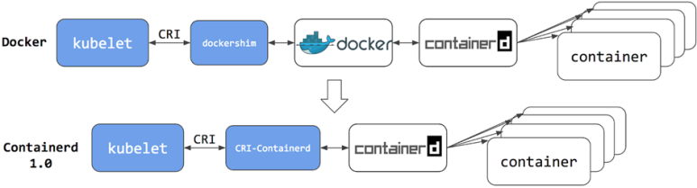
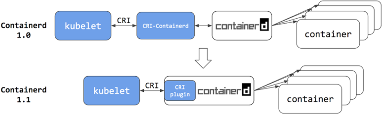

### 컨테이너 기술이란?

컨테이너는 실행에 필요한 모든 파일을 포함한 Runtime 환경에서 애플리케이션을 패키징하고 격리할 수 있는 기술


### 컨테이너 기술을 사용하면서 어떤 이점을 얻을 수 있나?

컨테이너 기술을 사용하면 일관된 환경을 제공하며 애플리케이션과 의존성을 하나의 단위로 패키징 할 수 있고 OS 수준의 격리로 가벼운 가상화를 제공하여빠른 시작과 배포가 가능하도록 한다.

- **기민한 애플리케이션 생성과 배포**: VM 이미지를 사용하는 것에 비해 컨테이너 이미지 생성이 보다 쉽고 효율적이다.

- **지속적인 개발, 통합 및 배포**: 안정적이고 주기적으로 컨테이너 이미지를 빌드해서 배포할 수 있고 (이미지의 불변성 덕에) 빠르고 효율적으로 롤백할 수 있다.

- **환경 일관성**: 랩탑에서도 클라우드에서와 동일하게 구동된다.

- **클라우드 및 OS 배포판 간 이식성**: Ubuntu, RHEL, CoreOS, 온-프레미스, 주요 퍼블릭 클라우드와 어디에서든 구동된다.

- **애플리케이션 중심 관리**: 가상 하드웨어 상에서 OS를 실행하는 수준에서, 논리적인 리소스를 사용하는 OS 상에서 애플리케이션을 실행하는 수준으로 추상화 수준이 높아진다.

- **리소스 효율성** : VM 대비 가벼운 구조 (OS 커널 공유)

- **격리성**: 프로세스/네트워크/파일시스템 격리로 보안성이 향상되며 다른 애플리케이션과 독립적 운영 가능

  - 컨테이너 아키텍쳐

  리눅스 시스템에서 컨테이너를 이용하여 격리 구조를 만드는 기법은 격리를 담당하는 Linux Namespace와 리소스를 제어하는 Control Group(cgroup)을 사용하여 격리된 컨테이너 환경을 제공합니다.

  리눅스 시스템에서 네임스페이스는 기본적으로 단일 네임스페이스를 사용하여 동작하며, 네임스페이스는 다음과 같은 종류로 있습니다.

  - 마운트 포인트
  - 프로세스
  - 네트워크 - IPC
  - UTS
  - 사용자

  제어 그룹은 프로세스 또는 컨테이너가 사용할 수 있는 리소스의 양을 제한할 수 있습니다. 제어 그룹이 제한할 수 있는 리소스를 다음과 같습니다.

  - CPU
  - 메모리
  - 네트워크 대역폭
  - 디스크 입출력


그렇다면 단점은?

* **성능 오버헤드**

  - 호스트 OS와 커널 공유로 인한 제약

  - 네트워크 가상화 레이어 추가

  - 디스크 I/O 성능 저하

* **보안 취약점**

  - 커널 공유로 인한 보안 위험

  - 이미지 취약점 관리 필요

  - 권한 설정 복잡성

* **모니터링 복잡성**

  - 컨테이너 수명주기가 짧음

  - 로그/메트릭 수집 어려움

  - 디버깅 복잡성 증가


---


### 쿠버네티스란?

컨테이너화된 워크로드와 서비스를 관리하기 위한 이식성이 있고, 확장가능한 오픈소스 플랫폼


### 쿠버네티스를 사용하면서 어떤 이점을 얻을 수 있나?

쿠버네티스는 분산 시스템을 탄력적으로 실행하기 위한 프레임 워크를 제공한다. 애플리케이션의 확장과 장애 조치를 처리하고, 배포 패턴 등을 제공한다. 예를 들어, 쿠버네티스는 시스템의 카나리아 배포를 쉽게 관리할 수 있다.

- **서비스 디스커버리와 로드 밸런싱** 쿠버네티스는 DNS 이름을 사용하거나 자체 IP 주소를 사용하여 컨테이너를 노출할 수 있다. 컨테이너에 대한 트래픽이 많으면, 쿠버네티스는 네트워크 트래픽을 로드밸런싱하고 배포하여 배포가 안정적으로 이루어질 수 있다.
- **스토리지 오케스트레이션** 쿠버네티스를 사용하면 로컬 저장소, 공용 클라우드 공급자 등과 같이 원하는 저장소 시스템을 자동으로 탑재할 수 있다
- **자동화된 롤아웃과 롤백** 쿠버네티스를 사용하여 배포된 컨테이너의 원하는 상태를 서술할 수 있으며 현재 상태를 원하는 상태로 설정한 속도에 따라 변경할 수 있다. 예를 들어 쿠버네티스를 자동화해서 배포용 새 컨테이너를 만들고, 기존 컨테이너를 제거하고, 모든 리소스를 새 컨테이너에 적용할 수 있다.
- **자동화된 빈 패킹(bin packing)** 컨테이너화된 작업을 실행하는데 사용할 수 있는 쿠버네티스 클러스터 노드를 제공한다. 각 컨테이너가 필요로 하는 CPU와 메모리(RAM)를 쿠버네티스에게 지시한다. 쿠버네티스는 컨테이너를 노드에 맞추어서 리소스를 가장 잘 사용할 수 있도록 해준다.
- **자동화된 복구(self-healing)** 쿠버네티스는 실패한 컨테이너를 다시 시작하고, 컨테이너를 교체하며, '사용자 정의 상태 검사'에 응답하지 않는 컨테이너를 죽이고, 서비스 준비가 끝날 때까지 그러한 과정을 클라이언트에 보여주지 않는다.
- **시크릿과 구성 관리** 쿠버네티스를 사용하면 암호, OAuth 토큰 및 SSH 키와 같은 중요한 정보를 저장하고 관리할 수 있다. 컨테이너 이미지를 재구성하지 않고 스택 구성에 시크릿을 노출하지 않고도 시크릿 및 애플리케이션 구성을 배포 및 업데이트할 수 있다.


---


### Docker / Container 차이점

Docker

- 컨테이너를 만들고 관리하는 플랫폼/도구
- 이미지 빌드, 공유, 실행 기능 제공
- CLI와 API를 통한 컨테이너 관리
- DockerHub를 통한 이미지 공유

Container

- 격리된 실행 환경 자체를 의미
- 여러 런타임(Docker, containerd, CRI-O)으로 실행 가능
- Linux 커널 기능(namespace, cgroups)으로 구현
- 도커 없이도 실행 가능한 독립적 개념

관계:

- 도커는 컨테이너를 다루는 도구
- 컨테이너는 격리된 프로세스의 실행 단위
- 도커는 컨테이너 기술을 쉽게 사용하게 해주는 플랫폼


---


### 도커 이미지 / 가상머신 이미지 차이점

- 리소스 사용: Docker는 애플리케이션과 의존성만 포함 하여 비교적 가볍고, VM은 전체 OS 를 포함하기에 비교적 무거움
- 격리수준: 도커는 프로세스 격리(호스트 OS 커널 공유), VM은 하드웨어 격리(독립적인 커널 실행)
- 이식성: 도커는 OS 종속적, VM은 완전 독립적
- 성능: 도커가 VM보다 빠름
- 구조 : 도커는 레이어구조로 효율적 저장 및 전송 가능


---


### Docker Architecture 


특징:Docker는 클라이언트-서버 아키텍처이다. 도커 클라이언트와 도커 데몬이RestApi를 사용하여 통신

#### Docker 데몬

- Docker Api 요청수신, 이미지,컨테이너,네트워크와 같은 도커 객체 및 도커 서비스 관리

#### Docker 클라이언트

* Docker 사용자가 Docker와 상호작용하기 위한 방법. 기본적인 도커명령어를 통해서 Docker 데몬과 통신

#### Docker 레지스트리

* Docker 이미지를 저장, Docker hub이라는 공용 레지스트리와 개인private한 레지스트리가 있다. 일반적으로 공용 레지스트리에서 실행

```null
docker pull, docker run: 사용하면  필수이미지 가져온다.
docker push: 레지스트리에 저장
```


---


### **containerd(컨테이너디)의 아키텍처**


일반적으로 쿠버네티스로 구축하는 클러스터에서는 Docker(도커)를 이용하여 컨테이너를 실행합니다. 쿠버네티스가 Docker를 통해 컨테이너를 실행하기 위해서는 표준 인터페이스인 CRI(Container Runtime Interface)가 필요한데요. Docker에서는 CRI를 지원하지 않기 때문에 dockershim을 통해 컨테이너를 실행하게 됩니다.





containerd 1.0의 경우에도 컨테이너를 실행하려면 CRI-containerd라는 데몬이 필요했습니다. CRI-containerd는 Kubelet의 CRI 서비스 요청을 처리하고, containerd 1.0에서는 컨테이너 실행 과정이 Docker에 비해 한 단계 단축되었다고 말할 수 있습니다. 





현재 containerd 1.1에서는 CRI-containerd 데몬이 이제 containerd CRI 플러그인으로 리팩토링 되었습니다. CRI 플러그인은 containerd 1.1에 내장되어 있으며 기본적으로 활성화되어 있습니다. CRI-containerd와 달리 CRI 플러그인은 직접 함수 호출을 통해 containerd와 상호작용합니다. containerd 1.1에서는 컨테이너 실행 과정이 또 한 단계 단축되고 더욱 안정적인 환경을 만들고 성능이 최적화되었습니다.


---


참고링크 : 

https://www.redhat.com/ko/topics/containers

https://kubernetes.io/ko/docs/concepts/overview/

https://nearhome.tistory.com/83


https://velog.io/@geunwoobaek/%EC%BB%A8%ED%85%8C%EC%9D%B4%EB%84%88-%EB%B0%8F-%EB%8F%84%EC%BB%A4-%EA%B0%9C%EB%85%90%EC%A0%95%EB%A6%AC

https://blog.naver.com/brainzsquare/223411921857

https://kubernetes.io/ko/blog/2020/12/02/dont-panic-kubernetes-and-docker/

https://velog.io/@rockwellvinca/kubernetes-%EC%BF%A0%EB%B2%84%EB%84%A4%ED%8B%B0%EC%8A%A4%EC%9D%98-%EB%8F%84%EC%BB%A4-%EC%A7%80%EC%9B%90-%EB%8C%80%ED%95%9C-%EB%AA%A8%EB%93%A0-%EA%B2%83