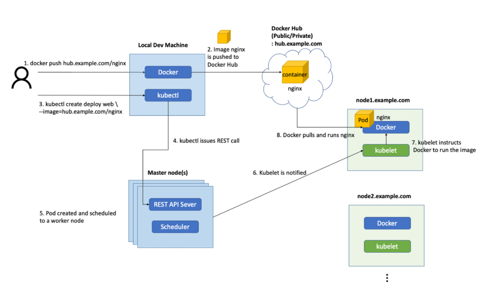

### Docker Build 명령어 수행 과정

1.docker build kubia . 

2.도커 클라이언트가 디렉터리의 콘텐츠를 데몬에 업로드한다.

3.이미지가 로컬에 저장되어있지 않은경우 퍼블릭 이미지 레포지토리로부터 BaseImage 를 Pull 한다.

4.새로운 콘텐츠와 함께 이미지를 빌드한다.

### kubectl run 명령어 수행 과정

1.docker 이미지를 Push 명령한다

2.public repository 에 푸시한다.

3.kubectl run ~~~ 명령 수행

4.kubectl은 Master Node 의 Rest API Server 에 API 호출을한다.

5.POD 가 생성되고 워커노드에 스케줄링된다

6.Kubelet 은 통지를 받는다

7.Kubelet은 도커에 이미지를 실행하라고 요청한다.

8.도커는 이미지를 풀하고 실행한다.

