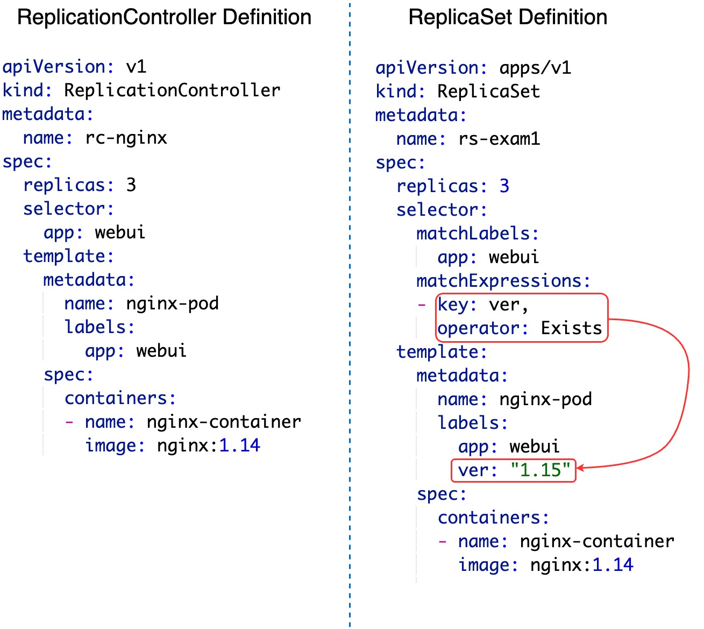
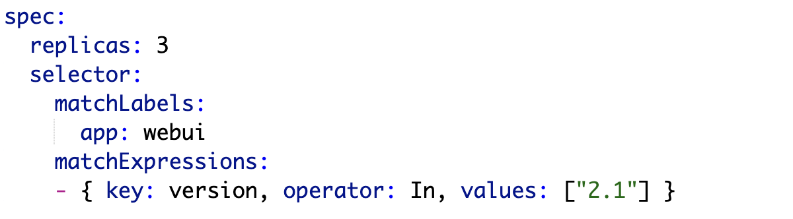
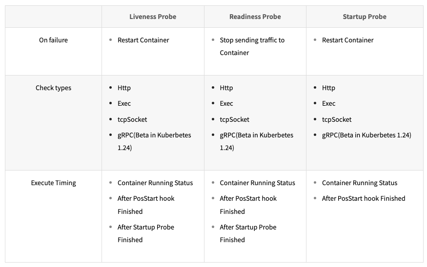
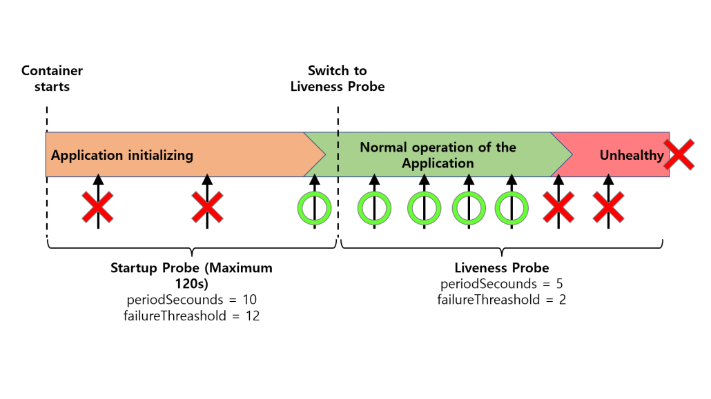
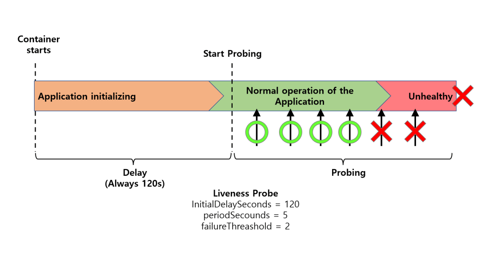

### 여러 프로세스를 실행하는 어플리케이션일 경우, 단일컨테이너vs 다중컨테이너 설계 방안

* 애플리케이션 특성

  - 프로세스 간 결합도가 높다면 단일 컨테이너

  - 독립적인 확장이 필요하다면 다중 컨테이너

* 확장성 요구사항

  - 전체 애플리케이션 단위 확장이면 단일 컨테이너

  - 개별 프로세스 단위 확장이면 다중 컨테이너


### RC(ReplicationController) vs RS(ReplicaSet)




rs 샘플 spec.selector.matchExpressions 

1) In: key와 values를 지정하여 key, value가 일치하는 Pod 필터링
2) NotIn: key는 일치하고 value는 일치하지 않는 Pod 필터링
3) Exists: key에 맞는 label의 Pod 연결
4) DoesNotExist: key와 다른 label의 Pod 연결




### **레플리카셋과 파드의 연관 관계**

파드는 레이블 기준으로 관리하기 때문에 레플리카셋과 파드는 느슨하게 결합되어 있다. 즉, 레플리카셋과 파드를 한꺼번에 삭제할 때는 **kubectl delete replicaset 컨테이너이름 --cascade=false** 명령으로 레플리카세트를 삭제한다.


### 레플리카셋과 레플리케이션컨트롤러 차이

"일치성 기준" 레이블 셀렉터는 "키=값" 모두 일치해야 하지만, "**집합성 기준**" 레이블 셀렉터는 "키=값" 모두 일치하거나, "키"만 일치하는 것도 지원합니다.

* 레플리케이션 컨트롤러 - 일치성 기준 레이블 셀렉터 지원

* 레플리카셋 -  일치성 및 집합성 기준 레이블 셀렉터 지원

  * matchExpressions 레이블 셀렉터

    ```yaml
    spec:
      selector:
        matchExpressions:
        - key: <string>
          operator: <In | NotIn | Exists | DoesNotExist>
          values:
          - <string>
    ```


### Kubernetes Probe란?

**컨테이너의 상태를 지속적으로 모니터링하고, 문제가 발생하면 자동으로 조치를 취하는 Kubernetes 기능**입니다. 이런 기능으로 **서비스의 가용성, 신뢰성을 유지할 수 있습니다**.

Kubernetes Probe는 크게 Liveness Probe, Readiness Probe, Startup Probe 세 가지 유형으로 나눌 수 있습니다.

- **Startup Probe** : Startup Probe는 Container 가 올바르게 시작되었는지 확인하는 데 사용됩니다. Kubernetes는 시작 단계 동안 주기적으로 Health Check 요청을 Container 로 보냅니다. 준비가 되었다는 응답 코드를 수신하면 Kubernetes는 해당 Container 가 정상적으로 기동되었다고 판단합니다. 지정된 시간 초과 내에 응답을 수신하지 못하면 Kubernetes가 컨테이너를 다시 시작합니다. 이를 통해 Liveness Probe 와 마찬가지로, 신뢰성 확보에 기여합니다. 해당 Probe는 컨테이너 생성 시 동작하며, 헬스체크에 성공하면 더 이상 동작하지 않습니다.
- **Liveness Probe**: Liveness Probe를 사용하여 Container 가 활성화되어 올바르게 작동하는지 확인합니다. Kubernetes 는 주기적으로 Container 에 Health Check 요청을 Container 로 보내고 지정된 Timeout 시간 내에 응답을 받지 못하면 Container를 재기동 시킵니다. 이를 통해 Pod의 상태를 실시간으로 모니터링하고, 문제가 발생한 경우 적시에 대응할 수 있습니다. 이는 Container 가 제대로 작동하지 않는 상황을 방지하여 신뢰성 확보에 기여합니다.
-  **Readiness Probe** : Readiness Probe 는 Container 가 트래픽을 수신할 준비가 되었는지 확인하는 데 사용됩니다. Kubernetes 는 주기적으로 Health Check 요청을 Container 로 보내고, 준비가 되었다는 응답 코드를 수신하면 트래픽을 수신할 준비가 된 컨테이너로 간주합니다. 그 외에 다른 코드를 받으면 Kubernetes 는 트래픽을 수신할 준비가 될 때까지 로드 밸런서 풀에서 해당 Container 를 제거합니다. 이를 통해, Container 가 사용 가능한 상태인지를 실시간으로 확인하고, 사용 가능하지 않은 Pod에 대한 요청을 차단하여 가용성 확보에 기여합니다.




#### Probe Options

| Value                                                        | Default | Description                                                  |
| :----------------------------------------------------------- | :-----: | :----------------------------------------------------------- |
| failureThreshold                                             |    3    | Probe 시도가 해당 옵션에 설정된 수 만큼 연속으로 실패하면, Probe가 실패하였다고 판단합니다. Kubelet 은 Pod의 Ready 조건을 false 로 설정하고, Probe 유형 별 실패 시 동작을 수행합니다. **기본 값은 3** 입니다. |
| initialDelaySeconds                                          |   0s    | Container 가 시작된 후 부터 Startup, Liveness, Readiness Probe가 실행되기 전의 Delay 시간(초) 입니다. **기본 값은 0초**이며, 최소 값은 0초 입니다. |
| periodSeconds                                                |   10s   | Probe를 수행하는 빈도(초) 입니다. **기본 값은 10초** 입니다. |
| successThreshold                                             |    1    | Probe 시도가 실패 후부터 Probe가 성공했다고 판단하는 최소 연속 성공 횟수입니다. **기본 값 및 최소 값은 1**입니다. **Startup 및 Liveness Probe는 반드시 1 이어야 합니다.** |
| terminationGracePeriodSeconds(Probe-level) [Kubernetes v1.25 Beta] |   30s   | Kubelet 이 Probe에 실패한 Container 의 종료를 트리거한 다음, Container Runtime 이 해당 Container 를 강제로 중지하는 사이에 대기하도록 설정한 유예 기간(초) 입니다.**기본 값은 30 초** 이며, 최소 값은 1초 입니다. |
| timeutSeconds                                                |   1s    | Probe 시도 후 실패라고 간주하는 Timeout 시간입니다. 기본 값은 1초 입니다. |


### Startup Probe는 왜 필요한가?

Startup Probe는 기동에 오랜 시간이 걸리는 애플리케이션들을 위해 만들어 졌습니다. 

예를 들면, Liveness Probe를 설정할 때에 initialDelaySeconds 설정 값을 길게 잡으면 되는 것이 아닌지?

아래는 Startup Probe를 이용하였을 때와, Liveness Probe의 initalDelaySeconds 값을 길게 설정하였을 때의 비교 그림 입니다.



####  Probing with Startup and Liveness Probe




#### Probing with Liveness Probe only

Startup Probe를 함께 사용하였을 때에 2가지 이점이 있는 것을 확인할 수 있습니다.

1. 애플리케이션 기동이 먼저 되면, 설정된 최대 시간보다 빨리 서비스를 할 수 있다. (Readiness Probe가 설정되어 있을 시, 유입이 되기 시작)
2. Liveness Probe의 설정을 조금 더 유연하게 할 수 있다. (Probe 주기, 최대 실패 횟수 등을 다르게 설정 가능)


조금 더 구체적인 동작을 알기 위해선 Probe를 설정하는 대상인 Pod 에 대해 조금 더 알아볼 필요가 있습니다.

Pod 의 Lifecycle 에 대해 알아보도록 하겠습니다.


이러한 Pod 는 정의된 Lifecycle 을 따르며, Pending phase 를 시작으로, Running phase를 지나, Pod 의 컨테이너의 종료 상태에 따라 Succeeded 혹은 Failed phase 로 넘어갑니다.

Pod Phase 종류

| Value     | Description                                                  |
| :-------- | :----------------------------------------------------------- |
| Failed    | Pod 내부의 모든 Container 가 종료되었으며, 하나 이상의 Container 가 실패 상태로 Terminated 된 상태입니다. 즉, Container 가 0이 아닌 상태 로 끝났거나, 시스템에 의해 종료된 것을 뜻합니다. |
| Pending   | Pod 가 Kubernetes Cluster 에 Accept 되어 Node 에 할당 되었으나, **하나 이상의 Container 가 설정 되지 않았거나 실행할 준비가 되지 않은 상태**입니다. 아래와 같은 이유 등으로 발생할 수 있습니다.<br />1. Pod가 실행되도록 예약된 Node 를 현재 사용할 수 없습니다.<br />2. Container 를 생성하기 위한 리소스가 Node 에 부족합니다.<br />3. Pod 정의에 지정된 Container Image 를 Container Registry 에서 아직 가져오지 않았습니다. |
| Running   | Pod 내부의 Container 가 잘 생성 되었고, 하나 이상의 Container 가 실행 중이거나, 실행 되고 있는 상태입니다. |
| Succeeded | Pod 내부의 모든 Container 가 성공적으로 잘 Terminated 된 상태입니다. 해당 Phase 의 Pod 는 재 기동 되지 않습니다. |
| Unknown   | 어떠한 이유로 Pod 의 상태를 가져올 수 없습니다. 해당 Phase 는 일반적으로 Pod 와 Node 간 통신 오류로 인해 발생합니다. |