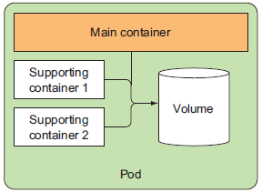
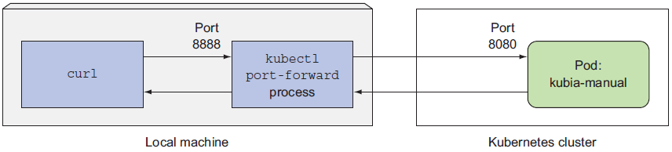
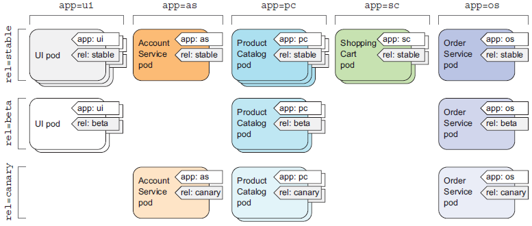
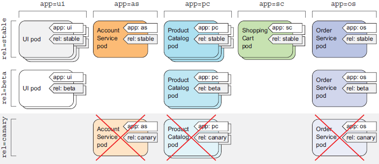

## 3장에서 다루는 내용

```
- 파드의 생성, 실행, 정지
- 파드와 다른 리소스를 레이블로 조직화하기
- 특정 레이블을 가진 모든 파드에서 작업 수행
- 네임스페이스를 사용해 파드를 겹치지 않는 그룹으로 나누기
```
  

#### 파드가 필요한 이유
* 컨테이너는 단일 프로세스를 실행하기 위한 목적으로 설계
* 파드를 사용하면 연관된 프로세스를 함께 실행하고 단일 컨테이너 안에서 모두 함께 실행되는 것처럼 거의 동일한 환경을 제공하면서 격리된 상태로 유지
* 파드의 모든 컨테이너는 동일한 네트워크 네임스페이스와 UTS 네임스페이스 안에서 실행되므로 **모든 컨테이너는 같은 호스트 이름과 네트워크 인터페이스를 공유함.**
* **애플리케이션들을 하나의 파드에 넣는 것**은 항상 같은 노드에서 실행되고 필요한 애플리케이션만 스케일링이 안되므로 **확장성 관점**에서 적합하지 않음 


  

#### 여러 컨테이너를 하나의 파드로 구성 시 고려사항
* 컨테이너를 함께 실행해야 하는가，혹은 서로 다른 호스트에서 실행할 수 있는가?
* 여러컨테이너가 모여 하나의 구성 요소를 나타내는가，혹은 개별적인 구성 요소인
가?
* 컨테이너가 함께，혹은 개별적으로 스케일링돼야 하는가?      
  

#### 파드를 정의하는 간단한 YAML 정의
```yaml
apiVersion: v1                  # 쿠버네티스 API 버전 v1을 준수
kind: Pod                       # 오프젝트 종류
metadata:
  name: kubia-manual            # 파드 이름  
spec:
  containers:
  - image: luksa/kubia          # 컨테이너 이미지
    name: kubia                 # 컨테이너 이름
    ports:
    - containerPort: 8080       # 애플리케이션이 수신하는 포트트
      protocol: TCP
```
  

#### 파드 애플리케이션 로그 보기
* 컨테이너화된 애플리케이션은 로그를 파일에 쓰기보다는 표준 출력과 표준 에러를 로그에 남기는게 일반적
* 컨테이너 로그는 하루 단위로 로그 파일이 10MB 크기에 도달할 때마다 순환됨
* 파드 로그를 보관하려면 로그 수집기를 사용하여 별도 저장 또는 PV 사용 필요함.     
  

#### 파드에 요청 보내기
* 포트 포워딩을 통해 연결 (local에서 8888로 서비스중인 AP를 8080 port로 연결)
```bash
kubectl port-forward kubia-manual 8888:8080
... Forwarding from 127.0.0.1:8888 -> 8080
... Forwarding from [::1]:8888 -> 8080
```

```bash
$ curl localhost:8888
You’ve hit kubia-manual
```


  

#### 레이블 관리
**레이블** : 파드와 모든 쿠버네티스 리소스를 조직화하여 관리하는 기능
**레이블 셀렉터**(리소스 필터링 조건) : 특정 레이블로 태그된 파드의 부분 집합을 선택후 작업 수행
* 레이블 검색 조건
  * 특정한 키를 포함하거나 포함하지 않는 레이블
  * 특정한 키와 값을 가진 레이블
  * 특정한 키를 갖고 있지만, 다른 값을 가진 레이블


  

#### 특정 노드에 파드 스케쥴링
* 일반적으로 어느 노드에 스케쥴링 되는지 중요하지 않음
* 워커노드 일부만 SSD를 가지고 있거나, GPU 제공 노드 사용이 필요한 경우에는 레이블을 활용하여 필요한 요구사항에 해당되는 노드로 스케쥴링

```yaml
apiVersion: v1
kind: Pod
metadata:
  name: kubia-gpu
spec:
  nodeSelector:   # nodeSelector는 쿠버네티스에 gpu=true 레이블을 포함한 노드에 이 파드를 배포하도록 지시
    gpu: "true"   
  containers:
  - image: luksa/kubia
    name: kubia
```
**주의사항** : nodeSelector에 실제 호스트 이름을 지정할 경우 해당 노드가 오프라인 상태인 경우 파드가 스케쥴링 안될 수 있음. 개별 노드가 아닌 레이블 셀렉터를 통해 지정한 특정 기준을 만족하는 노드의 논리적인 그룹으로 지정되어야함.
  

#### 파드에 어노테이션 달기
**용도** : 쿠버네티스에 새로운 기능을 추가할 때 흔히 사용.
알파 혹은 베타 버전은 API 오브젝트에 새로운 필드를 바로 도입하지 않음.
(필드 대신 어노테이션 사용)

#### 네임스페이스를 사용한 리소스 그룹화
**용도** : 쿠버네티스 네임스페이스로 오브젝트를 그룹화 (리눅스 네임스페이스는 프로세스 격리용도로 다름)
* 네임스페이스를 사용해 서로 관계없는 리소스를 겹치지 않는 그룹으로 분리
* 리소스 이름은 네임스페이스 안에서만 고유하면 됨. (다른 네임스페이스끼리 동일한 이름의 리소스 사용 가능)
* 단, 노드 리소스는 전역으로 단일 네임스페이스에 속하지 않음   

#### 파드 삭제
* 파드 이름 지정 삭제
```bash
$ kubectl delete po kubia-gpu
pod "kubia-gpu" deleted
```
* 레이블 섹렉터 사용하여 삭제 : 이름을 지정해서 삭제가능하지만 레이블 셀렉터를 통해 제할 수 있음
```bash
$ kubectl delete po -l creation_method=manual
pod "kubia-manual" deleted
pod "kubia-manual-v2" deleted
```
* 네임스페이스 삭제로 파드 삭제
```bash
$ kubectl delete ns custom-namespace
namespace "custom-namespace" deleted
```
* 네임스페이스를 유지하면서 네임스페이스 안에 있는 모든 파드 삭제
```bash
$ kubectl delete po --all
pod "kubia-zxzij" deleted
```
* 네임스페이스에서 (거의) 모든 리소스 삭제
```bash
$ kubectl delete all --all
pod "kubia-09as0" deleted
replicationcontroller "kubia" deleted
service "kubernetes" deleted
service "kubia-http" deleted
```

kubectl delete all --all 키워드로 삭제해도 모든 리소스가 완전히 삭제되는 것은 아님. 
시크릿 등 특정 리소스는 보존되어 명시적으로 삭제필요

   
   
## 궁금한 것
어노테이션을 어떤 경우 사용하는지? 
단지 신규 API 출시 전 알파, 베타버전 개발중에 임시로 사용하기 위한 기능만인지??
