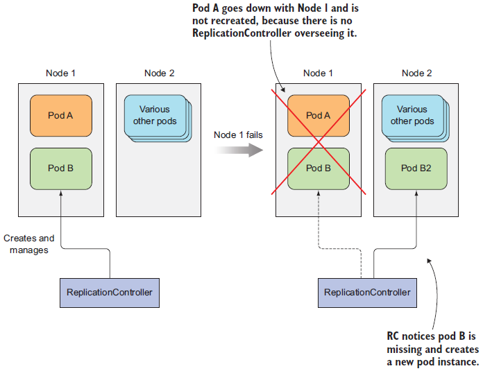

## 4장에서 다루는 내용
```
- 파드의 안정적인 유지
- 동일한 파드의 여러 인스턴스 실행
- 노드 장애 시 자동으로 파드 재스케줄링
- 파드의 수평 스케줄링
- 각 클러스터노드에서 시스템 수준의 파드 실행
- 배치 잡 실행
- 잡을 주기적 또는 한 번만 실행하도록 스케줄링
```   

#### 파드 생성 및 관리 자동화
**레플리케이션 컨트롤러 또는 디플로이먼트와 같은 유형으로 리소스 생성**
* 노드 전체에 장애가 발생하면 노드에 있는 파드는 유실되며, 별도 관리를 하지 않으면 새로운 파드로 대체되지 않으므로 컨테이너가 살아있는지 체크하고 그렇지 않은 경우 재시작 필요  
  * 크래시가 발생한 컨테이너는 자동으로 재 시작함.
  * 애플리케이션 프로세스의 크래시 없이 작동이 중단되는 경우를 감지하기 위해 외부에서 상태를 체크해야함      → liveness probe 사용
  
#### Liveness Probe
* 라이브니스 프로브 : 컨테이너가 살아있는지 확인. **정의되지 않으면 쿠버네티스가 애플리케이션이 살아 있는지 확인 불가능**
  → 쿠버네티스는 주기적으로 프로브를 실행하고 프로브가 실패할 경우 컨테이너를 다시 시작함.   

|종류|설명|
|--|--|
|HTTP get probe|지정한 IP주소, 포트, 경로에 HTTP Get 요청 수행|
|TCP socket probe|컨테이너의 지정된 포트에 TCP 연결 시도|
|Exec probe|컨테이너 내의 임의의 명령을 실행하고 명령의 종료 상태 코드 확인|   
  
   
* 라이브니스 프로브 설정
```yaml
apiVersion: v1
kind: pod
metadata:
  name: kubia-liveness
spec:
containers:
  - image: luksa/kubia-unhealthy
    name: kubia
    livenessProbe:
    httpGet:                # http get을 수행하는 liveness probe
      path: /               # http 요청 경로 (path 지정 시 해당 경로에 인증 필요여부 확인해야함. 그렇지 않으면 프로브가 항상 실패해 컨테이너가 무한정 재시작함)
      port: 8080            # probe가 연결해야하는 네트워크 포트트
```
  
* 컨테이너가 다시 시작된 이유 상세 확인
```yaml
$ kubectl describe po kubia-liveness
Name: kubia-liveness
...
Containers:
  kubia:
    Container ID: docker://480986f8
  Image: luksa/kubia-unhealthy
    Image ID: docker://sha256:2b208508
    Port:
    State: Running                   # 컨테이너가 현재 실행 중이다.
      Started: Sun, 14 May 2017 11:41:40 +0200
    Last State: Terminated
      Reason: Error
      Exit Code: 137                 # 이전 컨테이너가 에러로인해 코드 137을 반환하고 중지됐다.
      Started: Mon, 01 ]an 0001 00:00:60 +0000
      Finished: Sun, 14 May 2017 11:41:38 +0200
    Ready: True
    Restart Count: 1                 # 컨테이너가 한 번 다시 시작됐다.
    Liveness: http-get http://:8080/ delay=0s timeout=ls period=10s #success=l #failure=3            # delay, timeout, period 등 추가 속성 설정 가능
  Events: 
  ... Killing container with id docker://95246981:pod "kubia-liveness .,
container "kubia" is unhealthy, it will be killed and re-created.
```
##### 설정 유형
* delay=0s : 컨테이너가 시작된 후 바로 프로브 시작.
* timeout=1s : 컨테이너가 1초 안에 응답해야함. 그렇지 않으면 실패로 카운트 
* period=10s : 컨테이너는 10초마다 프로브를 수행
* failure=3 : 프로브가 3번 연속 실패하면 컨테이너 다시 시작.
* initialDelaySeconds : 첫 번째 프로브 실행까지 설정된 시간동안 대기함.
    애플리케이션 시작 시간을 고려해 적절하게 설정하지 않으면 애플리케이션이 요청 받을 준비가 안되어 프로브가 실패함.  
    
**리소스 관리 측면** : 프로브의 CPU 사용시간은 **컨테이너의 CPU 시간 할당량으로 계산**되므로 1초 내 완료되도록 적용필요
* 컨테이너에 크래시가 발생하거나 liveness probe가 실패한 경우 노드의 kubelet이 컨테이너를 재시작하게 하고 마스터에서 실행중인 쿠버네티스 컨트롤 플레인 구성 요소는 관여하지 않음.
* 노드 자체에 크래시가 발생한 경우 이로 인해 중단된 파드를 대체할 파드 생성은 컨트롤 플레인에서 관리 (kubelet은 노드에서 실행되기 때문에 노드 문제시 동작하지 않음)
따라서 **다른 노드에서 애플리케이션을 실행시키려면 레플리케이션 컨트롤러를 이용해야 함**   


**참고**
[Liveness, Readiness and Startup Probes](https://www.cloudacode.com/hello-kubernetes/hello-kubernetes/section02/readiness-liveness-probe/)
[Spring Boot Application의 Actuator를 통해 Liveness&Readiness 상태체크](https://rocksea.tistory.com/468)

#### 레플리케이션컨트롤러
레플리케이션컨트롤러는 파드가 항상 실행되도록 보장
노드 장애 발생 시 해당 노드에서 실행 중인 모든 파드에 대한 교체 복제본이 생성됨
수동 또는 자동으로 파드를 쉽게 수평으로 확장 가능


* 파드 A : 직접 생성하여 관리 X
* 파드 B : 레플리케이션컨트롤러에서 관리  
  노드 장애 시 레플리케이션컨트롤러는 파드 B를 교체하기 위해 신규 파드 B2를 생성하지만 파드 A는 유실됨.



##### 레플리케이션컨트롤러는 파드가 설정된 갯수와 동일하게 실행되도록 보장. 
* 파드가 너무 적으면 파드 템플릿에서 새 복제본 생성, 너무 많으면 초과 복제본을 삭제함  


레플리케이션컨트롤러의 세가지 요소
|구분|설명|비고|
|--|--|--|
|레이블 셀렉터|레플리케이션컨트롤러의 범위에 있는 파드를 결정||
|레플리카수|실행할 파드에 의도하는 수 지정|레플리카수 변경만 기존 파드에 영향을 미침|
|파드 템플릿| 새로운 파드 레클리카를 만들 때 사용|파드 템플릿의 파드 레이블은 레플리케이션컨트롤러의 레이블 셀렉터와 일치해야함. 그렇지 않으면 새 파드를 무한정 생성|    
    
    
##### 파드 템플릿을 변경하면 변경 이후에 생성된 파드만 영향을 미치며 기존 파드는 영향을 받지 않음.  
    

  


#### 레플리케이션컨트롤러 대신 레플리카셋 사용하기
* 레플리카셋은 레플리케이션컨트롤러와 똑같이 동작하지만 좀 더 풍부한 표현식을 사용하는 파드 셀렉터를 가짐
*  레플리카셋의 셀렉터는 특정 레이블이 없는 파드나 레이블의 값과 상관없이 특정 레이블의 키를 갖는 파드를 매칭시킴
* 레플리카셋은 두 파드 세트를 매칭시켜 하나의 그룹으로 관리가능


#### 데몬셋을 사용하면 클러스터 모든  노드에 노드당 하나의 파드만 실행   
   
* 모든 노드에서 로그 수집기과 리소스 모니터를 실행하는 경우 데몬셋을 사용하면 좋음.  
* 데몬셋은 각 노드에서 하나의 파드 복제본만 실행하지만 레플리카셋은 클러스터 전체에서 무작위로 파드를 분산시킴  


