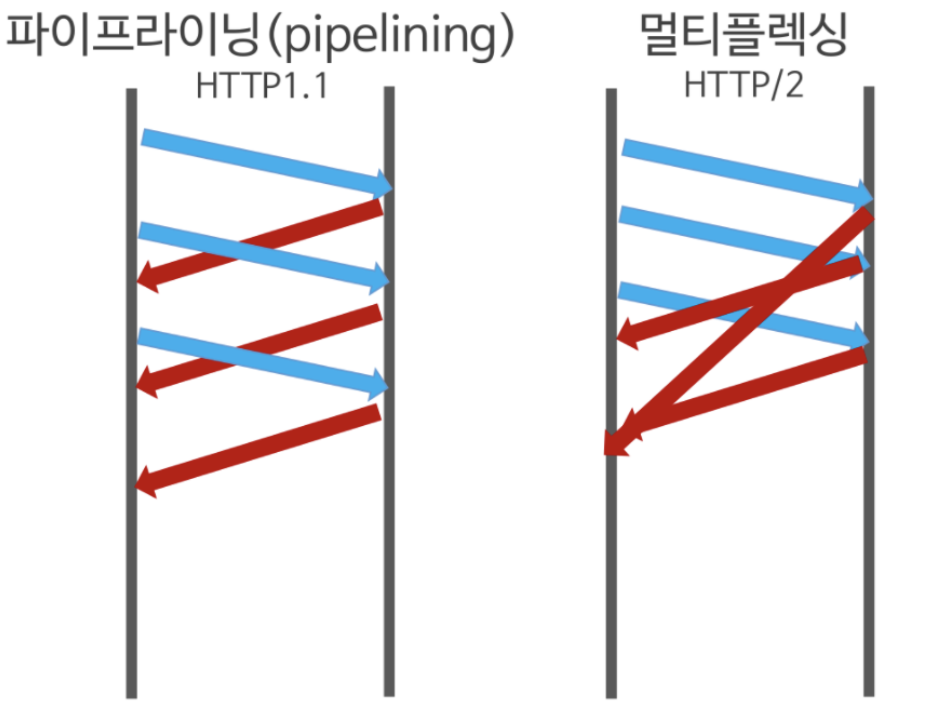

## 5장 서비스 : 클라이언트가 파드를 검색하고 통신을 가능하게 함


### externalTrafficPolicy란?

externalTrafficPolicy란 쿠버네티스 클러스터에서 파드가 배포된 **노드까지 트래픽이 들어왔을 때,** 이 트래픽을 **다른 노드로 전송할 수 있을지 없을지**를 결정하는 옵션이다.

#### Local  

한번 들어온 트래픽은 다른 노드로 빠지지 않고, **해당 노드 내의 파드로만 전달**된다. 

다른 노드로 이동할 때의 hop에 따른 `latency` 및 `Cross-AZ` 비용 문제를 해결하기 위해 사용


트래픽이 해당 노드로 들어온 이상, 다른 노드로 다시 이동하지 않으므로 네트워크에서 **추가적인 hop이 없다.** 따라서, `latency`를 감소시킬 수 있다.

또한, A노드와 B노드의 가용영역이 다른 상황이라면 A노드에 도착한 트래픽이 B노드로 트래픽을 다시 전송할 때 `Cross-AZ` 비용이 발생하게 되는데, **노드가 변하지 않으므로** Cross-AZ에서 발생할 일 또한 없기에 **Cross-AZ 비용문제 또한 해결**할 수 있다.


마지막으로, **클라이언트의 IP주소가 변경되지 않고 고정된다**. 따라서, IP 로그를 수집하기 수월하고, 특정 IP 접속만을 허용하는 등의 제어를 구현하기 편하다.

해당 노드로 트래픽이 들어왔지만, 해당 노드에 배포된 파드가 죽어있는 경우 다른 노드로 **트래픽이 이동하지 못하므로** 요청에 대해 `TimeOut`이 발생하게 된다.


#### Cluster

한번 들어온 트래픽은 **다른 노드로 자유롭게 빠질 수 있다**.

Cluster로 설정할 경우, **들어온 트래픽이 다른 노드로 자유롭게 이동**할 수 있다.
<노드IP>:<노드 포트 번호>로 특정 노드로 접속해도 다른 노드에 있는 파드에 트래픽이 접속되는 이유가 바로 이 이유 때문이다.

어쨌거나 **다른 노드로 트래픽이 이동**하기에 노드와 노드 사이의 `hop`이 여러개라면 큰 latency를 초례할 수 있고, 서로 다른 가용영역에 있는 노드라면 다른 지역간 통신 비용인 `Cross-AZ` 비용이 발생한다.


#### IP모드란?

더 효율적인 네트워크 경로 제공하는 모드

IP 모드를 사용하면 AWS 로드 밸런서가 파드 IP 주소로 직접 트래픽을 전달한다. 즉, 트래픽이 개별 EC2 워커 노드의 kube-proxy를 통해 전달되는 것이 아니라 **서비스 백엔드의 IP 주소로 직접 전달된다.**

이는 AWS VPC CNI의 특징으로, 직접적으로 트래픽이 파드에 바로 도착하므로 iptables와 같은 리눅스의 분산 룰을 사용하지 않아 **보다 효율적이게 동작한다.**


```yaml
apiVersion: v1
kind: Service
metadata:
  annotations:
    service.beta.kubernetes.io/aws-load-balancer-nlb-target-type: ip
spec:
  ports:
  - port: 80
    targetPort: 8080
  selector:
    app: your-app
```

---


### 쿠버네티스의 서비스 디스커버리 메커니즘

동적으로 변화하는 Pod의 상태를 실시간으로 반영한다.

```
Client Request 
  → Ingress Controller
    → Ingress Rule 확인
      → Service 조회
        → Endpoints 조회
          → Pod IP 확인
            → 트래픽 전달
```


---


### Service ExternalName 이란?

**외부 서비스를 DNS CNAME 레코드로 매핑하는 특별한 유형의 서비스**이며  클러스터 내부에서 **외부 서비스를 참조할 때 사용**

- selector를 사용하지 않음
- Pod를 생성하지 않음
- CNAME 레코드만 생성

```yaml
apiVersion: v1
kind: Service
metadata:
  name: my-service
spec:
  type: ExternalName
  externalName: api.google.com
```

활용 사례

- 클라우드 데이터베이스 연결
- 외부 API 서비스 연결
- 마이크로서비스 간 통신
- 클러스터 간 서비스 연결


---


### k8s Service LB 알고리즘

- rr: round-robin
- lc: least connection (가장 적은 연결을 가진 Pod로 전달)
- dh: destination hashing (목적지 기반 해시)
- sh: source hashing (출발지 기반 해시)
- sed: shortest expected delay
- nq: never queue

IPVS 모드 사용 예시:

```yaml
apiVersion: v1
kind: Service
metadata:
  name: my-service
  annotations:
    service.beta.kubernetes.io/ipvs-scheduler: "rr" # 또는 lc, dh, sh, sed, nq
spec:
  selector:
    app: my-app
  ports:
    - protocol: TCP
      port: 80
      targetPort: 8080
```

주의사항:

- IPVS 모드는 kube-proxy가 IPVS 모드로 실행될 때만 사용 가능
- 클러스터의 노드에 IPVS 커널 모듈이 설치되어 있어야 함
- 더 높은 성능과 더 많은 로드밸런싱 알고리즘 옵션을 제공하지만, 설정이 더 복잡할 수 있음

---


### Kubernetes Session Affinity란?

클라이언트의 요청이 항상 동일한 파드로 라우팅되도록 보장하는 기능 즉, 세션이 유지되는 동안 동일한 클라이언트의 요청이 동일한 백엔드 파드로 전달되도록 하여 상태를 유지하는 데 사용


#### 사용 방법

Kubernetes에서는 **Service**의 `sessionAffinity` 설정을 통해 Session Affinity를 구성할 수 있습니다. 기본적으로 Session Affinity는 비활성화되어 있으며 활성화시 아래와 같이 설정.

```yaml
apiVersion: v1
kind: Service
metadata:
  name: my-service
spec:
  selector:
    app: my-app
  ports:
    - protocol: TCP
      port: 80
      targetPort: 9376
  sessionAffinity: ClientIP
  sessionAffinityConfig:
    clientIP:
      # 세션 유지 시간 (초 단위)
      timeoutSeconds: 3600
```


#### Session Affinity 설정 시 고려사항

- **세션 유지 시간**: `sessionAffinityConfig`에서 세션 유지 시간을 설정할 수 있습니다. 이 값은 클라이언트가 특정 파드에 묶여있는 시간입니다. 기본값은 10800초 (3시간)입니다.

- **로드 밸런싱**: Session Affinity가 활성화되면 로드 밸런서의 균등 분배 기능이 제한될 수 있습니다. 특정 파드로 트래픽이 집중될 가능성이 있기 때문에, 파드 간 부하 분산이 필요하다면 이를 주의해야 합니다.

- Session Affinity는 주로 상태 기반 웹 애플리케이션이나 세션을 필요로 하는 서비스에서 사용되며, 무상태 서비스에서는 필요하지 않은 기능입니다.

  

---

서비스 노출시 브라우저를 통해 k8s 에 활성화된 서비스로 요청을 보낼경우 매번 같은 POD 를 호출한다. 

그렇다면 Session Affinity 가 활성화 되어있는겄일까?

이유는 아니다. 왜냐하면 브라우저는 Default Http 설정이 2.0 으로 설정되어있고 keep-alive 연결을 사용하기 때문이다.

---


### HTTP란?

- Hyper Text Transfer Protocol
- 클라이언트(웹브라우저)와 서버간 데이터를 주고 받는 응용 계층의 프로토콜
- TCP 세션 기반의 데이터 전달

---


#### HTTP 1.0

- 매번 요청마다 커넥션 수립 ( 매번 새로운 연결 )
  - TCP 커넥션이 HTTP 요청마다 3-way Handshake와 TearDown 반복
  - 서버에 오버헤드 발생, 시간의 지연
- **커넥션 하나당 요청 하나와 응답 하나만 처리함**

#### HTTP 1.1

- 커넥션 유지
  - 한개의 TCP 세션을 통해 여러개의 컨텐츠 요청 가능
  - **Pipelining** 클라이언트는 응답에 상관없이 요청을 보내고 서버에서는 응답을 요청이 들어온 순서대로 보낸다. → HOL Blocking 발생
  - **Mupltiple** : TCP 다중 연결 , 많은 양의 objects를 검색하는 성능을 높임
- 헤더
  - 호스트 헤더 (가상 호스팅 ) : 하나의 IP 주소에 여러 도메인 적용
  - proxy-authentication, proxy-authorization 헤더 추가 → 프록시가 사용자의 인증을 요구하는 것이 가능해짐
  - 요청과 응답이 많아지면서 중복되는 header 내용이 많아짐 → 불필요한 데이터를 주고 받아 네트워크 자원 낭비 발생

> 💡 HOL (Head Of Line) Blocking
> 응답을 요청을 받은 순서대로 보내야 하기 때문에, 앞의 요청에 대한 응답이 지연되면 그 뒤의 응답에 대해 blocking이 발생할 수 있다.

#### HTTP 2.0

1) **HTTP 메시지 전송 방식의 변화**

- 1.0의 text 형식 전달에서 요청, 응답 메시지는 프레임 단위로 나누어지고 **바이너리 형식**으로 인코딩으로 변경
- 파싱, 전송 속도가 빨라짐

2**) HOL Blocking 문제 개선**

- 멀티플렉스 스트림 (Multiplexed Streams) : 요청과 응답의 다중화
  - 한 커넥션으로 동시에 여러개의 메시지를 주고 받고, 응답은 순서에 상관없이 stream으로 주고 받는다.
  - Stream Prioritization 응답에 대한 우선 순위를 정해 우선 순위가 높을 수록(먼저한 필요한 리소스 부터) 응답을 빨리한다.
  - 클라이언트가 요청하기 전에 필요하다고 예상되는 리소스를 서버에서 먼저 보내준다. 서버는 클라이언트의 요청에 대해 요청하지 않은 리소스를 마음대로 보내줄 수 있다.



3**) Header 중복 해결**

- **Header table과 Huffman Encoding 기법을 이용해 압축한다.** 클라이언트와 서버는 각각 Header Table을 관리하고 이전 요청과 동일한 필드는 table의 index만 보내고 변경되는 값은 Huffman Encoding 후 보냄으로써 Header의 크기를 경량화 한다. → 헤더의 크기를 줄여 페이지 로드 시간 감소

#### HTTP 3

- 전송 계층에 스트림을 기본 구조로 도입하는 새 인터넷 전송 프로토콜인 UDP를 기반 QUIC을 사용한다.


---

### NodePort <> LoadBalancer 상관관계

외부노출 방법중 하나인 LoadBalancer는 NodePort 의 Extension 이다?

LoadBalancer는 NodePort를 기반으로 동작합니다. 구체적인 관계를 살펴보면:

* 계층 구조

  - LoadBalancer는 NodePort의 상위 계층

  - LoadBalancer가 생성되면 자동으로 NodePort도 함께 생성됨

* 트래픽 흐름

  - 외부 요청 → LoadBalancer → NodePort → Pod 순서로 트래픽이 전달됩니다

  - LoadBalancer는 클라우드 제공자의 로드밸런서를 사용하여 외부 트래픽을 NodePort로 전달합니다

  - NodePort는 모든 Worker 노드에 동일한 포트를 열어 Pod로 트래픽을 전달합니다

* 사용 사례

  - NodePort: 간단한 외부 노출이 필요한 경우 (테스트 환경 등)

  - LoadBalancer: 프로덕션 환경에서 안정적인 외부 접근이 필요한 경우

* 주요 차이점

  - NodePort는 30000-32767 범위의 포트만 사용 가능하지만 LoadBalancer 는 모든 포트 사용 가능

  - LoadBalancer는 클라우드 제공자의 추가 비용이 발생할 수 있음


그렇다면 방화벽 신청시 어떻게 신청해야하는가???????????????????????????????????????????????????????????????????????


---

### 쿠버네티스 안에서 외부 Request IP 인식 하는 방법


X-Forwarded-For 헤더 사용

```yaml
nginx.ingress.kubernetes.io/configuration-snippet: |
  proxy_set_header X-Real-IP $remote_addr;
  proxy_set_header X-Forwarded-For $proxy_add_x_forwarded_for;
```

externalTrafficPolicy 설정 LoadBalancer나 NodePort 서비스에서 다음과 같이 설정

```yaml
apiVersion: v1
kind: Service
metadata:
  name: my-service
spec:
  externalTrafficPolicy: Local
  type: LoadBalancer
```

Ingress Controller 설정 NGINX Ingress Controller

```yaml
apiVersion: networking.k8s.io/v1
kind: Ingress
metadata:
  annotations:
    nginx.ingress.kubernetes.io/use-forwarded-headers: "true"
```

애플리케이션 코드에서 IP 확인

```java
@GetMapping("/ip")
public String getClientIp(HttpServletRequest request) {
    String xForwardedFor = request.getHeader("X-Forwarded-For");
    if (xForwardedFor != null) {
        return xForwardedFor.split(",")[0];
    }
    return request.getRemoteAddr();
}
```

주의사항:

- 프록시나 로드밸런서를 사용하는 경우 X-Forwarded-For 헤더가 여러 IP를 포함할 수 있습니다
- 보안을 위해 신뢰할 수 있는 프록시의 헤더만 허용하도록 설정해야 합니다
- Cloud Provider의 로드밸런서를 사용하는 경우, 해당 프로바이더의 특정 설정이 필요할 수 있습니다


---

### HostPort , NodePort 차이


**HostPort** **:** 해당 팟이 돌아가는 호스트의 포트를 외부로 노출시킴. 꼭 필요하지 않으면 되도록 사용하지 말것.


**NodePort** **:** 30000~33000대 사이의 포트중 하나를 외부로 노출시킴. 외부 로드밸런서에서 내부와 다른 포트로 들어오게 하고 싶을때 조합해서 사용함.(내부에서 연결시 30000번으로 연결해야 하더라도 외부에서 80번으로 들어오게 하고싶을때 사용.) 서비스를 노출해야 할 일이 있으면 HostPort보다 NodePort를 우선적으로 고려한다.


Cluade 답변

```yaml
apiVersion: v1
kind: Pod
metadata:
  name: hostport-pod
spec:
  containers:
  - name: web
    image: nginx
    ports:
    - containerPort: 80
      hostPort: 8080  # 노드의 8080 포트와 컨테이너의 80 포트를 매핑
```

주요 특징:

1. 노드 포트 직접 바인딩

   - 컨테이너의 포트를 호스트 노드의 특정 포트에 직접 바인딩
   - 노드IP:hostPort로 직접 접근 가능

2. 제한사항

   - 같은 hostPort는 노드당 하나의 pod만 실행 가능
   - 다른 노드로 pod가 이동하면 접근 주소가 변경됨

3. 일반적인 사용 사례:

   - 디버깅 목적
   - 레거시 애플리케이션 지원
   - 노드 레벨의 모니터링

4. NodePort vs hostPort

   ```yaml
   # NodePort 예제
   apiVersion: v1
   kind: Service
   metadata:
     name: my-service
   spec:
     type: NodePort
     ports:
     - port: 80
       targetPort: 80
       nodePort: 30080  # 모든 노드의 30080 포트로 접근 가능
   ```

주의사항:

- 프로덕션 환경에서는 Service(NodePort, LoadBalancer) 사용 권장
- 보안 고려사항 검토 필요
- 포트 충돌 가능성 있음
- pod 스케줄링 제한됨


---


출처 

https://jisooo.tistory.com/entry/kubernetes-%EC%99%B8%EB%B6%80-%EC%9A%94%EC%B2%AD%EC%9D%B4-%ED%81%B4%EB%9F%AC%EC%8A%A4%ED%84%B0-%EB%82%B4-%ED%8C%8C%EB%93%9C%EA%B9%8C%EC%A7%80-%EC%A0%84%EB%8B%AC%EB%90%98%EB%8A%94-%EA%B3%BC%EC%A0%95

https://velog.io/@rockwellvinca/kubernetes-externalTrafficPolicy%EB%9E%80

https://jeongchul.tistory.com/780

https://qkqhxla1.tistory.com/1102