## 5. 서비스

#### 서비스가 필요한 사유

* 파드는 일시적이고 파드가 시작되기 전에 파드의 IP 주소를 미리 알수 없음
* Pod의 IP를 사용하여 서비스를 호출하게되면 바뀐 IP를 계속 추적해야함.
  → 파드의 개별 IP 목록 유지 불필요하고 파드는 단일 IP 주소로 액세스 할 수 있어야함.

* 이러한 문제를 해결하기 위해 **Service** 리소스 유형을 제공
* 서비스는 Pod 앞단에서 클라이언트의 요청을 Pod로 전달하는 Reverse Proxy와 같은 역할 수행
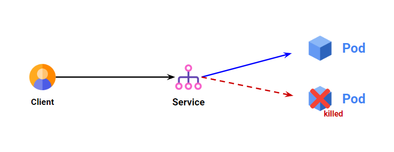


#### 라벨 셀렉터
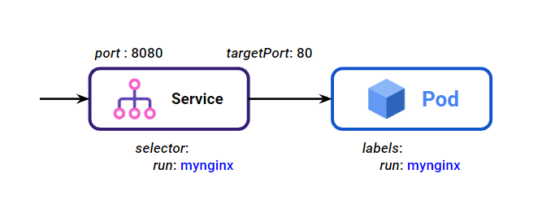
* Service의 트래픽을 전달할 Pod를 선택할 때 라벨 셀렉터를 사용
* Service에서 Pod의 이름이나 IP로 참조하면 Pod 생명주기에 따라 매번 새로운 값을 등록하고 삭제해야함 
⇒ 라벨링을 사용하면 특정 라벨만 가지고 있는 Pod로만 트래픽 전달
</br>
* 환경변수에서 서비스 IP/Port를 확인할수 있음.
  ⇒ 쿠버네티스에서 DNS 서버를 포함하고 DNS를 통해서 서비스 IP를 찾는게 더 일반적임.  
  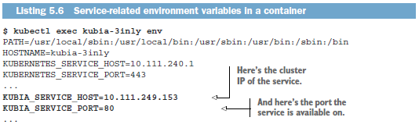

#### 1. Pod IP로 접근
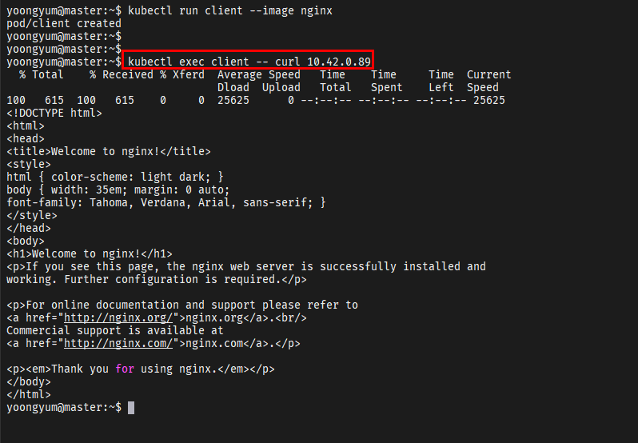

#### 2. Service IP로 접근
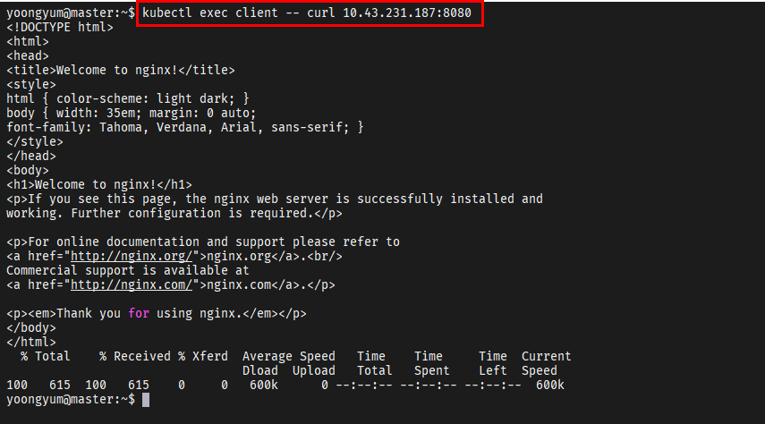

#### 3. Service DNS로 접근
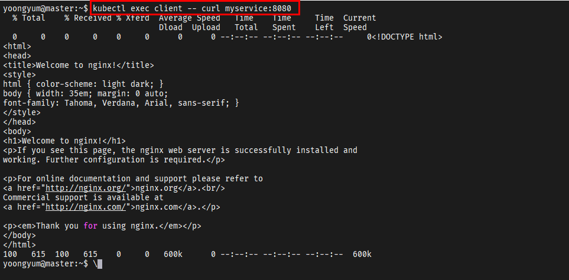

#### 서비스 IP에 핑을 할 수 없는 이유
```bash
root@kubia-3inly:/# ping kubia
PING kubia.default.svc.cluster.local (10.111.249.153): 56 data bytes
^C--- kubia.default.svc.cluster.local ping statistics ---
54 packets transmitted, 0 packets received, 100% packet loss
```
* 서비스의 클러서트 IP가 가상IP이므로 서비스로 curl은 동작하지만 Ping은 응답이 없음.
  → 서비스 포트와 결합된 경우에만 의미가 있음  

#### 클러스터 외부에 있는 서비스 연걸

[참고] https://westlife0615.tistory.com/212

##### 서비스 엔드포인트
* Kubernetes Service 는 Pod 들을 네트워크적으로 묶기 위해서 Endpoint 라는 리소스를 사용
* Endpoint 는 Service 와 연결되는 Pod 들의 IP 를 저장
* 지속적으로 Pod 의 상태 변화에 따라서 Pod 의 IP 를 업데이트함
* Service 는 연결된 Pod 들을 찾기 위해서 Pod 와 IP 정보를 가지고 있는 Endpoint 를 활용 ⇒ **Service Discovery**
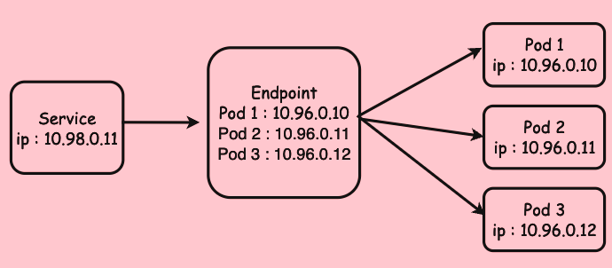

##### Endpoint 생성   
* Endpoint는 Service를 생성할 때 자동으로 생성됨
* Service는 matchLabels 설정을 통해 연결할 Pod를 생성 ⇒ 이 과정에서 연결된 Pod들의 IP 정보를 가진 Endpoint가 생성됨
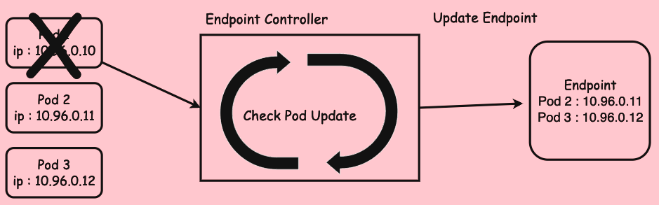    


#### 외부 클라이언트에 서비스 노출
* 크게 3가지로 사용 가능 (노드포트 서비스 사용, 로드밸런서 구성, Ingress 사용)  
  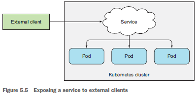
  

#### 1) 노드포트 서비스 사용
노드포트 서비스의 경우 각 클러스터 노드는 노드 자체에서 포트를 열고 해당 포트로 수신된 트래픽을 서비스로 전달
→ 일반적으로 서비스와 유사하지만, 서비스이 내부 클러스터 IP 뿐만 아니라 모든 노드의 IP와 할당된 노드포트로 서비스에 엑세스
>**노드포트 서비스는 설정된 포트가 모든 노드에서 개방되어 있어야 하므로 로드밸런서 서비스만큼 유연하지는 않다.**  

노드포트를 생략할 경우 쿠버네티스가 임의의 포트를 선택함.
- 모든 노드를 대상으로 외부 접속 가능한 포트를 예약
- Default NodePort 범위: 30000 - 32767
- ClusterIP를 생성 후 NodePort를 예약

**노드포트 서비스의 단점**
클라이언트가 하나의 노드에 요청 시, 해당 노드가 장애가 나면 더 이상 서비스에 엑세스할 수 없으므로 온라인 상태인 모든 노드에 요청을 분산시키도록 노드앞에 로드밸런서를 배치하는 것이 좋음.

#### 2) 로드밸런서로 구성
전용 로드밸런서로 서비스에 엑세스하며 로드밸랜서는 트래픽을 모든 노드 포트로 전달
→ 클라이언트는 로드밸런서의 IP로 서비스에 엑세스

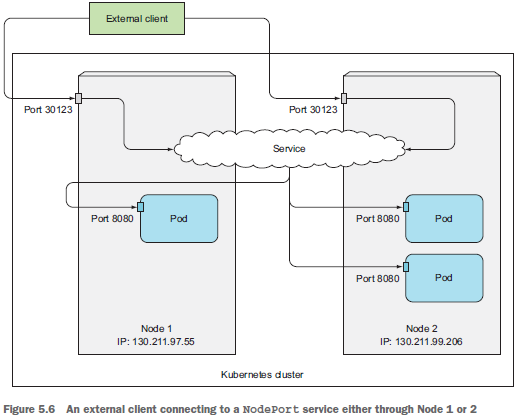

##### 세션 어피니티와 웹 브라우저
###### curl을 사용 시 같은 브라우저 요청이 다른 파드로 안가는지?
브라우저는 keep-alive 연경을 사용하고 같은 연결로 모든 요청을 보내고 curl은 매번 새롭게 연결함.
서비스는 연결 수준에서 동작하므로 서비스에 대한 연결을 처음 열면 임의의 파드가 선택된 다음 해당 연결에 속하는 모든 네트워크 패킷은 모두 같은 파드로 전송됨.
**세션 어피니티가 None으로 설정되어 있어도 사용자는 연결이 종료될때까지 항상 동일한 파드로 연결**


**Session Affinity 란?** [참고 Site](https://velog.io/@hl08217/Kubernetes-Session-Affinity%EB%A5%BC-%ED%86%B5%ED%95%B4-Sticky-Session-%EC%84%A4%EC%A0%95%EC%9D%84-%ED%95%B4%EB%B3%B4%EC%9E%90)

Kubernetes의 Service에서 Session Affinity라는 기능은 NCP 에서 Sticky Session과 같은 기능이다.
클라이언트의 연결을 특정 인스턴스 또는 Pod에 유지시키는 기능이다.
클라이언트가 처음으로 연결을 요청한 인스턴스 또는 Pod에 대해서는 세션을 연결주고, 동일한 클라이언트의 후속 요청은 동일한 인스턴스 또는 Pod에 연결된다.
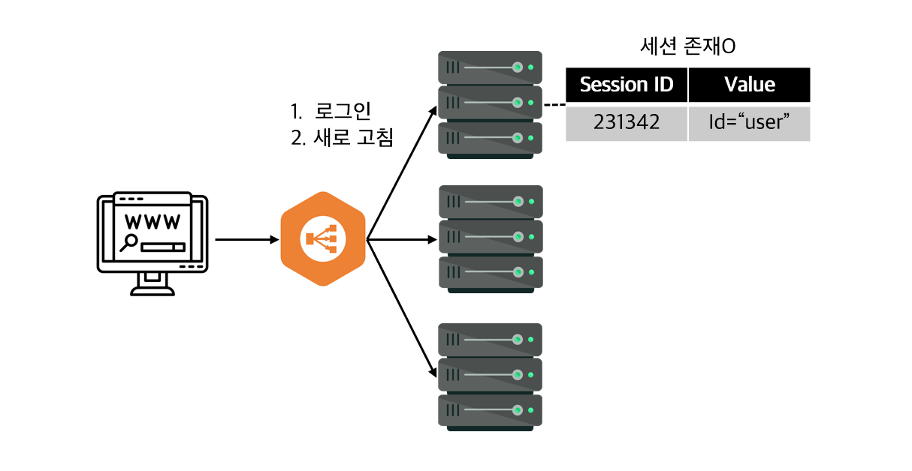

예를 들어, 로그인 세션, 장바구니 정보 등을 특정 인스턴스 또는 Pod에 유지하여 일관된 상태를 유지할 수 있다.

* Service의 'sessionAffinity'를 설정할 때, 주로 Client IP를 지정하여 세션 유지를 구현한다.
  * Client IP를 기준으로 세션을 유지하면, 동일한 Client IP를 가진 요청은 항상 동일한 Pod로 전달되어 세션 연결을 유지할 수 있다.
  * 쿠키 기반의 세션 유지는 L7 Layer에서 동작하기 때문에 Service 수준에서 직접 제공되지 않는다. 대신, 일부 Ingress Controller나 애플리케이션 자체에서 쿠키 기반의 세션 유지를 구현할 수 있다.
쿠키 : 클라이언트와 서버 간의 상태 정보를 저장하는 작은 데이터 조각, 웹 브라우저는 서버로부터 받은 쿠키를 저장하고, 이후에 같은 서버에 요청을 보낼 때 쿠키를 함께 전송하여 상태 정볼르 유지한다.


##### 불필요한 네트워크 홉의 이해와 예방
외부 클라이언트가 노트포트로 서비스에 접속할 경우 파드에 도달하려면 추가적인 네트워크 홉이 필요할 수 있음.
아래와 같이 실행중인 파드로만 외부 트래픽을 전달하도록 구성해 이 추가 홉을 방지할 수 있음.
```yaml
spec:
  externalTrafficPolicy: Local
  ...
```
로컬 외부 트래픽 정책을 사용하는 서비스는 파드 간 부하가 고르지 않을 수 있음.

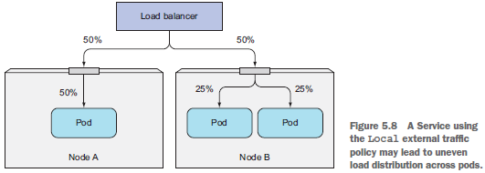

일반적으로 클러스터 내의 클라이언트가 서비스로 연결하면 서비스 파드는 Client IP를 얻을 수 있으나 노드포트로 연결을 수신하면 SNAT이 수행되므로 패킷의 소스 IP가 변경됨.
**Client IP 확인이 필요한 경우 주의해야함!!**  
  
  
#### 3) Ingress 리소스 사용
http레벨(L7)에서 작동하므로 4계층 서비스보다 더 많은 기능 제공 (쿠키기반 세선 어피니티 기능 등)  

##### 인그레스가 필요한 이유
로드밸런서는 자신의 공용IP를 가진 로드밸런서가 필요하지만 인그레스는 한 IP 주소로 수십개의 서비스에 접근 가능하도록 지원.
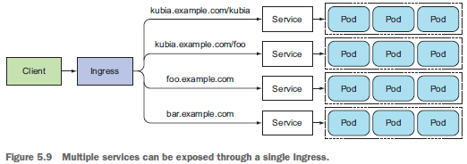

##### 인그레스로 동작 방식
DNS 조회 → DNS 서버가 IP 반환 → 컨트롤러가 파드에 요청  
* 인그레스 컨트롤러는 요청을 서비스로 전달하지 않음. 
* 파드 선택 시에 사용하며 대부분의 컨트롤러는 이와 같이 동작함  

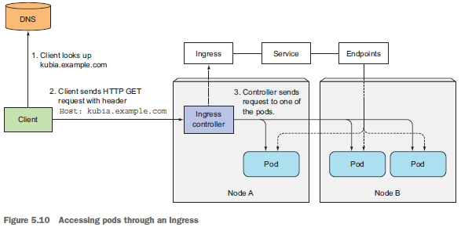

* 동일한 호스트의 다른 경로로 여러 서비스 매핑 또는 서로 다른 호스트로 서로 다른 서비스 매핑하여 사용함.
* https 연동 필요 시 인그레스 컨트롤러에서 TLS 관련 모든 것을 처리 가능하므로 파드에서 실행중인 애플리케이션은 TLS 지원 불필요

#### 레디니스 프로브
파드가 완전히 준비될 때까지 기동중인 파드에 요청을 전달하지 않도록 주기적으로 호출하여 특정 파드가 클라이언트 요청을 수신할 수 있는지를 확인함.
**클라이언트가 정상 상태인 파드하고만 통신하고 시스템에 문제가 있다는 사실을 모르게함**

##### 레디니스 프로브 유형
* Exec 프로브 : 컨테이너 상태를 프로세스의 종료 상태 코드로 결정
* HTTP GET 프로브 : HTTP GET 요청을 컨테이너로 보내고 응답의 HTTP 상태 코드를 보고 컨테이너가 준비되었는지 여부를 결정
* TCP 소켓 프로브 : 컨테이너의 지정된 포트로 TCP 연결  

* 레디니스 프로브가 실패한 파드는 서비스의 엔드포인트에서 제거
* 파드가 다시 준비되면 서비스에 다시 추가
  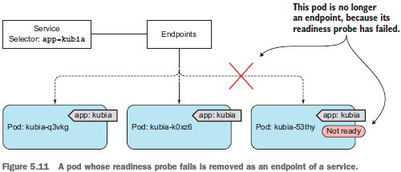
    
##### 라이브니스 프로브와 레디니스 프로브의 가장 큰 차이
라이브니스 프로브는 상태가 좋지 않은 컨테이너를 제거하고 새롭고 건강한 컨테이너로 교체해 파드의 상태를 정상으로 유지하는 반면，레디니스 프로브는 요청을 처리할 준비가 된 파드의 컨테이너만 요청을 수신하도록함.

##### 해드리스 서비스 [참고 Site](https://ddii.dev/kubernetes/headless-service/)
Headless Service는 클러스터 IP를 생성하지 않으며, Kubernetes DNS 시스템을 사용하여 파드 간의 직접적인 통신을 가능하게 한다. 이는 상태를 가진 애플리케이션, 즉 각 파드가 고유한 ID와 상태를 유지해야 하는 경우에 매우 유용하다. 주로 데이터베이스, 분산 시스템, 상태 기반 애플리케이션에서 주로 사용된다. 레플리카셋을 통해 생성된 스테이트리스 파드는 동일한 것으로 간주되며, 요청이 어느 쪽에 도착하는지는 중요하지 않다, 따라서 일반 서비스 형태로 로드 밸런싱이 이루어진다. 그러나 스테이트풀 파드는 서로 다르며, 특정 파드의 좌표로 특정 파드에 도달해야 하는 경우가 많다.

##### 서비스로 파드에 엑세스 할 수 없는 경우
- 먼저 외부가 아닌 클러스터 내에서 서비스의 클러스터 IP에 연결되는지 확인한다.
- 서비스에 액세스할 수 있는지 확인하려고 서비스 IP로 핑을 할 필요 없다（서비스의
클러스터 IP는 가상 따이므로 핑되지 않는다）.
- 레디니스 프로브를 정의했다면 성공했는지 확인하라. 그렇지 않으면 파드는 서비
스에 포함되지 않는다.
- 파드가 서비스의 일부인지 확인하려면 kubernetes get endpoints를 사용해 해당 엔
드포인트 오브젝트를 확인한다.
- FQDN이나 그 일부（예: myservice, mynamespace.svc.cluster.local 또는 myservice.mynamespace）로 서비스에 액세스하려고 하는데 작동하지 않는 경우，대신 클러스터 IP를 사용해 액세스할 수 있는지 확인한다.
- 대상 포트가 아닌 서비스로 노출된 포트에 연결하고 있는지 확인한다.
- 파드 IP에 직접 연결해 파드가 올바른 포트에 연결돼 있는지 확인한다.
- 파드 IP로 애플리케이션에 액세스할 수 없는 경우 애플리케이션이 로컬호스트에만 바인딩하고 있는지 확인한다.
