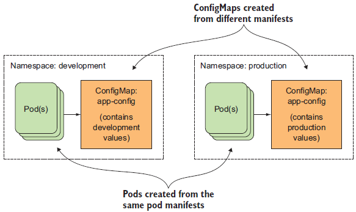

### 7장에서 다루는 내용

- 컨테이너의 주 프로세스 변경
- 애플리케이션에 명령줄 옵션 전달
- 애플리케이션에 노출되는 환경변수 설정
- 컨피그맵으로 애플리케이션 설정
- 시크릿으로 민감한 정보 전달

### 컨테이너 애플리케이션에 설정 데이터 전달 방법

1. 컨테이너화된 애플리케이션에서 설정을 전달할 때 널리 **환경변수**를 사용

        → 설정 파일을 컨테이너 이미지 안에 포함하거나 파일이 포함되어있는 볼륨을 컨테이너로 마운트 해야하기 때문에..

1. gitRepo 볼륨을 설정 소스로 사용
→ 언제든지 설정을 롤백할 수 있어서 괜찮음.
2. 설정 데이터를 최상위 레벨의 쿠버네티스 리소스에 저장하고 이를 깃 저장소 혹은 다른 파일 기반 스토리지에 저장
→ 설정 데이터를 저장하는 쿠버네티스를 **컨피그맵**이라고 함

 
<br>

### 7.2 컨테이너에 명령줄 인수 전달

- ENTRYPOINT 명렁어로 실행하고 기본 인자를 정의하는 경우에 CMD를 지정하여 사용 (아무런 인자도 지정하지 않고 이미지를 실행)
    
    
    | Docker | k8s | 설명 | 예시 |
    | --- | --- | --- | --- |
    | ENTRYPOINT | command | 컨테이너 안에서 실행되는 실행파일 |  |
    | CMD | args | 실행파일에 전달되는 인자 | • shell 형식 : ENTRYPOINT node app.js<br> → 컨테이너 내부에서 node 프로세스 직접 실행<br> • exec 형식 : ENTRYPOINT [”node”, “app.js”] <br>→ node 프로세스가 아닌 shell 프로세스가 실행됨 |
<br>

### 7.3 컨테이너의 환경변수 설정

- 각 컨테이너를 위한 사용자 정의 환경변수 지정 
→ 환경변수는 파드레벨이 아닌 컨테이너 정의 안에서 설정함.
    
    
<br>

### 7.4 컨피그맵

- 컨피그맵의 내용은 컨테이너의 환경변수 또는 볼륨 파일로 전달
- 환경변수는 $(ENV_VAR) 구문을 사용해 프로세스의 명령줄 인자로 전달 가능
    
    
    

- 각각 다른 환경별로 동일한 이름으로 컨피그맵에 관한 여러 메니페스트를 유지할 수 있음.
→ 모든 환경에서 동일한 파드 정의를 사용해 각 환경에서 서로 다른 설정 사용
    
    
    

- 파일 내용으로 컨피그맵 생성
    - 컨피그맵에는 전체 설정 파일 같은 데이터를 통째로 저장하는 것도 가능
    
    ```bash
    # 파일을 읽어 개별항목으로 저장
    $ kubectl create configmap my-config --from-file=config-file.conf
    
    # 파일 내용을 컨피그맵의 config-file.conf 키 값으로 저장
    $ kubectl create configmap my-config --from-file=customkey=config-file.conf
    
    # --from file 인수를 여러번 사용해 여러 파일 추가
    $ kubectl create configmap my-config --from-file=/path/to/dir
    ```
    

- 개별 파일, 디렉토리, 문자열 값으로 configmap 생성
    
    
    

- Configmap 항목을 환경변수로 컨테이너에 전달하려면 valueFrom 필드 사용
    
    
    | fortune-config.yaml | fortune-pod-env-configmap.yaml |
    | --- | --- |
    | apiVersion: v1<br>    data: <br>        **sleep-interval: “25”**<br>    kind: ConfigMap<br>    metadata:<br>        name: fortune-config<br>        … | apiVersion: v1<br>    kind: Pod<br>    metadata:<br>        name: forntune-env-from-configmap<br>    spec:<br>        contaiers:<br>        - image: luksa/fortune:env<br>          env:<br>          - name:  INTERVAL<br>             **valueFrom:<br>                configMapKeyRef :<br>                    name: fortune-config<br>                    key: sleep-interval**<br>    … |
    

```
💡파드를 생성할 때 존재하지 않는 configmap을 지정하면 컨테이너 시작 시 실패함.
configMapKeyRef.optional: true 로 지정하면 configmap이 존재하지 않아도 컨테이너는 시작함.
```      

<br>

- 볼륨 안에 있는 컨피그맵 항목 사용
    
    ```yaml
    apiVersion: v1
    kind: Pod
    metadata:
    name: fortune-configmap-volume
    spec:
    containers:
    - image: nginx:alpine
    name: web-server
    volumeMounts:
    ...
    - name: config
    mountPath: /etc/nginx/conf.d           # 컨피그맵 볼륨을 마운트하는 위치
    readOnly: true
    ...
    volumes:
    ...
    - name: config
    configMap:
    name: fortune-config                  # 이 볼륨은 fortune-config 컨피그맵을 참조
    ...
    ```
<br>    

- 개별 configmap 항목을 파일로 마운트
    
    
    
    ```yaml
    spec:
    containers:
    - image: some/image
      volumeMounts:
      - name: myvolume
        mountPath: /etc/someconfig.conf      # 디렉토리가 아닌 파일을 마운트
        subPath: myconfig.conf               # 전체 볼륨을 마운트하는 대신 myconfig.conf 항목만 마운트
    ```
<br>

- 컨피그맵 볼륨 안에 있는 파일 권한 설정
    
    ```yaml
    volumes:
    - name: config
      configMap:
        name: fortune-config
        defaultMode: "6600"      # 모든 파일 권한을 -rw-rw----- 로 설정
    ```
    

- Configmap 을 사용해 볼륨으로 사용하면 파드를 다시 만들거나 컨테이너를 다시 시작안하도 설정 업데이트 가능
→ 단, Configmap을 업데이트 한 후에 파일이 업데이트 되기까지 오랜 시간이 걸릴 수 있음 (최대 1분)

- Configmap 편집
    
    ```bash
    # configmap 수정
    $ kubect edit configmap fortune-config
    
    # configmap 변경사항 확인
    $ kubectl exec fortune-configmap-volume -c web-server
    ➥ cat /etc/nginx/conf.d/my-nginx-config.conf
    
    # 설정 다시 로드
    $ kubectl exec fortune-configmap-volume -c web-server -- nginx -s reload
    ```
<br>
<br>

### 시크릿으로 민감한 데이터를 컨테이너에 전달

보안이 유지되어야하는 자격증명과 개인 암호화 키와 같은 민감 정보는 secret을 사용

- 환경변수로 시크릿 항목을 컨테이너에 전달
- 시크릿 항목을 볼륨 파일로 전달

  ```
  💡시크릿에 접근해야하는 파드가 실행되고 있는 노드에만 개별 시크릿을 배포해 안전하게 유지해야함
  노드 자체적으로 시크릿을 항상 메모리에만 저장되게하고 물리 저장소에 기록되지 않게 해야함
  → 물리 저장소는 시크릿을 삭제한 후에도 디스크를 완전 삭제하는 작업이 필요하므로…
  ```    
<br>

### Configmap과 Secret 비교

- 민감하지 않고, 일반 설정 데이터는 configmap
- 민감한 데이터는 secert을 사용해 키 아래에 보관. 민감 데이터와 그렇지 않은 데이터를 모두 가지고 있다면 secret에 저장해야함.
    
    ```yaml
    $ kubectl get secret fortune-https -o yaml
    apiVersion: v1
    data:
    foo: YmFyCg==
    https.cert: LS0tLS1CRUdJTiBDRVJUSUZJQ0FURS0tLS0tCk1JSURCekNDQ...
    https.key: LS0tLS1CRUdJTiBSU0EgUFJJVkFURSBLRVktLS0tLQpNSUlFcE...
    kind: Secret
    ...
    ```
    

- default-token 시크릿은 자동으로 생성돼 각 파드에 자동으로 할당
    
    
    
<br>

**바이너리 데이터 시크릿 사용**

시크릿 항목에 일반 텍스트 뿐만 아니라, 바이너리 값도 담을 수 있으므로 Base64 인코딩 사용

```
민감하지 않은 데이터도 시크릿을 사용할 수 있지만, 시크릿의 최대 크기는 1MB로 제한됨.
```     
<br>

**stringData 필드**
읽기 전용으로 값을 설정할때만 사용.

```yaml
kind: Secret
apiVersion: v1
stringData:
foo: plain text
data:
https.cert: LS0tLS1CRUdJTiBDRVJUSUZJQ0FURS0tLS0tCk1JSURCekNDQ...
https.key: LS0tLS1CRUdJTiBSU0EgUFJJVkFURSBLRVktLS0tLQpNSUlFcE...
```
<br>

**환경변수로 시크릿 항목 노출**

시크릿의 개별항목을 환경변수로 노출할 수 있음. secretKeyRef 사용

→ 좋은 방법은 아님.. 로그를 남기면 환경변수를 남겨 secret을 노출할 수 있음. 안전을 위해서 secret을 노출할 떄 항상 secret  볼륨 사용해야함.