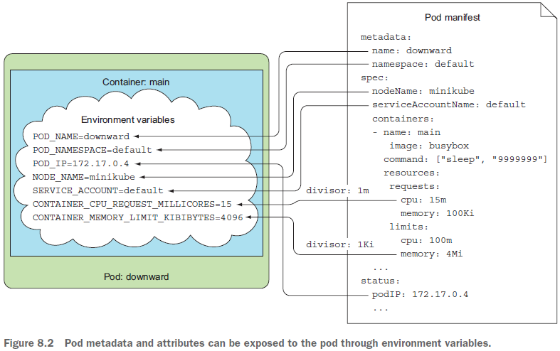
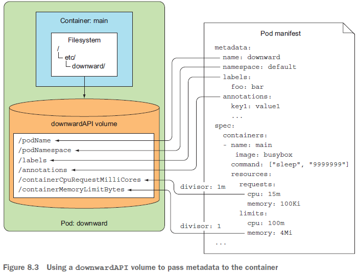
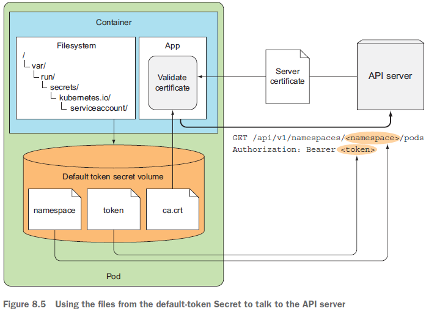
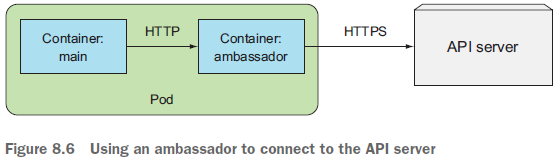
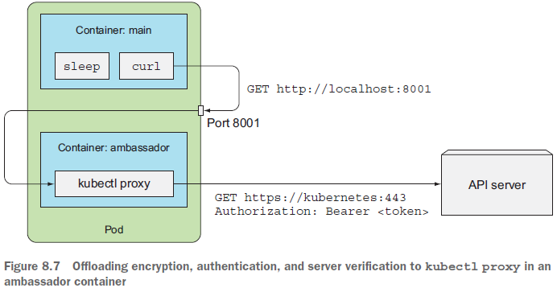

# Chater 8. 애플리케이션에서 파드 메타데이터와 그 외의 리소스에 엑세스하기

### 8장에서 다루는 내용

* 컨테이너에 정보를 전달하기 위해 Download API 사용
* 쿠버네티스 REST API 알아보기
* 인증과 서버 검증을 kubectl proxy에 맡기기
* 컨테이너 내에서 API 서버 접근하기
* 앰버서더 컨테이너 패턴의 이해
* 쿠버네티스 클라이언트 라이브러리 사용
  
<br>

### Downward API
애플리케이션이 쿠버네티스 환경의 메타데이터나 리소스 정보를 동적으로 활용해야할때 주로 사용
컨테이너가 자기 자신 혹은 클러스터에 대한 정보를, 쿠버네티스 클라이언트나 API 서버 없이도 사용할 수 있게 함

* 환경 변수를 이용한 방법
  * Pod 생성 이후, 외부에서 변경할 수 없는 정보를 사용하는 경우
* 볼륨 파일을 이용한 방법
  * pod 단위로 정의되기 때문에 다른 컨테이너 정보를 활용할 때 용이
  * 실행되는 동안 수정될 수 있는 정보를 저장하기에 적합
* 일부 정보는 둘 중 하나의 방법만 사용가능

파드 및 컨테이너 필드를 노출하는 이 두 가지 방법을 다운워드 API라고 함.
<br>

### Downward API에서 사용가능한 메타 데이터
#### fieldRef를 통해 접근 가능한 정보  
|구분|설명|
|--|--|
|metadata.name |파드의 이름|
|metadata.namespace|파드가 속한 네임스페이스|
|metadata.uid|파드의 고유 ID|
|metadata.annotations['<KEY>']|파드의 어노테이션에서 <KEY>에 해당하는 값 (예를 들어, metadata.annotations['myannotation'])|
|metadata.labels['<KEY>']|파드의 레이블에서 <KEY>에 해당하는 문자열 (예를 들어, metadata.labels['mylabel'])|
|spec.serviceAccountName|파드의 서비스 어카운트|
|spec.nodeName|파드가 실행중인 노드명|
|status.hostIP|파드가 할당된 노드의 기본 IP 주소|
|status.podIP|파드의 기본 IP 주소 (일반적으로 IPv4 주소)|

<br>

#### 환경 변수가 아닌 Downward API 볼륨의 fiedlRef로만 접근 가능
|구분|설명|
|--|--|
|metadata.labels|파드의 모든 레이블로, 한 줄마다 하나의 레이블을 갖는(label-key="escaped-label-value") 형식을 취함|
|metadata.annotations|파드의 모든 어노테이션으로, 한 줄마다 하나의 어노테이션을 갖는(annotation-key="escaped-annotation-value") 형식을 취함|

<br>

#### resourceFieldRef를 통해 접근 가능한 정보
컨테이너 필드는 CPU와 메모리 같은 리소스에 대한 요청 및 제한 값을 제공한다.
(컨테이너의 리소스 필드를 참조할 때에는 참조하는 컨테이너의 이름을 명시적으로 지정 필요)

|구분|설명|
|--|--|
|resource: limits.cpu|컨테이너의 CPU 제한|
|resource: requests.cpu|컨테이너의 CPU 요청|
|resource: limits.memory|컨테이너의 메모리 제한|
|resource: requests.memory|컨테이너의 메모리 요청|
|resource: limits.hugepages-*|컨테이너의 hugepage 제한 (DownwardAPIHugePages 기능 게이트가 활성화 된 경우)|
|resource: requests.hugepages-*|컨테이너의 hugepage 요청 |(DownwardAPIHugePages 기능 게이트가 활성화 된 경우)|
|resource: limits.ephemeral-storage|컨테이너의 임시 스토리지 제한|
|resource: requests.ephemeral-storage|컨테이너의 임시 스토리지 요청|


<br/>

#### 환경변수와 값 매핑


<br>

#### Downward API 볼륨 사용
```yaml
spec:
  volumeMounts:
  - name: downward                     
    mountPath: /etc/downward   # downward 볼륨을 /etc/downward 아래에 마운트
volumes:
- name: downward
  downwardAPI:
    items:
    - path: "podName"          # 파드의 이름(manifest metadta.name 필드)은 podName 파일에 기록
      fieldRef:
        fieldPath: metadata.name
...
```


```bash
$ kubectl exec downward ls -lL /etc/downward
-rw-r--r-- 1 root root 134 May 25 10:23 annotations
-rw-r--r-- 1 root root 2 May 25 10:23 containerCpuRequestMilliCores
-rw-r--r-- 1 root root 7 May 25 10:23 containerMemoryLimitBytes
-rw-r--r-- 1 root root 9 May 25 10:23 labels
-rw-r--r-- 1 root root 8 May 25 10:23 podName
-rw-r--r-- 1 root root 7 May 25 10:23 podNamespace
```
<br>

#### 레이블과 어노테이션 업데이트
* 환경변수는 나중에 업데이트를 못하므로 파드의 레이블 또는 어노테이션을 사용해서 이 값을 가지고 있는 파일을 업데이트해서 파드가 항상 최신 데이터를 볼 수 있도록 해야함 (파드가 실행되는 동안 레이블과 어노테이션은 수정 가능)

* 볼륨을 사용하는 것은 환경변수를 사용하는 것보다 약간 복잡하지만 **한 컨테이너의 리소스 필드를 다른 컨테이너에 전달할 수 있는 장점이 있음** (단, 두 컨테이너는 같은 파드에 있어야함)
→ 환경변수는 컨테이너 자신의 리소스 제한과 요청만 전달 가능  

* Downward API를 애플리케이션을 다시 짜거나 환경변수에 노출하는 쉘을 사용하지 않고 데이터 노출 가능하지만 **사용 가능한 메타데이터가 상당히 제한적임.**
**→ 더 많은 정보가 필요한 경우 쿠버네티스 API 서버에서 직접 가져와야함.**


#### Downward API의 한계
* downward api를 통해서 pod 자기 자신의 메타데이터 및 속성 정보를 얻을 수 있지만, 다른 pod의 리소스를 얻을 수는 없다.
* 다른 pod의 리소스 정보를 얻을 때는 api 서버를 직접 거쳐야 한다.

<br>

### 쿠버네티스 API 서버와 통신하기
서비스와 파드에 관한 정보는 서비스 관련 환경변수나 DNS로 얻을 수 있지만, 그러나, **애플리케이션이 다른 리소스의 정보가 필요하거나 가능한 한 최신 정보에 접근해야하는 경우 API 서버와 직접 통신해야함.**

<br>

#### kubectl proxy로 API 서버 엑세스 하기
kubectl proxy 명령은 프록시 서버를 실행해 로컬 컴퓨터에서 HTTP 연결을 수신 및 인증을 관리하면서 API서버로 전달하므로 요청할때마다 인증 토큰을 전달할 필요가 없음.
```bash
$ kubectl proxy
Starting to serve on 127.0.0.1:8001

$ curl localhost:8001
{
  "paths": [
    "/api",
    "/api/v1",
    ...
```
<br>

#### 파드 내에서 API 서버와 통신
kubectl이 없는 파드에서의 통신은 아래 3가지를 처리해야함
* API 서버의 위치를 찾음
* API 서버와 통신하고 있는지 확인
* API 서버로 인증
<br>

##### 1) API 서버와의 통신을 시도하기 위한 파드 실행
curl 바이너리가 포함된 컨테이너 이미지를 사용하여 파드 생성
```yaml
apiVersion: v1
kind: Pod
metadata:
  name: curl
spec:
  containers:
  - name: main
  image: tutum/curl
  command: ["sleep", "9999999"]

```

##### 2) API 서버 주소 찾기
쿠버네티스 API 서버의 IP와 포트 찾기
```bash
# 서비스 찾기
$ kubectl get svc
NAME CLUSTER-IP EXTERNAL-IP PORT(S) AGE
kubernetes 10.0.0.1 <none> 443/TCP 46d

root@curl:/# env | grep KUBERNETES_SERVICE
KUBERNETES_SERVICE_PORT=443
KUBERNETES_SERVICE_HOST=10.0.0.1
KUBERNETES_SERVICE_PORT_HTTPS=443

# 443 포트를 사용하므로 HTTPS 서버로 접속
root@curl:/# curl https://kubernetes
curl: (60) SSL certificate problem: unable to get local issuer certificate
...
If you'd like to turn off curl's verification of the certificate, use
the -k (or --insecure) option.

```
##### 3) API 서버로 인증

```bash
# 토큰을 환경변수에 로드해 API 서버에 엑세스
root@curl:/# TOKEN=$(cat /var/run/secrets/kubernetes.io/
➥ serviceaccount/token)

# API 서버로 요청
root@curl:/# curl -H "Authorization: Bearer $TOKEN" https://kubernetes
{
  "paths": [
    "/api",
    "/api/v1",
    "/apis",
    "/apis/apps",
    "/apis/apps/v1beta1",
    "/apis/authorization.k8s.io",
    ...
    "/ui/",
    "/version"
  ]
}
```

<br>

#### 파드가 쿠버네티스와 통신하는 방법
* 애플리케이션은 API 서버의 인증서가 인증 기관으로부터 서명됐는지를 검증하며, 인증 기관의 인증서는 ca.cart 파일에 있음
* 애플리케이션은 token 파일의 내용을 Authorization HTTP 헤더에 Bearer 토큰으로 넣어 전송해서 인증
* namespace 파일은 파드의 네임스페이스 안에 있는 API 오브젝트의 CRUD 작업을 수행할 때 네임스페이스를 API 서버로 전달하는데 사용
  


<br>

#### 엠배서버 컨테이너를 이용한 API 서버 통신 간소화
HTTPS, 인증서, 인증 토큰을 다루는 것은 너무 복잡하니 간소화 방법을 사용하자...

* API 서버와 직접 통신하는 대신 메인 컨테이너의 애플리케이션은 HTTPS 대신, HTTP 앰배서더로 연결하고, 앰배서더 프록시가 API 서버에 대한 HTTPS 연결을 처리하도록해 보안을 관리함    
  
  
```yaml
# 앰배서더 컨테이너가 있는 파드
apiVersion: v1
kind: Pod
metadata:
  name: curl-with-ambassador
spec:
  containers:
  - name: main
    image: tutum/curl
    command: ["sleep", "9999999"]
  - name: ambassador            # kubectl-proxy 이미지를 실행하는 앰배배서더 컨테이너
    image: luksa/kubectl-proxy:1.6.2
```

```bash
# 앰배서더 컨테이너로 API 서버 엑세스 하기
root@curl-with-ambassador:/# curl localhost:8001
{
  "paths": [
    "/api",
    ...
  ]
}
```
<br>

* 엠배서더 컨테이너의 kubectl proxy로 암호화, 인증, 서버 검증 부하를 줄임  
  


<br>

#### 클라이언트 라이브러리를 사용해 API 서버와 통신
단순한 API 요청 이상을 수행하려면 쿠버네티스 API 클라이언트 라이브러리 중 하나를 사용하는 것이 좋음.

##### 클라이언트 라이브러리 사용
API Machinery SIG(Special Interest Group)에서 지원하는 k8s API client lib.
* Golang client—https://github.com/kubernetes/client-go
* Python—https://github.com/kubernetes-incubator/client-python

공식적으로 지원되는 라이브러리 외
* Java client by Fabric8—https://github.com/fabric8io/kubernetes-client
* Java client by Amdatu—https://bitbucket.org/amdatulabs/amdatu-kubernetes
* Node.js client by tenxcloud—https://github.com/tenxcloud/node-kubernetes-client
* Node.js client by GoDaddy—https://github.com/godaddy/kubernetes-client
* PHP—https://github.com/devstub/kubernetes-api-php-client
* Another PHP client—https://github.com/maclof/kubernetes-client
* Ruby—https://github.com/Ch00k/kubr
* Another Ruby client—https://github.com/abonas/kubeclient
* Clojure—https://github.com/yanatan16/clj-kubernetes-api
* Scala—https://github.com/doriordan/skuber
* Perl—https://metacpan.org/pod/Net::Kubernetes


##### 선택한 프로그래밍 언어에 사용할 수 있는 클라이언트가 없는 경우 Swagger API 프레임워크를 사용해 클라이언트 라이브러리와 문서를 생성할 수 있음.
쿠버네티스는 스웨거 API가 공개되어 있고 API서버에 스웨거 UI도 통합되어있지만 기본적으로 비활성화 되어있음. (--enable-swagger-ui=true 옵션으로 활성화 필요)

```bash
# minikube 예시
minikube start --extra-config=apiserver.Features.Enable-SwaggerUI = true
```
