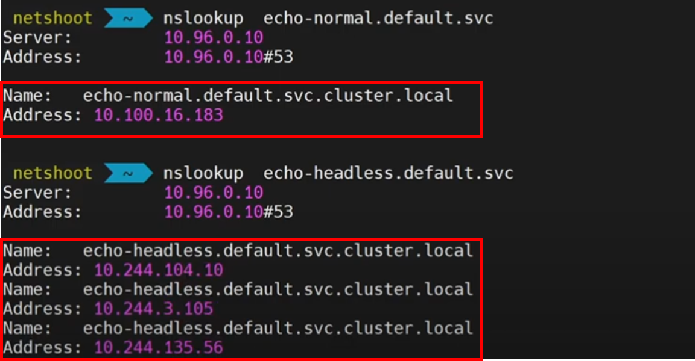

## 10장 스테이트풀셋 : 복제된 스테이트풀 애플리케이션 배포하기


### 스테이트풀셋 이란?


스테이트풀셋은 애플리케이션의 스테이트풀을 관리하는데 사용하는 워크로드 API 오브젝트이다.
파드 집합의 디플로이먼트와 스케일링을 관리하며, 파드들의 순서 및 고유성을 보장한다 .
디플로이먼트와 유사하게, 스테이트풀셋은 동일한 컨테이너 스펙을 기반으로 둔 파드들을 관리한다. 디플로이먼트와는 다르게, 스테이트풀셋은 각 파드의 독자성을 유지한다. 이 파드들은 동일한 스팩으로 생성되었지만, 서로 교체는 불가능하다. 다시 말해, 각각은 재스케줄링 간에도 지속적으로 유지되는 식별자를 가진다.
스토리지 볼륨을 사용해서 워크로드에 지속성을 제공하려는 경우, 솔루션의 일부로 스테이트풀셋을 사용할 수 있다. 스테이트풀셋의 개별 파드는 장애에 취약하지만, 퍼시스턴트 파드 식별자는 기존 볼륨을 실패한 볼륨을 대체하는 새 파드에 더 쉽게 일치시킬 수 있다.


 

**Stateless 애플리케이션**을 예로 들면 아파치, nginx, IIS 가 있습니다.

 

해당 애플리케이션에서 서비스가 죽으면 단순 복제로 대체해주면 됩니다.

볼륨의 경우 같은 내용을 서비스하기 때문에 필요하다면 하나의 볼륨에 다수가 접근하면 됩니다.

 

***네트워크 트래픽***에서는 서비스에 접근하면 부하를 방지하기 위해 각각 분산을 하게 됩니다.

 

 

**Stateful 애플리케이션**은 각각의 역할이 있는데 **Primary 메인 DB**가 있고 **Secondary로 Primary가 죽으면 대체할 DB**이 존재하고 이를 **감시하는 Arbiter**가 있습니다.

 

각각의 역할이 있기 때문에 아비터가 죽으면 아비터 역할을 살려줘야 합니다.

또한, 각각의 역할마다의 볼륨을 사용하기 때문에 원래 사용하던 볼륨에 접근해야 해당 역할을 이어갈 수 있습니다.

 

***네트워크 트래픽***에서는 대체로 내부 시스템들이 데이터베이스에 사용되는데 각 앱에 특징에 맞게 들어가야 합니다.

**App1**에는 메인DB로 Read/Write가 가능하므로 내부 시스템들이 CRUD를 모두 하려면 이곳으로 접근해야하고

**App2**는 Read 권한만 있기 때문에 조회만 할 때 트래픽 분산을 위해 사용할 수 있으며

**App3**은 Primary와 Secondary를 감시하고 있어야 하기 때문에 App1,2에 연결이 되어야 합니다.

 


쿠버네티스에서 마이크로서비스 구조로 동작하는 애플리케이션은 대부분 상태를 갖지 않는 경우(Stateless) 가 많습니다. 그러한 경우에는 디플로이먼트,레플리카셋을 통해 쉽게 애플리케이션을 배포할 수 있습니다.

 

하지만, 레플리케이션 컨트롤러나 레플리카셋을 제공하는 파드는 각 별도의 볼륨을 사용할 수 있는 방법을 제공해주지 않아 **모두 같은 볼륨으로 같은 상태를 가질수 밖에 없습니다**. 또한 **데이터베이스처럼 상태를 갖는(Stateful) 애플리케이션**을 쿠버네티스에서 **실행하는 것은 매우 복잡한 일** 입니다. 왜냐하면 Pod 내부의 데이터를 어떻게 관리해야 할지, 상태를 갖는 Pod에는 어떻게 접근할 수 있을지 등을 꼼꼼히 고려해야 하기 때문입니다.

 

쿠버네티스가 이에 대한 해결책을 완벽하게 제공하는 것은 아니지만, **스테이트 풀셋**이라는 쿠버네티스 오브젝트를 통해 어느정도 해결할 수 있도록 제공하고 있습니다.

즉, 파드마다 각각 다른 스토리지를 사용해 각각 다른 상태를 유지하기 위해서는 **스테이트풀셋 (StatefulSet)** 리소스를 사용하면 됩니다.

또한, 목적에 따라 해당  파드에 연결하기 위한 **Headless Service** 를 달아주면 됩니다.

 

 

|                                    | **레플리카셋**                                               | **스테이트풀셋**                                        |
| ---------------------------------- | ------------------------------------------------------------ | ------------------------------------------------------- |
| 파드 생성시 이름 설정              | Random 이름으로 설정 cf) Pod-ska25, Pod-dk15d ...            | Ordinal index 이름으로 생성 cf) Pod-0, Pod-1, Pod-2 ... |
| 파드 생성 시 순서                  | 동시 생성                                                    | 순차 생성. 0->1->2...                                   |
| 파드 Recreate 시                   | 파드 이름 변경 cf) Pod-sdf34 -> Pod-vjng3                    | 파드 이름 유지 cf) Pod-2 -> Pod-2                       |
| 파드 삭제 시 순서                  | 동시 삭제                                                    | **인덱스 높은 순부터 순차 삭제** 2->1->0                |
|                                    |                                                              |                                                         |
| 파드의 수를 늘리면 PVC는?          | 1개의 PVC에 모두 연결                                        | 각각의 PV 를 생성한 뒤 연결                             |
| PVC 연결된 특정 파드를 죽으면?     | NodeSelector 가 설정 되어 있다면 해당 노드에 동일한 서비스로 랜덤한 파드이름 생성 (같은 노드에 PVC,파드가 생성되지 않으면 연결되지 않음) | 특정 파드와 동일한 파드를 생성 후 기존 PVC와 연결       |
| PVC가 연결된 파드 수를 0으로 하면? | PVC도 삭제함                                                 | PVC는 삭제하지 않음                                     |


---


### 스테이트풀셋을 배포하기위해 필요한것

- PV
- Headless svc
  - **ClusterIP가 없는 서비스**
  - **pod를 그룹으로 관리하고 POD IP목록을 직접 조회가 필요한 아키텍처에서 사용**
  - 일반 서비스는 kube-proxy가 처리하므로 서비스가 트래픽을 로드밸런싱 합니다. 하지만 headless서비스는 서비스를 거치지 않고 pod에 직접 접근
  - 
- StatefulSet
  - 왜 쓰는지
  - 언제쓰는지
  - Deployment 사용방법 차별점
    - VolumeClaimTemplates


---


### 레코드 종류

#### **A** 레코드

A레코드는 특정 도메인에 매핑하는 IP주소(IPv4)를 알려줍니다.

간단히 말해, A record는 “ ‘lifeoncloud.kr’의 IP 주소가 ‘183.111.199.159’이다.”라고 말하는 역할을 합니다.

##### 

##### NSLookup이란? 

**n**ame **s**erver **lookup**. 

nslookup은 여러 운영체제에서 사용할 수 있는 네트워크 관리 명령줄 도구입니다.

nslookup을 사용하면 도메인네임, IP주소, 기타 DNS레코드를 알 수 있습니다.


nslookup -type=a {도메인}

```cmd
$ nslookup -type=a lifeoncloud.kr

Server: 1.214.68.2
Address: 1.214.68.2#53
Non-authoritative answer:
Name: lifeoncloud.kr
Address: 183.111.199.159

 
```

 

A레코드는 반드시 일대일 매칭이 될 필요는 없습니다. 일대다, 다대일도 가능합니다.


---


#### **NS 레코드**

Name Server 레코드.

네임서버 레코드는 

“ ‘lifeoncloud.kr’ 도메인을 관리하는 네임서버는 ‘ns2.cafe24.co.kr.’ 입니다.”


##### 네임서버는 무엇일까요? 

네임서버는 도메인 이름과 IP주소를 서로 상호전환 시켜주는 서버를 말합니다.

대부분 도메인네임 하나당 2개 이상의 네임서버를 가지고 있습니다.


---


#### **AAAA 레코드**

AAAA 레코드는, A레코드와 똑같은 역할을 수행합니다.

차이점은 IPv4 주소 체계에서 쓰이는 A레코드와 달리, AAAA레코드는 IPv6 주소 체계에서 쓰인다는 점입니다.

  

---


 

##### **CNAME**

CNAME 레코드는 

“ ‘test.lifeoncloud.kr’는 ‘lifeoncloud.kr’를 바라보고 있습니다.”라고 말하는 역할을 합니다. 


| 이름                | 타입  | Value           |
| ------------------- | ----- | --------------- |
| lifeoncloud.kr      | A     | 183.111.199.159 |
| test.lifeoncloud.kr | CNAME | lifeoncloud.kr  |
| mail.lifeoncloud.kr | CNAME | lifeoncloud.kr  |

 

A 레코드에 의하여, lifeoncloud.kr 은 183.111.199.159 을 가리키게 됩니다.

lifeoncloud.kr ⇒ 183.111.199.159

 

CNAME 레코드에 의하여, test.lifeoncloud.kr 은 lifeoncloud.kr 을 가리키게 됩니다.

그리고 다시 A레코드에 의하여, lifeoncloud.kr 은 183.111.199.159 을 가리키게 됩니다. 

test.lifeoncloud.kr ⇒ lifeoncloud.kr ⇒ 183.111.199.159

 

mail.lifeoncloud.kr도 마찬가지 입니다.

mail.lifeoncloud.kr ⇒ lifeoncloud.kr ⇒ 183.111.199.159


---


#### CName Record 를 왜 사용하는지?


---


#### **SRV 레코드**

Service 레코드.

SRV 레코드는 서비스를 호스팅하는 **서버의 위치(호스트 이름 및 포트 번호)를 식별하는데 사용되는 DNS 레코드**입니다. 

예를 들면, 서버의 특정 포트에서 비디오나 오디오 연결을 하려면 SIP 프로토콜을 사용하는데, 이 SIP 프로토콜에 SRV레코드가 들어갑니다.

GSLB(Global server load balancing)에서 특정 포트를 지정할 때에도 사용합니다.

 

SRV레코드는 GSLB 페일오버 등 가중치와 포트를 이용한 사용처가 많습니다.

  

형식 설명

- service : 서비스 이름. 앞에 언더바(_)가 붙습니다.
- proto : 서비스의 전송 프로토콜. 일반적으로 TCP 또는 UDP이며, 앞에 언더바(_)가 붙습니다.
- name :이 레코드가 적용되는 도메인 이름. 점으로 끝납니다.
- TTL : 표준 DNS TTL(Time to Live)
- class : 표준 DNS class. 
- SRV : 레코드 유형. 항상 SRV라고 씁니다.
- priority : 대상 호스트의 우선 순위입니다. 값이 낮을수록 선호도가 높습니다
- weight : 우선 순위가 같은 레코드에 대한 상대적 가중치. 값이 높을수록 선택될 가능성이 높습니다.
- port : 서비스의 포트.
- target : 서비스를 제공하는 시스템의 정식 호스트 이름. 점으로 끝납니다.

 


---

### 외부에서 쿠버네티스의 클러스터링된 리소스들에 대한 접근방법(Redis)


레디스 클러스터 환경에서 특정 키의 데이터가 특정 노드에 없는 경우 일반적으로 다음과 같은 상황이 발생합니다

**MOVED 리다이렉션**: 클라이언트가 잘못된 노드에 키를 요청하면 레디스는 `MOVED` 에러와 함께 올바른 노드 정보를 반환합니다. 예: `MOVED 3999 127.0.0.1:6381`

**ASK 리다이렉션**: 클러스터 리샤딩 중에 키가 다른 노드로 이동 중일 때 `ASK` 응답이 발생합니다.


* 각 노드별 NodePort 서비스 (권장)

* Ingress 컨트롤러와 TCP 프록시 (고급)

  * ```yaml
    apiVersion: networking.k8s.io/v1
    kind: Ingress
    metadata:
      name: redis-ingress
      annotations:
        nginx.ingress.kubernetes.io/tcp-services: "6379:redis-headless:6379"
    spec:
      rules:
      - host: redis-cluster.example.com
        http:
          paths:
          - path: /
            pathType: Prefix
            backend:
              service:
                name: redis-headless
                port:
                  number: 6379
    ```

  * **IP 주소 변환 처리**:

    - 외부에서 접속할 때 레디스 MOVED 리다이렉션 응답의 내부 IP 주소를 외부에서 접근 가능한 주소로 변환해야 합니다.

    - 이를 위해 레디스 클러스터 설정 시 

      ```yaml
      # redis.conf
      cluster-announce-ip <외부 접근 가능한 IP>
      cluster-announce-port <NodePort 번호>
      ```


---

참조


https://kubernetes.io/ko/docs/concepts/workloads/controllers/statefulset/

https://nearhome.tistory.com/107

https://malwareanalysis.tistory.com/493

https://blog.o3g.org/network/dns-record/
