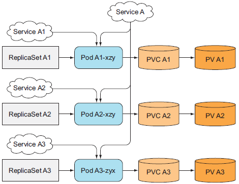
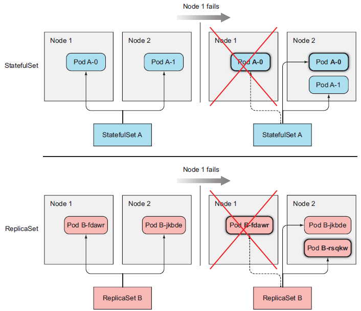

## 10. 스테이트풀셋: 복제된 스테이트풀 애플리케이션 배포하기

```
10장에서 다루는 내용
- 클러스터된 스테이트풀 애플리케이션 배포
- 파드 레플리카에 안정적인 이름과 호스트 이름 보장
- 예측 가능한 순서대로 파드 레플리카의 시작과 중지
- DNS 서비스 레코드를 통한 피어 디스커버리

```

#### 동일 레플리카셋의 모든 파드는 항상 같은 퍼시스턴트볼륨클레임과 퍼시스턴트볼륨을 사용
- 레플리카셋을 사용해서는 각 인스턴스가 별도의 스토리지를 필요로 하는 분산 데이터 저장소를 실행 불가


<br>

#### 파드 인스턴스별로 하나의 레플리카셋 사용하기
- 이렇게 구성하여 PVC, PV를 분리할 수 있지만 레플리카수 변경이 안됨. (계속 추가로 생성해야함)  
  
  


<br>

#### 동일 볼륨을 여러 개 디렉터리로 사용
- 이 방법은 인스턴스간 조정이 필요하고 올바르게 수행하기 쉽지 않으며, 공유 스토리지 볼륨에 병목현상이 생김


<br>

#### 각 파드 인스턴스별 전용 서비스 사용
- 파드당 하나의 서비스와 레클리카셋을 사용하여 안정적인 네트워크 주소와 개별 볼륨 제공
→ 개별 파드는 자신이 어떤 서비스를 통해 노출되는지 알수 없으므로 안정적인 IP를 알수 있는것도 아니고, 모든 문제 해결안됨.



<br>

#### 스테이트풀셋과 레플리카셋
|구분|레플리카셋(가축)|스테이트풀셋(애완동물)|
|--|--|--|
|파드 교체성|단순 교체(Stateless)|삭제된 파드와 동일한 이름, 호스트 이름 보장 (Stateful)|
|레플리카 수 지정|가능|가능|
|파드 템플릿 사용|가능|가능|
|생성 파드 특성|자체 스토리지 미보유<br>-----------------<br>무작위 아이덴티티|각 파드별 자체 볼륨 세트 (스토리지)를 보유<br>-----------------<br>예측가능한 아이덴티티(파드 및 호스트 이름, 거버닝 서비스)|
|스케일 업|동일한 파드이므로 무작위 생성|동일한 이름, 호스트이름, 아이덴티티 부여.<br>신규 파드에 대한 이름 예측 가능 (인덱스 +)|
|스케일 다운|동일한 파드이므로 무작위 생성|가장 높은 인덱스 인스턴스를 항상 우선 삭제<br>인스턴스 전체가 정상일 경우만 진행<br>파드만 삭제하고 볼륨 클레임은 삭제하지 않음|

<br>

#### 안정적인 네트워크 아이덴티티 제공
스테이트풀셋의 이름과 인스턴스의 서수 인덱스로부터 파생되므로 파드의 이름 예측가능


##### 거버닝 서비스
모든 파드가 예측 가능한 이름과 호스트 이름을 가지는 것이 아니므로 거버닝 헤드리스 서비스를 생성해서 각 파드에게 실제 네트워크 아이덴티티를 제공해야함.
이 서비스를 통해 각 파드는 자체 DNS 엔트리를 가지며 클러스터의 피어 혹은 클러스터의 다른 클라이언트가 호스트 이름을 통해 파드의 주소를 지정할 수 있음.

<br>

#### 스테이트풀셋 교체
스테이트풀셋은 동일한 아이덴티티를 가진 새 파드로 교체하고 레플리카셋은 관련없는 새 파드로 교체함.


<br>

#### 스테이트풀셋 생성과 삭제
스테이트풀셋은 스케일 다운 시 PVC를 삭제하지 않고 다음 스케일 확장 시 다시 연결함함


<br>

#### 스테이트풀셋을 통한 애플리케이션 배포하기
* 데이터 파일을 저장하기 위한 퍼시스턴트볼륨 생성
* 스테이트풀셋에 필요한 거버닝 서비스
  * clusterIP 필드를 None으로 설정하여 헤드리스 서비스 생성 (파드간 피어 디스커버리에 사용)
* 스테이트풀셋 생성
  * 스테이트풀셋은 레플리카셋과 달리 동시에 생성되지 않음.
  * 특정 클러스터된 스테이트풀 애플리케이션은 두 개 이상의 멤버가 동시에 생성되면 레이스 컨디션에 빠질 가능성이 있어서 순차 생성함.
  (레이스 컨디션 : 동시에 여러 작업이 진행될 때 그 작업 순서가 결과에 영향을 미치는 것)

<br>


#### 스테이트풀셋의 피어 디스커버리
피어 디스커버리는 클러스터된 애플리케이션의 주요 사항 중 하나로 **클러스터의 다른 멤버를 찾는 기능을 의미**
API 서버와 직접 통신해서 확인하는 바람직하지 않은 방법말고 쿠버네티스-독립적(Kuberenetes-Agnostic)이도록 애플리케이션을 유지하면서 기능을 노출하는 것
DNS 레코드의 한 유형인 SRV 레코드를 사용하면 가능

##### SRV 레코드
특정 서비스를 제공하는 서버의 호스트 이름과 포트를 가리키는 데에 사용됨
DNS lookup 도구인 dig를 실행해 SRV 레코드를 조회할 수 있음
쿠버네티스는 헤드리스 서비스를 뒷받침하는 파드의 호스트 이름을 가리키도록 SRV 레코드를 생성
파드가 스테이트풀셋의 다른 모든 파드의 목록을 가져오려면 SRV DNS 룩업을 수행하면 됨


<br>

#### 분산 데이터 저장소의 동작
1. 애플리케이션이 Get 요청을 받음
2. 요청받은 서버는 헤드리스 kubia 서비스의 SRV 레코드 룩업을 수행
3. GET 요청을 서비스하는 각 파드에 보냄
4. kubia-1에 저장된 데이터 가져옴
5. kubia-2에 저장된 데이터 가져옴
6. 모든 노드의 리스트 반환
   
