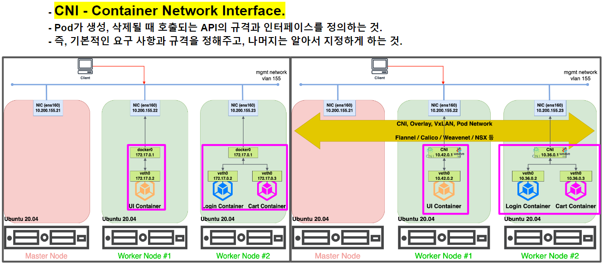

## 11. 쿠버네티스 내부 이해

```
11장에서 다루는 내용
- 쿠버네티스 클러스터 구성 요소
- 각 구성 요소의 기능과 동작 방법
- 디플로이먼트 오브젝트를 생성해 파드를 실행하는 방법
- 실행 중인 파드에 관하여
- 파드 간의 네트워크 동작 방식
- 쿠버네티스 서비스의 동작 방식
- 고가용성 실현 방법
```


#### 쿠버네티스 구성 요소의 분산 특정
k8s시스템 구성 요소는 오직 API 서버하고만 통심.
  

|구분|구성요소|비고|
|--|--|--|
|컨트롤 플레인|etcd 분산 저장 스토리지 (병렬수행 가능)<br>API 서버 (병렬수행 가능) <br>스케쥴러 (하나의 인스턴스만 활성화)<br>컨트롤러 매니저 (하나의 인스턴스만 활성화)|여러 서버에 걸쳐 실행될 수 있음|
|워커노드|kubelet<br>kube-proxy<br>컨테이너 런타임|모두 동일한 노드에서 실행되어야함|
|애드온|쿠버네티스 DNS 서버<br>대시보드<br>Ingress Controller<br>힙스터<br>CNI (Container Network Interface)||

<br>

[참고 Site] : https://sphong0417.tistory.com/53
#### etcd
- **쿠버네티스에서 생성된 모든 오브젝트는 상태와 매니페스트를 영구적으로 저장해야함.**
- 이를 위해서 쿠버네티스는 분산 key-value 저장소인 etcd를 사용
- etcd는 분산된 아키텍처 형태를 가질 수 있으며 이를 통해 **고가용성 및 빠른 성능 제공**
- 쿠버네티스는 etcd v2나 v3를 모두 지원하지만 v3가 더 나은 성능을 보여주기 때문에 v3를 사용하는 것을 권장함
- v3 기준으로 etcd는 계층적 key 구조를 통해 /registry 아래에 모든 데이터를 저장함

**장점**
* **유효성 검사**
  * etcd에 저장하기 전 API 서버를 통해 저장하려는 데이터의 유효성을 검증함
* **낙관적 동시성 제어**
  * 낙관적 동시성 제어는 데이터에 잠금을 설정해 업데이트를 막는 대신 데이터에 버전을 포함하는 방식으로 만약 클라이언트가 데이터를 읽고 업데이트를 제출하는 사이에 버전 번호가 변경되었다면 해당 업데이트는 거부되고 이전에 업데이트 된 내용을 읽고 다시 업데이트를 수행함
  * 낙관적 동시성 제어는 데이터를 선점하지 않기때문에 성능상 이점이 있음
  * 이를 통해 오류가 발생할 가능성을 줄이고 일관성을 유지할 수 있게 해줌

<br>

#### 클러스트링된 etcd의 일관성 보장
- 고가용성을 보장하기 위해 두 개 이상의 etcd 인스턴스를 실행하는 것이 일반적이며, 여러 etcd 인스턴스는 일관성을 유지하기 위해 RAFT 합의 알고리즘 사용


- 클러스터가 연결이 끊어진 두 개의 노드 그룹으로 분리될 경우, etcd-2는 과반을 충족 못하므로 상태가 변경되지 않음.


<br>

#### API Server
- API Server는 클러스터의 모든 구성요소가 다른 구성요소와 통신하기 위해 필요한 중요 구성요소로 클러스터와 관련된 다양한 REST API를 제공함. (상태는 etcd안에 저장)


- 클라이언트가 API 서버에 리소스 생성 및 조회의 요청을 보내게 되면 다음과 같은 과정을 거침.

  1. 요청을 보낸 클라이언트가 인증된 클라이언트인지 확인
  2. 인증된 사용자가 현재 보낸 요청을 수행할 수 있는 권한이 있는지 확인
  3. (리소스 생성 및 수정, 삭제) 리소스를 기존에 정의된 플러그인을 통해 수정
  4. 리소스의 유효성을 확인한 후 etcd에 저장
  5. 리소스의 변경 사항을 리소스를 감시하고 있는 모든 클라이언트에게 통보


#### Scheduler
* 클라이언트가 Pod을 생성하면 리소스를 고려해 어떤 노드에 배치될지는 Scheduler가 결정함
* 어떤 노드에 스케줄링 될지 결정하여 Pod의 Spec을 변경하고 이를 API 서버에게 전송하고 최종적으로 API 서버는 워커 노드의 Kubelet에게 이 정보를 보냄으로써 Pod이 해당 노드에서 실행됨.

* Scheduler는 먼저 디스크, 메모리, 포트, affinity, taint와 같은 다양한 조건을 통해 스케줄링 될 수 있는 노드를 선정
* 이렇게 선출된 노드 목록 중 우선순위를 부여하고 가장 높은 우선순위를 갖는 노드에 Pod을 스케줄링함
* 일반적으로는 위의 과정을 수행하는 기본 스케줄러를 사용하게 되지만 사용자가 직접 스케줄러를 구현하거나, 다른 메커니즘을 가진 스케줄러를 배포해 사용할 수도 있음.

#### Controller Manager
* Scheduler를 통해 Pod이 스케줄링 되었다면 Controller를 통해 해당 리소스를 원하는 상태로 만듬
→ 실제 작업은 Controller에서 수행하고 컨트롤러 매니저는 다양한 컨트롤러들을 실행하는 역할을 담당.

##### Controller
* Controller는 API 서버를 통해 리소스의 변경을 감시하고 변경하는 작업을 담당
* 클라이언트가 선언한 Spec으로 조정하며 새롬게 변경된 상태를 Status에 저장함
* 쿠버네티스에는 기본적으로 제공되는 다양한 Controller 존재   (ex. Deployment, ReplicaSet, StatefulSet 등)    
   
레플리케이션 매니저 예시
  

#### Kubelet
* 워커노드에서 실행하는 모든 것을 담당하는 구성요소
  * Scheduler에 의해 Pod가 스케줄링되면 API 서버는 Kubelet에게 Pod을 생성하라는 요청을 보냄. 
  * 이 요청을 받은 Kubelet은 지정된 컨테이너 런타임과 이미지를 사용해 컨테이너를 생성
  * 실행 중인 컨테이너를 모니터링하며 관련된 정보를 API 서버에게 보냄 
  * 추가로 Liveness Probe가 설정되어 있는 경우, 컨테이너를 재시작하는 역할도 kubulet에서 담당함.

#### Kube-Proxy
* Kube-Proxy는 서비스의 IP 및 포트로 들어온 접속을 서비스의 엔드포인트에 해당하는 Pod에 연결하는 역할을 담당
* Proxy라는 이름이 붙은 이유는 초기 쿠버네티스 버전에서 kube-proxy는 userspace에서 동작하던 프록시였기 때문
* 현재는 성능이 더 우수한 iptables 프록시 모드로 수행됨    
  
userspace 프록시 모드
  

iptables 프록시 모드


* 두 모드의 가장 큰 차이점은 패킷이 kube-proxy를 통과해 사용자 공간에서 처리되는지, 아니면 커널에서 처리되는지 여부로 이는 성능에 큰 영향을 줌.
* userspace 프록시 모드는 Round Robin 방식, iptables 프록시 모드는 random 방식.
  
#### 애드온 배포 방식
애드온은 yaml 매니페스트를 API 서버에 게시해 파드로 배포된다.

##### 디플로이먼트로 배포된 애드온
```bash
$ kubectl get deploy -n kube-system
NAME                          READY   UP-TO-DATE   AVAILABLE   AGE
cilium-operator               1/1     1            1           63d
coredns                       2/2     2            2           63d
coredns-secondary             2/2     2            2           63d
csi-cinder-controllerplugin   1/1     1            1           63d
dns-autoscaler                1/1     1            1           63d
dns-autoscaler-secondary      1/1     1            1           63d
kubernetes-dashboard          1/1     1            1           63d
kubernetes-metrics-scraper    1/1     1            1           63d
```
  

##### DNS 서버 동작 방식
* 파드는 기본적으로 클러스터 내부 DNS 서버를 사용하도록 설정
* DNS 서버 파드는 kube-dns 서비스로 노출되며 해당 서비스의 ip 주소는 클러스터에 배포된 모든 컨테이너가 가지고 있는 /etc/resolv.conf 파일안에 nameserver로 지정
* kube-dns 파드는 API 서버를 통해 서비스와 엔드포인트의 변화를 관찰하고 DNS 레코드에 갱신

[참고 Site] : https://kubetm.github.io/k8s/08-intermediate-controller/ingress/
##### 인그레스 컨트롤러 동작 방식
* 인그레스 컨트롤러는 리버스 프록시 서버(nginx)를 실행하고 클러스터에 정의된 인그레스, 서비스, 엔드포인트 리소스 설정을 유지하고 컨트롤러는 이러한 리소스를 감시하고 변경
* 인그레스 컨트롤러는 트래픽을 서비스의 IP로 전달하지 않고 서비스의 파드로 전달


#### 이벤트 체인
디플로이먼트 매니페스트 yaml을 kubectl을 사용해 쿠버네티스에 생성하는 예시


<br>

[참고 Site] : https://velog.io/@chan9708/K8S-network-%EB%B0%8F-CNI-%EC%9D%B4%EB%A1%A0-%EC%A0%95%EB%A6%AC
#### CNI
* 컨테이너를 네트워크에 쉽게 연결하기 위해 시작
* Calico, Flannel, Romana, Weave Net, 그 외 기타

##### veth
 
* 가상 이더넷 인터페이스
* 항상 쌍(pair)로 생성되어 연결된 상태를 유지한다.
* 네트워크 인터페이스 간의 터널 역할

##### Bridge
  

  

* 컨테이너는 호스트와 네트워크 네임스페이스 격리하여 호스트 - 컨테이너 간 veth pair 생성 연결
* 각 컨테이너의 veth들은 Bridge로 연결하여 같은 Bridge에 연결된 컨테이너 간 통신이 가능하고 컨테이너 네트워크 외부로 통신 시 Bridge를 경유한다.

##### Pod 네트워크


##### k8s에서는


##### 따라서 k8s Pod 네트워크는 CNI를 사용

* Pod들은 각자 고유의 IP를 가진다.
* 클러스터 내의 모든 Pod들은 NAT 없이 서로 통신이 가능하다.
* 노드의 Agent들은 해당 노드의 모든 Pod와 통신이 가능하다.

<br>

#### 고가용성 클러스터
* 가동 중단 시간 감소를 위한 다중 인스턴스 실행
* 중단 시간 발생 방지를 위한 비활성 복제본 실행. 활성 상태인 인스턴스를 하나만 지정하도록 빠른 임대 (fast-acting lease), 리더 선출 메커니즘 등을 활용. 
* 가용성 향성을 위해 etcd, API 서버, 컨트롤러 매니저, 스케줄러는 마스터 노드에서 실행
     
##### 3개의 마스터 노드로 구성된 고가용성 클러스터 예시   
  

  * etcd는 분산 시스템이므로 고가용성을 위해 여러 노드에 분산 가능. (5, 7대)
  * 여러 API 서버 인스턴스 실행. API 서버는 스테이트리스하므로 분산 가능. 다만 로드밸런서가 API 서버 앞에 위치해 항상 정상 작동하는 인스턴스로만 연결됨. 그와 달리 etcd는 그 뒤에서 API 서버와 로컬로 통신.
  * 컨트롤러, 스케줄러의 경우 인스턴스 간 작업 중복 및 경쟁이 발생할 수 있으므로 한번에 하나의 인스턴스만 활성화되도록 리더 선출 메커니즘 등을 활용해 리더의 작업 수행 중 다른 인스턴스는 작업 실패를 대기. 
* 리더 선출 메커니즘 : 인스턴스 간 대화가 필요 없이 오브젝트 생성 작업만으로 동작. 엔드포인트 리소스 생성 및 갱신 시 leader라는 어노테이션에 먼저 해당 필드에 이름을 넣는데 성공한 인스턴스가 유일한 리더가 되는 구조.  
