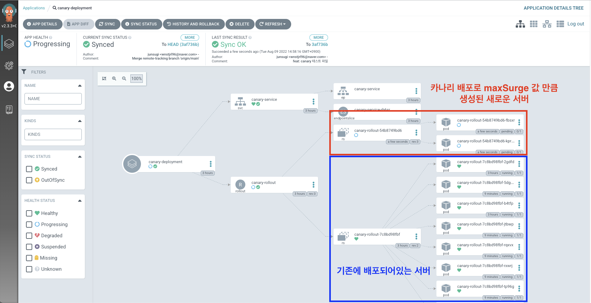

## 9장 디플로이먼트 : 선언적 애플리케이션 업데이트


---


### 디플로이먼트를 왜 쓰는가?

클라이언트인 kubectl 을 통하여 파드수를 조절하며 롤링배포를한다.

명령을 주어서 처리하기보다 선언하고 그 상태를 달성할 수 있도록 처리하기위해

예를들어 배포시 kubectl 이 업데이트를 계속 요청하는 도중 중간에 에러발생하면 중단이 발생하니 지양해야함


---

### RollingUpdate 전략 옵션

1. maxUnavailable
   - **롤링 업데이트 중 최대로 삭제할 파드 갯수**
   - 높게 설정하면 롤링 배포를 빠르게 적용 가능
   - 트래픽이 남아있는 소수의 파드로 집중될 수 있어 값을 적절히 설정 필요
   - 절대 숫자(예: `2`)나 백분율(예: `25%`)로 지정할 수 있습니다
   - 기본값: 25%
2. maxSurge
   - **롤링 업데이트를 위해 최대로 생성할 수 있는 파드 갯수**
   - 높게 설정하면 롤링 배포를 빠르게 적용 가능
   - 절대 숫자(예: `2`)나 백분율(예: `25%`)로 지정할 수 있습니다
   - 기본값: 25%

```yaml
apiVersion: apps/v1
kind: Deployment
metadata:
  name: example-deployment
spec:
  replicas: 3
  strategy:
    type: RollingUpdate
    rollingUpdate:
      maxSurge: 1
      maxUnavailable: 1
```

---


### 블루그린 배포

---


#### 쿠버네티스 Deployment 를 사용한 블루그린 배포

https://velog.io/@junnn0021/%EC%BF%A0%EB%B2%84%EB%84%A4%ED%8B%B0%EC%8A%A4-%EB%B8%94%EB%A3%A8%EA%B7%B8%EB%A6%B0-%EC%B9%B4%EB%82%98%EB%A6%AC-%EB%B0%B0%ED%8F%AC

---


#### ArgoCD Rollout 을 활용한 블루그린 배포


Rollout은 2개의 서비스를 이용해 preview와 active로 나누어서 Blue와 Green을 구분하며,

active 에서는 blue가 보이고, preview에서는 green이 보이게 지정한다.

 

autoPromotionEnabled 옵션은 자동으로 배포할 것인지, 관리자가 수동으로 승인할 것인지에 대한 여부를 묻는 옵션


```yaml
apiVersion: argoproj.io/v1alpha1     
kind: Rollout  # Deplyment 대신 Rollout을 사용한다
metadata:
  name: rollout-bluegreen
spec:
  replicas: 2
  revisionHistoryLimit: 2
  selector:
    matchLabels:
      app: rollout-bluegreen
  template:
    metadata:
      labels:
        app: rollout-bluegreen
    spec:
      containers:
      - name: rollouts-demo
        image: argoproj/rollouts-demo:blue
        # image: argoproj/rollouts-demo:green
        imagePullPolicy: Always
        ports:
        - containerPort: 8080
  strategy:
    blueGreen: 
      activeService: rollout-bluegreen-active
      previewService: rollout-bluegreen-preview      
      #autoPromotioEnabled 옵션은 Blue/Green 배포를 자동으로 진행할 것인지 여부. false 옵션을 사용해 수동으로 지정
      autoPromotionEnabled: false

---
kind: Service
apiVersion: v1
metadata:
  name: rollout-bluegreen-active
spec:
  selector:
    app: rollout-bluegreen
  ports:
  - protocol: TCP
    port: 80
    targetPort: 8080
    nodePort: 30081
  type: NodePort

---
kind: Service
apiVersion: v1
metadata:
  name: rollout-bluegreen-preview
spec:
  selector:
    app: rollout-bluegreen
  ports:
  - protocol: TCP
    port: 80
    targetPort: 8080
    nodePort: 30082
  type: NodePort
```


---


### 카나리 배포

---


#### 쿠버네티스 Deployment 를 사용한 카나리 배포

https://yscho03.tistory.com/72

---


#### ArgoCD Rollout 을 활용한 카나리 배포

```yaml
apiVersion: argoproj.io/v1alpha1
kind: Rollout # Rollout으로 생성
metadata:
  name: canary-rollout
spec:
  replicas: 8
  revisionHistoryLimit: 2
  selector:
    matchLabels:
      app: canary
  template:
    metadata:
      labels:
        app: canary
    spec:
      containers:
      - name: canary-rollouts-demo
        image: particule/simplecolorapi:1.0
        imagePullPolicy: Always
        ports:
        - containerPort: 5000
  # 이 부분에서 카나리로 지정
  strategy:
    canary:
      maxSurge: "25%"    # canary 배포로 생성할 pod의 비율
      maxUnavailable: 0  # 업데이트 될 때 사용할 수 없는 pod의 최대 수

      # 안정 버전을 가리키는 서비스 이름 (trafficRouting사용시 필수)
      #stableService: icis-sa-cmmn-service-rest-apigw

      # 카나리 버전을 가리키는 서비스 이름 (trafficRouting사용시 필수)
      #canaryService: icis-sa-cmmn-service-rest-apigw-preview
      
      #헤더 기반 라우팅시 반드시 세팅(Istio,ALB,Apisix 만 세팅 가능 OKD 는 불가)
      #trafficRouting:
      #  nginx:
      #    stableIngress: icis-sa-cmmn-service-rest-apigw-ingress  # 실제 Ingress 이름
      #    annotationPrefix: nginx.ingress.kubernetes.io  # 기본값, 변경 가능
      #    additionalIngressAnnotations:
      #      canary-by-header: X-Canary  # 선택적 추가 설정

      steps:
      - setWeight: 20
      - pause: {}
      - setWeight: 40
      - pause: {duration: 10}
      - setWeight: 60
      - pause: {duration: 10}
      - setWeight: 80
      - pause: {duration: 10}

      # header.responseType이 'S'(오류)인지 확인하여 롤아웃 진행 여부 결정
      # - 총 5회 체크를 수행하며 1분 간격으로 진행됨
      # - 1회라도 'S' 값이 감지되면 롤백 수행(failureLimit: 1)
      # - 5회 모두 'S'가 아니면 성공으로 간주하고 다음 단계로 진행
      # - 분석 중 일시적인 오류는 무시됨(inconclusive: ignore)
      #- analysis:
      #    templates:
      #    - templateName: elasticsearch-response-check
          
      # N단계: 헤더기반으로 라우팅 -> Istio,ALB,Apisix 만 세팅 가능 OKD 는 불가
      #- setHeaderRoute:
      #    name: header-route
      #    match:
      #      - headerName: User-Agent
      #        headerValue:
      #          regex: ".*Chrome.*"
---
kind: Service
apiVersion: v1
metadata:
  name: canary-service
spec:
  selector:
    app: canary
  ports:
  - protocol: TCP
    port: 80
    targetPort: 5000
    nodePort: 30081
  type: NodePort
---
#분석 템플릿
apiVersion: argoproj.io/v1alpha1
kind: AnalysisTemplate
metadata:
  name: elasticsearch-response-check
spec:
  metrics:
  - name: elasticsearch-response-check
    interval: 10s      # 30초마다 체크
    count: 5          # 총 5회 체크
    # responseType이 'I'가 아니면 성공 (조건 성공시 배포 진행)
    successCondition: "response.hits.hits[0].fields['header.responseType'][0] == 'I'"
    # responseType이 'I'이면 실패 (조건이 참이면 배포 실패)
    failureCondition: "response.hits.hits[0].fields['header.responseType'][0] == 'S' ||result.hits.hits[0].fields['header.responseType'][0] == 'E'"
    failureLimit: 1   # 1번 이상 실패시 실패로 간주 
    provider:
      #Prometheus: 가장 일반적으로 사용되는 방식
      #Datadog: Datadog 모니터링 서비스 사용
      #NewRelic: NewRelic 모니터링 서비스 사용
      #Wavefront: VMware Wavefront 모니터링 사용
      #Kayenta: Netflix의 Kayenta 분석 도구 사용
      #Web: HTTP 요청을 통한 커스텀 메트릭 사용
      #Job: Kubernetes Job을 실행하여 메트릭 수집
      web:
        url: https://elasticsearch.dev.icis.kt.co.kr:443/logs-kubernetes.container_logs-*/_async_search
        # 쿼리 파라미터
        jsonPath: "{$}"
        method: POST
        insecure: true   # 자체 서명 인증서를 사용하는 경우 필요
        # 인증 헤더
        headers:
        - key: Content-Type
          value: application/json
        - key: Authorization
          value: Basic ZWxhc3RpYzpuZXcxMjM0IQ==
        timeoutSeconds: 20
        # 요청 본문
        body: |
          {
            "sort": [
              {
                "@timestamp": {
                  "order": "desc",
                  "format": "strict_date_optional_time",
                  "unmapped_type": "boolean"
                }
              },
              {
                "_doc": {
                  "order": "desc",
                  "unmapped_type": "boolean"
                }
              }
            ],
            "track_total_hits": false,
            "fields": [
              {
                "field": "header.responseType",
                "include_unmapped": true
              },
              {
                "field": "@timestamp",
                "format": "strict_date_optional_time"
              }
            ],
            "size": 1,
            "version": true,
            "_source": false,
            "query": {
              "bool": {
                "must": [{ "range": { "@timestamp": { "gte": "now-60m" } } }],
                "filter": [
                  {
                    "match_phrase": {
                      "kubernetes.container.name": "icis-sa-rest-apigw"
                    }
                  },
                  {
                    "match_phrase": {
                      "category": "MON"
                    }
                  }, 
                  {
                    "match_phrase": {
                       "header.trFlag":"R"
                    }
                  }
                ],
                "should": [],
                "must_not": []
              }
            }
          }
```

`kind` 를 `Rollout` 으로 변경해주고 `strategy` 를 설정

`Auto Promotion` 이라는 말이 있는데, 새로운 서버가 `maxSurge` 에 적힌 퍼센티지에 따라서 그 수만큼 배포가 되는데, 새로운 서버가 `Canary` **배포된 후 얼마나 시간이 흐른 뒤 새로운 서버로 전부 배포할까요?** 라는 설정이다.

따라서 pause에 10분으로 설정해두면 새로운 서버가 `Canary`로 배포된 후 10분 뒤에 기존 서버가 점진적으로 삭제되면서 새로운 서버가 생성되는 것을 말한다.


setWeight필드는 카나리아로 보내야 하는 트래픽의 비율을 나타내고 pause는 롤아웃을 일시 중지하도록 지시한다. 

 

pause에 정의된 시간에 도달하면 설정부분 만큼 추가한다.

pause가 설정되면 카나리는 duration을 기다릴 때까지 다음 단계로 진행되지 않는다

duration을 사용하지않으면 카나리는 해당 일시 중지 조건이 제거될 때까지 무기한 대기한다. 

setWeight및 필드 를 사용하여 pause사용자는 새 버전으로 진행하려는 방법을 선언적으로 설명할 수 있다.

 

추가로 pause에는 다음과 같이 설정이 들어갈 수 있습니다. 유효한 시간 단위는 "s", "m", "h"이며 지정하지 않으면 기본값은 "s"이다.

```yaml
- pause: { duration: 30 }  # 30초
- pause: { duration: 30s } # 30초
- pause: { duration: 30m } # 30분
- pause: { duration: 30h } # 30시간
- pause: {}                # Auto Promotion 옵션 비활성화
- pause: { duration: -10 } # 잘못된 옵션
```




위에 빨간색 부분이 새롭게 `Canary` 배포로 생성된 새로운 서버이다. maxSurge가 25%로 설정되어 있고 `replicas` 가 `8` 로 되어있기 때문에 `8 * 25 / 100` 을 계산하면 `2` 가 나온다. 따라서 2개의 새로운 서버만 띄워져 있는 모습을 볼 수 있다.

여기서 `pause` 값에 시간이 정해져 있으면 그 시간만큼 시간이 흐른 뒤 자동으로 파란색 부분에 있는 기존 서버를 삭제하고 빨간색 부분에 새로운 서버가 8개로 점진적 생성이 된다.

만약 수동으로 `promote` 하고 싶을 경우 다음 명령을 입력해서 `promote` 할 수 있다.


---


### Argo Rollout 설치

argo-rollout 공식문서 https://argoproj.github.io/argo-rollouts

 

우선 위에 문서를 참조하고 argo-rollout의 namespace 및 설치

```
kubectl create namespace argo-rollouts
kubectl apply -n argo-rollouts -f https://github.com/argoproj/argo-rollouts/releases/latest/download/install.yaml
```

 

위에서 argo-rollouts을 설치하였으면 kubectl용 plugin 설치

```
# curl -LO https://github.com/argoproj/argo-rollouts/releases/latest/download/kubectl-argo-rollouts-linux-amd64
# chmod +x ./kubectl-argo-rollouts-linux-amd64
# mv ./kubectl-argo-rollouts-linux-amd64 /usr/local/bin/kubectl-argo-rollouts
# kubectl argo rollouts version
```


---


출처 

https://velog.io/@junsugi/Argo-CD-Canary-%EB%B0%B0%ED%8F%AC-%EB%B0%A9%EB%B2%95

https://jiheon95.tistory.com/104
