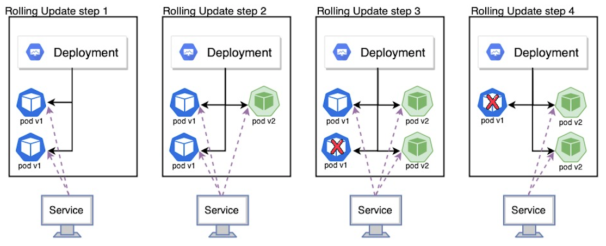

## Chapter9. 디플로이먼트: 선언적 애플리케이션 업데이트

```
9장에서 다루는 내용
- 파드를 최신 버전으로 교체
- 관리되는 파드 업데이트
- 디플로이먼트 리소스로 파드의 선언적 업데이트
- 롤링 업데이트 수행
- 잘못된 버전의 롤아웃 자동 차단
- 롤아웃 속도 제어
- 이전 버전으로 파드 되돌리기
```
<br>

#### 파드에서 실행중인 애플리케이션 업데이트
- 기존 파드 삭제 후 새 파드 시작 → 이전 파드가 삭제되고 새 파드가 시작되는 동안 짧은 시간의 다운타임을 허용할 수 있다면 파드 세트를 업데이트하는 가장 간단한 방법
- 다운타임 없이 새 파드를 기동한 후 이전 파드 삭제 (blue-green) → 리소스 여유가 있으면 가능

ImagePullPolicy : 동일한 이미지 태그로 업데이트하면 새로운 이미지를 가져오지 않으므로 해당 옵션을 설정해야 향상 Pull 함.
→ 이미지를 변경할 때마다 새로운 태그를 적용해야함.   

<br>

#### Rolling Update
k8s에서는 롤링 업데이트 기능을 사용하여 새로운 버전으로 파드를 하나씩 교체하여 다운타임 없이 롤링업데이트 가능
```bash
$ kubectl rolling-update kubia-v1 kubia-v2 --image=luksa/kubia:v2
Created kubia-v2
Scaling up kubia-v2 from 0 to 3, scaling down kubia-v1 from 3 to 0 (keep 3
pods available, don't exceed 4 pods)
...
```
<br>

#### kubectl rolling-update를 더 이상 사용하지 않는 이유
- 롤링 업데이트의 모든 단계는 kubectl 클라이언트에서 수행함.
→ kubectl이 업데이트를 수행하는 동안 네트워크 연결이 끊어진다면 업데이트 프로세스는 중간에 중단될 수 있음.
- k8s에 의도하는 시스템의 상태를 선언하고 k8s가 그것을 달성할 수 있도록 가장 좋은 방법을 찾아내어 그 상태를 달성하도록 설계됨.
  → 사용자가 실제 명령을 해서 조절하는게 아님.  

<br>

#### Deployment
레플리카셋을 통해 수행하는 대신 애플리케이션을 배포하고 선언적으로 업데이트 하기위한 리소스
디플로이먼트는 파드를 직접 관리하지 않고 레플리카셋을 생성하고 레플리카셋이 파드를 관리하도록함.

디플로이먼트에서 생성한 파드 이름 구성 <디플로이먼트 이름>-<레플리카셋 해시값>-<파드 해시값> 구조로 구성됨.

<br>

#### rolling-update vs deployment
- **rolling-update**
  - 레플리케이션컨트롤러를 사용해 애플리케이션을 실실행하므로 kubectl rolling-update를 실행해 쿠버네티스에 업데이트를 수행하도록 명시적으로 지시필요
  - 기존 레플리케이션컨트롤러를 대체하는 새 래플리케이션컨트롤러의 이름 지정필요
  - 모든 원본 파드를 새 파드로 교체하고 프로세스가 끝날 때 원본 레플리케이션컨트롤러 삭제 필요
  - 이 프로세스동안 터미널을 열여두고 kubectl에 롤링업데이트를 완료할때까지 대기필요.

- **Deployment**
  - 디플로이먼트 리소스에 정의된 파드 템플릿을 수정하기만하면 리소스에 정의된 상태로 만드는데 필요한 모든 단계를 수행함.

<br>

#### 디플로이먼트 전략
- **RollingUpdate 전략**
  - 이전 파드를 하나씩 제거하고 동시에 새 파드를 추가해 서비스 다운타임이 없도록 함 (기본 전략)
- **Recreate 전략**
  - 새 파드를 만들기 전에 이전 파드를 모두 삭제
  - 애플리케이션이 여러 버전을 병렬로 실행하는 것을 지원하지 않고 새 버전을 시작하기전에 이전 버전을 완전히 중지해야하는 경우 사용
  - 짧은 서비스 다운타임 발생

<br>

[참고 Site] : https://nearhome.tistory.com/106
#### RollingUpdate: 롤링업데이트 방식(기본값)   



**롤링 업데이트**란 새 버전을 배포하면서, 새 버전 파드를 하나씩 늘려가고 기존 버전의 파드를 하나씩 줄여나가는 방식 (=무중단 배포)
이전 버전과 새로운 버전이 공존하는 시간이 발생한다는 단점이 있음
 

##### maxUnavailable
- 롤링업데이트 프로세스 중에 사용할 수 없는 최대 파드의 수 (기본값: 25%).
→ **롤링 업데이트 중 동시에 삭제할 수 있는 파드의 최대 갯수를 의미**
- 퍼센트 및 직접 지정 가능
  - 정수: ex) 3
  - 비율: ex) 10%
  - 위 예시라면 롤링 업데이트 시작 시 3개가 동시에 삭제되거나 10% 비율만큼 삭제됨

값을 높게 설정하면 동시에 교체되는 파드가 늘어나므로 롤링 업데이트 시간은 줄어든다.
하지만 롤링 업데이트 중에 남아 있는 파드의 요청 수가 몰릴 수 있다.
따라서 1로 설정해 파드를 하나씩 교체하는 것이 안전할 수 있다.

##### maxSurge
- 생성할 수 있는 최대 파드의 수(기본값: 25%)
→ **롤링 업데이트 중 동시에 생성하는 파드 갯수**
  - 정수: ex) 3
  - 비율: ex) 10%
 
위의 예시라면 롤링 업데이트 시작 시 새 버전의 파드가 3개 추가되거나 10% 비율만큼 추가 생성한다.
값을 높게 설정하면 필요한 파드를 빨리 생성하므로 파드 교체 시간이 단축된다.
하지만, 필요한 시스템 자원이 급증할 수 있다.

<br>

[참고 Site] : https://www.gomgomshrimp.com/posts/k8s/rolling-update
##### 새로운 버전 Pod생성 후 기존 버전 Pod 종료
```yaml
rollingUpdate:
  maxSurge: 1
  maxUnavailable: 0
```
- maxUnavailable 값이 0이기 때문에 새로운 버전의 Pod가 생성되야만 종료가 발생합니다.
- replica + maxSurge 만큼의 Pod가 동시에 유지될 수 있습니다.
- 위 예시에서는 새로운 Pod가 1개가 생성되고 난 후 1개의 기존 Pod가 종료됩니다.
  - replica가 10개라면, 업데이트시 11개의 Pod가 동시에 유지될 수 있습니다.
  - replica가 10개라면, 다음과 같이 업데이트 됩니다.  
  
  
- **장점** : 새로운 Pod가 생성되어야 기존 Pod가 삭제되므로 안정적
- **단점** : 업데이트시 기존 replica보다 많은 Pod가 생성되는 순간이 있기 때문에 **리소스와 노드의 허용 Pod 수 고려 필요**

##### 기존 버전 Pod 종료 후, 새로운 버전 Pod 생성 방식
```yaml
rollingUpdate:
  maxSurge: 0
  maxUnavailable: 1
```

- maxSurge=0, maxUnavailable=1(또는 n)으로 설정
- maxSurge 값이 0이기 때문에 기존 버전의 Pod가 종료되어야만 새로운 버전의 Pod가 생성됩니다.
- replica - maxUnavailable 만큼의 Pod가 동시에 유지될 수 있습니다.
- 위 예시에서는 기존 Pod가 1개가 종료되고 난 후 1개의 새로운 버전의 Pod가 생성됩니다.
  - replica가 10개라면, 업데이트시 9개의 Pod가 동시에 유지될 수 있습니다.
  - replica가 10개라면, 다음과 같이 업데이트 됩니다.

  
- **장점** : 업데이트시 기존 설정 replica 수를 넘어가지 않으므로, 이미 배포가 되어있다면 리소스나 노드에 대해서 크게 고려하지 않아도 괜찮음
- **단점** : 기존 Pod를 먼저 삭제하는 부분에서 **안정성이 떨어질 수 있음**

<br>

##### minReadySeconds
MinReadySeconds 옵션 : pod status 가 ready 로 업데이트 될 때 까지 최소 대기 시간, 그 전까지 서비스에서 트래픽 받지 않음
liveness나 startup probe를 사용한다면 불필요.
경우에 따라서는 앱 자체가 readinessProbe를 설정해주기 어려운 상황인 경우
- .spec.minReadySeconds 옵션을 이용하면 어느정도 readinessProbe와 비슷한 효과를 낼 수 있습니다. 
- .spec.minReadySeconds은 pod의 status가 ready가 될때까지의 최소대기시간입니다. 그래서 pod가 실행되고나서 .spec.minReadySeconds에 설정된 시간동안은 트래픽을 받지 않습니다. 그렇기 때문에 readinessProbe를 설정하기 어렵고 초기화 시간이 오래 걸리는 컨테이너에 대해서 사용하면 컨테이너가 준비될때까지 일정시간동안 트래픽을 받지않고 대기할 수 있기 때문에 유용하게 사용할 수 있습니다. 
- 하지만, readinessProbe가 완료되면 .spec.minReadySeconds에 설정된 시간이 아직 남아 있더라고도 무시되고 트래픽을 보내게 됩니다. 
- .spec.minReadySeconds의 기본값은 0입니다.


<br>
 
#### Recreate: 재성성(기존 파드는 모두 삭제되고, 새로운 파드 생성)


Recreate의 경우 기존 파드를 모두 삭제한 다음 새로운 파드를 생성하는 방법
무중단 방식이 아니므로 다운타임 발생

<br>
 
#### cf) RollingUpdate, Recreate 이외에도 추가적인 배포 업데이트 방식 소개
 

#### Blue/Green

구 버전과 신버전 2가지를 서버에 마련하고 한꺼번에 교체하는 방법입니다.

무중단 방식이며 롤백이 쉽고 RollingUpdate 의 단점(이전 버전과 새로운 버전이 공존하는 시간이 존재) 해결 가능합니다.

배포 시 시스템 자원을 2배로 사용한다는 단점이 있습니다.

<br> 

#### Canary

구버전과 신버전을 구성하여 일부 트래픽을 신버전으로 분산시켜 테스트를 진행한 뒤 서서히 옮기는 방식

따른 위험감지를 하기 위한 배포 전략으로 성능 모니터링에 유용하다는 장점이 있습니다.

<br>

#### Ramped Slow Rollout 
참고 Site : https://slowfactory.tistory.com/78
ramped rollout은 이전 복제본을 제거하는 동안 새 복제본을 생성하여 pods를 점진적으로 업데이트합니다. 매번 롤아웃할 복제본 수를 선택할 수 있다. 또한 사용할 수 없는 pods가 없는지 확인해야 합니다. 

이 전략과 일반 롤링 배포의 차이점은 **새 복제본이 롤아웃되는 속도를 제어**할 수 있다는 것이다. 예를 들어 업데이트의 위험을 줄이기 위해 한 번에 1개 또는 2개의 노드만 업데이트되도록 정의할 수 있다.

이 동작을 정의하려면 maxSurge를 1로 설정하고 maxUnvailable을 0으로 설정한다. 즉, 배포는 사용 가능한 포드가 없는지 확인하면서 한 번에 하나의 포드를 롤링한다.

<br>

#### Best-effort Controlled Rollout
**ramped rollout의 단점은 특히 대규모로 애플리케이션을 롤아웃하는 데 시간이 걸린다는 것**이다. 대안은 "best-effort controlled rollout"이다. 이렇게 하면 롤아웃이 더 빨라지지만 노드 간에 일정 비율의 다운타임을 허용함으로써 더 높은 위험을 감수해야 한다.

- maxUnavailable을 특정 비율로 설정하면 업데이트가 가동 중지 시간이 있는 특정 양의 포드를 허용할 수 있음.
- maxSurge를 0으로 설정하여 배포에 항상 동일한 수의 포드가 있도록 합니다. 이렇게 하면 업데이트 중에 최상의 리소스 활용이 가능하다.

이렇게 하면 주어진 시간에 제한된 수의 pods가 다운되도록 하면서 가능한 한 빨리 pods를 신속하게 교체하는 효과가 있다. 


 
 