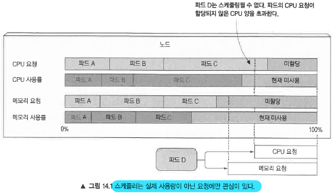
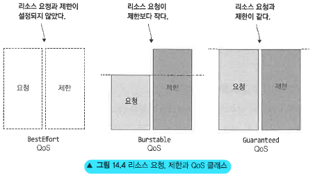
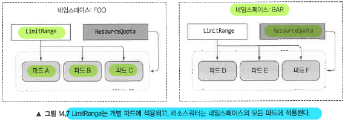

# 14. 파드의 컴퓨팅 리소스 관리

``` 
14장에서 다루는 내용
- 컨테이너의 CPU, 메모리, 그 밖의 컴퓨팅 리소스 요청
- CPU와 메모리에 대한 엄격한 제한 설정
- 파드에 대한 서비스 품질의 보장 이해
- 네임스페이스에서 파드의 기본, 최소, 최대 리소스 설정
- 네임스페이스에서 사용 가능한 리소스의 총량 제한

```

## 14.1 파드 컨테이너의 리소스 요청
파드를 생성할 때 컨테이너가 필요로 하는 CPU와 메모리 양(requests)과 사용할 수 있는(limits) 엄격한 제한을 지정할 수 있음.
컨테이너에 개별적으로 지정되며 파드 전체에 지정되지 않고, 파드는 모든 컨테이너의 요청과 제한의 합으로 계산된다.
  
### 14.1.1 리소스 요청을 갖는 파드 생성

```yaml
apiVersion: v1
kind: Pod
metadata:
  name: requests-pod
spec:
  containers:
  - image: busybox
    command: ["dd", "if=/dev/zero", "of=/dev/null"]
    name: main
    resources:
      requests:           # 컨테이너 리소스 요청
        cpu: 200m         # cpu 200밀리코어 (1 core : 1000m 또는 1, 200밀리코어는 1/5 core 시간을 의미)
        memory: 10Mi      # 10Mi 메모리를 요청
```
CPU 요청을 지정하지 않으면 컨테이너에서 실행중인 프로세스에 할당되는 CPU시간에 신경쓰지 않는다는 것과 같다. 하지만 최악의 경우 CPU 시간을 전혀 할당받지 못할수도 있다.(다른 프로세스가 CPU 요청을 많이 한 상황에서 발생할 수 있음)
이러한 이유로 배치같은 경우에 CPU를 지정하지 않을수도 있으나, 웹애플리케이션같은곳에서는 필수적으로 지정하는것이 좋다.

### 14.1.2 리소스 요청이 스케줄링에 미치는 영향
* 리소스 Reqsuest를 지정하면 파드에 필요한 리소스의 최소량을 지정할 수 있음
* 할당되지 않은 CPU나 메모리가 파드 요청보다 적으면 노드는 파드가 요청하는 최소량을 제공할 수 없으므로 그 노드에 파드를 스케쥴링 안함.

#### 파드가 특정 노드에 실행할 수 있는지 스케줄러가 결정하는 방법
* 스케줄러는 스케줄링하는 시점에 각 개별 리소스가 얼마나 사용되는지 보지 않고, 노드에 배포된 파드들의 리소스 요청량의 전체 합만을 기준으로 처리
* 실제 리소스 사용량에 기반해 다른 파드를 스케줄링한다는 것은 이미 배포된 파드에 대한 리소스 요청 보장을 깨뜨릴 수 있기 때문임.

아래 그림처럼 파드D를 배포하려고 하지만 노드에 미할당된 CPU양으로는 커버할수 없기 때문에 해당 노드에 스케줄링되지 않는다.



#### 스케줄러가 파드를 위해 최적의 노드를 선택할 때 파드의 요청을 사용하는 방법
스케줄러의 우선순위 함수(요청된 리소스 양에 기반해 노드의 순위를 정한다.)
* LeastRequestedPriority : 할당되지 않은 리소스의 양이 많은 노드 우선 (요청 리소스가 적은)
* MostRequestedPriority : 할당된 리소스의 양이 가장 많은 노드 우선 (요청 리소스가 많은)
* MostRequestedPriority의 필요성
    * 클라우드 기반 환경에서는 노드수가 비용이기 때문에 MostRequestedPriority와 같은 스케줄러 우선순위 함수를 차용하는것이 비용절감에 효과적일 수 있다.
    
#### 노드의 용량 검사
* Capacity : 노드 총 리소스를 의미, 파드에서 모두 사용 가능한 것은 아님.
* Allocatable : 할당 가능한 리소스를 의미, **스케쥴러는 오직 allocation 리소스 양을 기준으로 결정함.**

CPU는 압축 가능한 리소스이므로 프로세스에 악영향을 주지 않으면서 컨테이너가 사용하는 CPU양을 조절할 수 있지만 메모리는 프로세스에 주어지면 프로세스가 메모리르 해제하지 않은 한 다른 프로세스에서 사용할 수 없다.  
→ **그래서 컨테이너에 할당되는 메모리의 최대량을 제한해야 한다.**  


#### 리소스 제한 오버커밋
* 리소스 request와 달리 리소스 limit은 노드의 할당가능한 리소스 양으로 제한되지 않음.
* 노드 용량의 100%를 초과할수 있음 (limit은 overcommitted 될 수 있음)
* 컨테이너는 항상 컨테이너 메모리가 아닌 노드의 메모리를 봄


#### 파드를 분류하는 세가지 서비스 품질(QoS, Quality of Service) 클래스
|구분|설명|
|--|--|
|BestEffort(최하위 우선순위)|우선순위가 가장 낮은 클래스<br>아무런 리소스 요청과 제한이 없는 경우 부여됨<br>이런 파드에 실행중인 컨테이너는 리소스를 보장 받지 못함<br>(최악의 경우 CPU 시간을 전혀 받지 못할 수도 있다.)<br>메모리가 필요한 경우 가장 먼저 종료됨<br>그러나 설정된 메모리 제한이 없기 때문에 메모리가 충분하다면 컨테이너는 원하는 만큼 메모리를 사용할 수 있다.|
|Burstable|이 클래스는 리소스 요청과 리소스 제한이 동일한 파드에 부여됨<br>요청된 리소스의 양을 얻는것은 보장되지만 추가 리소스는 사용 불가<br>Guaranteed의 조건<br>CPU와 메모리 리소스 요청과 제한이 모두 설정되어야함<br>각 컨테이너에 설정되어 있어야 함.<br>리소스 요청과 제한이 동일해야함|
|Guaranteed(최상위 우선순위)|BestEffort와 Guaranteed 사이의 클래스(BestEffort와 Guaranteed가 아닌 경우 해당)<br>컨테이너의 리소스 제한이 리소스 요청과 일치하지 않은 단일 컨테이너 파드, 적어도 한 개의 컨테이너가 리소스 요청을 지정했지만 리소스 제한을 설정하지 않은 모든 파드가 여기에 속함<br>요청한 양 만큼의 리소스를 얻지만 필요하면 추가 리소스(리소스 제한까지) 사용가능

참고 : 컨테이너에 제한만 설정된 경우, 요청은 기본으로 제한과 동일한 값으로 설정되므로 Guaranteed QoS 클래스를 갖게 됨



### 14.4.1 LimitRange 리소스
* 모든 컨테이너에 리소스 요청과 제한을 설정하는 대신 LimitRage 리소스를 생성해 이를 수행가능
    * 컨테이너의 각 리소스(네임스페이스별) 최소/최대 제한을 지정가능
    * 리소스 요청을 명시적으로 지정하지 않은 컨테이너의 기본 리소스 요청을 지정가능
    
* LimitRange에 설정된 제한은 각 개별 파드/컨테이너에만 적용이 되는데, 이 경우 많은 수의 파드가 만들어진다면 클러스터에서 사용 가능한 모든 리소스를 다 써버릴수 있다.(요청과 달리 제한은 총양을 보지 않으므로)

```yaml
apiVersion: v1
kind: LimitRange
metadata:
  name: example
spec:
  limits:
  - type: Pod              # 파드 전체에 리소스 제한 지정
    min: 
      cpu: 50m 
      memory: 5Mi
    max:
      cpu: 1
      memory: 1Gi
  - type: Container         # 컨테이너 전체에 요청 기본 지정
    defaultRequest:
      cpu: 100m
      memory: 10Mi
    default:                # 리소스 제한을 지정하지 않은 컨테이너의 기본 제한(limit)
      cpu: 200m
      memory: 100Mi
    min:
      cpu: 50m
      memory: 5Mi
    max:
      cpu: 1
      memory: 1Gi
    maxLimitRequestRatio:     # 각 리소스요청/제한간의 최대 비율
      cpu: 4
      memory: 10
  - type: PersistentVolumeClaim    # PVC에 대한 min/max
    min:
      storage: 1Gi
    max:
      storage: 10Gi
```

## 14.5 네임스페이스의 사용 가능한 총 리소스 제한하기
쿠버네티스에서는 리소스쿼터(ResourceQuota)를 통해 각 네임스페이스에서 사용 가능한 총 리소스를 제한할 수 있음

### 14.5.1 리소스쿼터 오브젝트
* 리소트쿼터는 LimitRange와 마찬가지로 네임스페이스에 적용되나, 각 개별 파드나 컨테이너에 개별적으로 적용하지 않고, 모든 파드의 리소스 요청과 제한의 총합에 적용됨.



#### 리소스쿼터 예시  

```yaml
#===== 리소스쿼터 CPU/MEM 예시 =====
apiVersion: v1
kind: ResourceQuota
metadata:
  name: cpu-and-mem
spec:
  hard:
    requests.cpu: 400m
    requests.memory: 200Mi
    limits.cpu: 600m
    limits.memory: 500Mi

#===== 리소스쿼터 PV Storage 예시 =====
apiVersion: v1
kind: ResourceQuota
metadata:
  name: storage
spec:
  hard:
    requests.storage: 500Gi
    ssd.storageclass.storage.k8s.io/requests.storage: 300Gi
    standard.storageclass.storage.k8s.io/requests.storage: 1Ti

#===== 네임스페이스 내의 파드, 레플리카셋, 서비스, 디플로이먼트 등에 대해서 오브젝트 수 제한 예시 =====
apiVersion: v1
kind: ResourceQuota
metadata:
  name: objects
spec:
  hard:
    pods : 10
    replicationcontrollers: 5
    secrets: 10
    configmaps: 10
    services: 5
    services.loadbalancers: 10
    services.nodeports: 10
    standard.storageclass.storage.k8s.io/persistentvolumeclaims: 2

#===== BestEffort/NotTerminating 파드 예시 =====
apiVersion: v1
kind: ResourceQuota
metadata:
  name: besteffort-notterminating-pods
spec:
  scopes:
  - BestEffort               # BestEffort Qos를 갖고 유효 데드라인이 없는 파드에만 적용
  - NotTerminating
  hard:
    pods: 4                   # 저 스코프에 해당하는 파드는 4개까지만 존재할수 있다.
```

### 14.5.4 특정 파드 상태나 QoS 클래스에 대한 쿼터 지정
* QoS 클래스 기준 쿼터 범위(quota scope)

|유형|설명|
|--|--|
|BestEffort|BeftEffort QoS 클래스를 갖는 파드에 적용|
|NotBestEffort|BeftEffort가 아닌 QoS 클래스(Burstable, Guaranteed)를 갖는 파드에 적용|
|Terminating|종료 과정의 파드에 적용|
|NotTerminating|종료되지 않은 파드에 적용|

```yaml
apiVersion: v1
kind: ResourceQuota
metadata:
  name: besteffort-notterminating-pods
spec:
  scopes:
  - BestEffort               # BestEffort Qos를 갖고 유효 데드라인이 없는 파드에만 적용
  - NotTerminating
  hard:
    pods: 4                   # 저 스코프에 해당하는 파드는 4개까지만 존재할수 있다.
```
