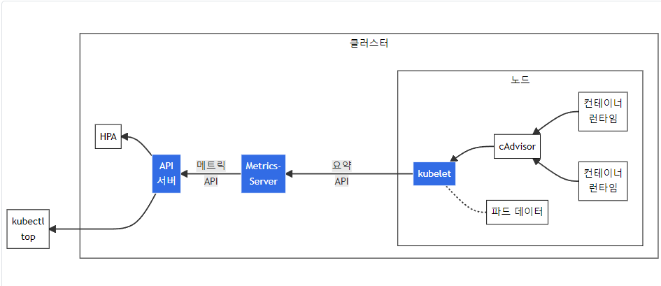

## 15장 : 파드와 클러스터노드의 오토스케일링

### 오토스케일링 프로세스

- 모든 노드에서 실행되는 kubelet에서 실행되는 cAdvisor 에이전트에 의해 메트릭 수집
- 수집한 메트릭은 클러스터 전역 구성 요소인 힙스터에 의해 집계됨
- 오토스케일링이 동작하기 위해선 힙스터가 반드시 동작해야 함

#### 주요 구성요소

1. **cAdvisor(Container Advisor)**:
   - 모든 Kubernetes 노드에서 실행되는 kubelet(쿠버네티스 노드 에이전트)의 일부로 포함된 에이전트
   - 각 노드에서 실행 중인 컨테이너의 리소스 사용량(CPU, 메모리, 네트워크, 디스크 등)을 모니터링하고 수집
2. **Heapster(힙스터)-Metrics Server**:
   - 클러스터 전체의 리소스 사용량 데이터를 수집하는 Kubernetes 애드온
   - kubelet API를 통해 각 노드로부터 메트릭을 수집하고 집계
   - 이전의 Heapster를 대체하는 경량화된 솔루션
   - 메모리 내에 메트릭을 저장하며 장기 모니터링 시스템으로 설계되지 않음
   - `kubectl top` 명령어와 HPA 컨트롤러에 메트릭 정보를 제공
3. **오토스케일링(Auto Scaling)**:
   - Kubernetes에서 워크로드의 리소스 사용량에 따라 Pod(컨테이너 그룹)의 수를 자동으로 조절하는 기능
   - 오토스케일링이 작동하려면 현재 리소스 사용량 메트릭이 필요한데, 이 메트릭은 힙스터(또는 Metrics Server)가 제공
   - 리소스 사용량 데이터가 없으면 오토스케일링 결정을 내릴 수 없음


---


### HPA (Horizontal Pod Autoscaler)

HPA는 QPS(Query Per Second) 등의 메트릭에 따라 파드 수를 자동으로 조절합니다.

#### 어댑터 및 메트릭 확인 명령어

```bash
# API 서비스 확인
kubectl get apiservices | grep metrics

# 설치된 메트릭 서버 확인
kubectl get pods -n kube-system | grep metrics-server

# Prometheus Adapter 확인
kubectl get pods -n monitoring | grep prometheus-adapter
# 또는
kubectl get pods --all-namespaces | grep adapter

# 사용 가능한 메트릭 목록 확인
kubectl get --raw "/apis/metrics.k8s.io/v1beta1/pods" | jq .

# 커스텀 메트릭 API 확인
kubectl get --raw "/apis/custom.metrics.k8s.io/v1beta1" | jq .

# 외부 메트릭 API 확인
kubectl get --raw "/apis/external.metrics.k8s.io/v1beta1" | jq .

# 특정 네임스페이스의 커스텀 메트릭 확인
kubectl get --raw "/apis/custom.metrics.k8s.io/v1beta1/namespaces/default/pods/*/http_requests" | jq .

# 어댑터 로그 확인 (Prometheus Adapter의 경우)
kubectl logs -n monitoring deploy/prometheus-adapter

# HPA에서 사용 중인 메트릭 확인
kubectl describe hpa [hpa-name]
```

#### HPA 스케일링 옵션

1. **내장 메트릭 (별도 어댑터 없이 사용 가능)**
   - CPU, Memory (오토스케일링에 적합하지 않음)
2. **External 메트릭 (어댑터 필요)**
   - 외부 모니터링 시스템의 메트릭을 기반으로 스케일링
   - 예: QPS, RPS(Requests Per Second), 요청 지연시간(latency), 큐 길이 등
3. **Object 메트릭 (어댑터 필요)**
   - Kubernetes 클러스터 내부의 다른 객체에서 제공하는 메트릭
   - 예: Ingress 객체의 요청량, Service 객체의 트래픽 등

#### QPS(초당 쿼리 수) 기반 스케일링 설정 예시

```yaml
apiVersion: autoscaling/v2
kind: HorizontalPodAutoscaler
metadata:
  name: qps-based-hpa
spec:
  scaleTargetRef:
    apiVersion: apps/v1
    kind: Deployment
    name: my-app
  minReplicas: 1
  maxReplicas: 20
  metrics:
  - type: External
    external:
      metric:
        name: http_requests_per_second
        selector:
          matchLabels:
            service: my-service
      target:
        type: AverageValue
        averageValue: 1000  # 파드당 초당 1000개 요청을 목표로 스케일링
```

#### 일반적으로 사용되는 스케일링 메트릭 옵션

1. **요청 지연시간(Latency)**:

   ```yaml
   metrics:
   - type: External
     external:
       metric:
         name: http_request_duration_seconds
         selector:
           matchLabels:
             service: my-service
       target:
         type: AverageValue
         averageValue: 0.1  # 평균 100ms 응답 시간 유지
   ```

2. **큐 깊이(Queue Depth)**:

   ```yaml
   metrics:
   - type: External
     external:
       metric:
         name: rabbitmq_queue_messages
         selector:
           matchLabels:
             queue: worker-queue
       target:
         type: Value
         value: 100  # 큐에 100개 이상의 메시지가 쌓이면 스케일 업
   ```

3. **오류율(Error Rate)**:

   ```yaml
   metrics:
   - type: External
     external:
       metric:
         name: http_5xx_errors_per_second
         selector:
           matchLabels:
             service: my-service
       target:
         type: AverageValue
         averageValue: 10  # 5xx 에러가 초당 10개 이상이면 스케일 업
   ```

4. **연결 수(Connection Count)**:

   ```yaml
   metrics:
   - type: External
     external:
       metric:
         name: nginx_connections_active
       target:
         type: AverageValue
         averageValue: 100  # 파드당 평균 100개 활성 연결 유지
   ```

5. **처리량(Throughput)**:

   ```yaml
   metrics:
   - type: External
     external:
       metric:
         name: kafka_messages_in_per_second
         selector:
           matchLabels:
             topic: events
       target:
         type: Value
         value: 5000  # 초당 5000개 메시지 처리량 목표
   ```

#### 다른 오브젝트 메트릭 참조 방법

```yaml
apiVersion: autoscaling/v2
kind: HorizontalPodAutoscaler
metadata:
  name: object-metrics-hpa
spec:
  scaleTargetRef:
    apiVersion: apps/v1
    kind: Deployment
    name: my-app
  minReplicas: 2
  maxReplicas: 10
  metrics:
  - type: Object
    object:
      describedObject:
        apiVersion: v1
        kind: Service      # 참조할 객체 유형
        name: frontend-svc # 참조할 특정 서비스 이름
      metric:
        name: requests-per-second  # 어댑터가 제공하는 메트릭 이름
      target:
        type: Value
        value: 2000        # 서비스 전체에서 초당 2000개 요청을 목표로 함
```

이 방식의 중요한 요소들:

1. **`type: Object`**: HPA에게 다른 Kubernetes 오브젝트의 메트릭을 사용할 것임을 알립니다.
2. **`describedObject`**: 메트릭을 참조할 Kubernetes 객체를 지정합니다.
   - `apiVersion`: 객체의 API 버전
   - `kind`: 객체 종류 (Service, Pod, Ingress 등)
   - `name`: 특정 객체의 이름
3. **`metric.name`**: 해당 객체에서 수집할 메트릭의 이름입니다. 이 이름은 어댑터가 제공하는 이름이어야 합니다.
4. **`target.type`**: `Value` 또는 `AverageValue`를 사용할 수 있습니다.
   - `Value`: 참조 오브젝트의 메트릭 값 자체를 사용
   - `AverageValue`: 스케일링 대상의 레플리카 수로 나눈 평균값을 사용


---


### 메모리소비량이 오토스케일링에 적합하지 않은 이유

1. **비탄력적 특성**: CPU와 달리 메모리는 일반적으로 증가하기만 하고 줄어들지 않는 경향이 있습니다. 많은 애플리케이션은 가비지 컬렉션이 실행되기 전까지 또는 실행되어도 메모리를 완전히 해제하지 않습니다.
2. **스케일 다운 문제**: 부하가 감소해도 메모리 사용량은 그대로 유지되는 경우가 많아, 스케일 다운 트리거가 발생하지 않습니다. 이로 인해 필요 이상으로 많은 파드가 실행될 수 있습니다.
3. **캐싱 메커니즘**: 많은 애플리케이션은 성능 향상을 위해 메모리 캐싱을 사용합니다. 이런 경우 높은 메모리 사용량이 실제로는 문제가 아니라 의도된 동작일 수 있습니다.
4. **지연된 가비지 컬렉션**: 일부 언어/런타임(Java, Go 등)은 가비지 컬렉션 타이밍을 지연시켜 메모리 사용량이 실제 필요량보다 높게 보일 수 있습니다.
5. **메모리 누수 가능성**: 메모리 사용량 증가가 부하 증가가 아닌 메모리 누수 때문일 수 있으며, 이 경우 스케일링은 문제를 해결하지 못하고 더 많은 리소스만 낭비하게 됩니다.


---


### 클러스터 오토스케일링 유형

1. **Cluster Autoscaler (CA)**: 가장 널리 사용되는 클러스터 오토스케일링 솔루션입니다.
   - 파드가 리소스 부족으로 스케줄링되지 못할 때 노드를 추가
   - 특정 노드의 사용률이 낮고 파드를 다른 노드로 이동할 수 있을 때 노드를 제거
2. **Node Auto-provisioning**: Google Kubernetes Engine(GKE)에서 제공하는 기능으로, 노드 풀을 자동으로 생성 및 삭제합니다.
3. **Karpenter**: AWS에서 제공하는 새로운 오토스케일링 솔루션으로, Cluster Autoscaler보다 빠른 스케일링과 더 세분화된 인스턴스 유형 선택을 제공합니다.


---


### VPA (Vertical Pod Autoscaler)

VPA는 파드의 CPU 및 메모리 리소스 요청(requests)과 제한(limits)을 자동으로 조정합니다.

```yaml
apiVersion: autoscaling.k8s.io/v1
kind: VerticalPodAutoscaler
metadata:
  name: my-app-vpa
spec:
  targetRef:
    apiVersion: "apps/v1"
    kind: Deployment
    name: my-app
  updatePolicy:
    updateMode: "Auto"  # 자동 조정 활성화 (다른 옵션: Initial, Off)
  resourcePolicy:
    containerPolicies:
    - containerName: '*'  # 모든 컨테이너에 적용
      minAllowed:
        cpu: "100m"       # 최소 CPU 할당량
        memory: "200Mi"   # 최소 메모리 할당량
      maxAllowed:
        cpu: "1"          # 최대 CPU 할당량
        memory: "1Gi"     # 최대 메모리 할당량
```


---


### PodDisruptionBudget (PDB)

PDB는 자발적인 중단(voluntary disruption) 상황에서도 애플리케이션의 가용성을 유지하기 위한 리소스입니다.

```yaml
apiVersion: policy/v1
kind: PodDisruptionBudget
metadata:
  name: app-pdb
spec:
  minAvailable: 2       # 항상 최소 2개의 파드가 실행 상태여야 함
  # 또는 maxUnavailable: 1     # 최대 1개의 파드만 동시에 중단 가능
  selector:
    matchLabels:
      app: example-app  # 이 레이블을 가진 파드에 적용
```
