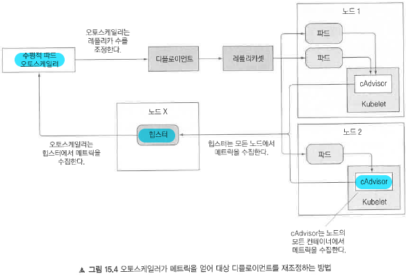
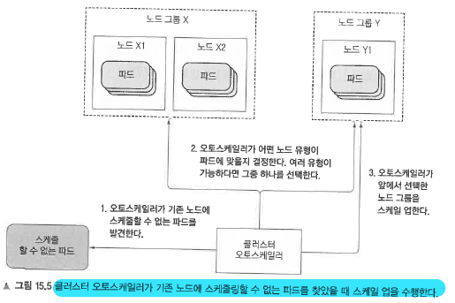

# 15. 파드와 클러스터 노드의 오토스케일링
```
15장에서 다루는 내용
- CPU 사용률을 기반으로 파드의 자동 수평 스케일링 설정
- 사용자 정의 메트릭 기반으로 파드의 자동 수평 스케일링 설정
- 파드의 수직 스케일링이 아직 불가능한 이유 이해
- 클러스터 노드 자동 수평 스케일링 이해
```

### 15.1.1 오토스케일링 프로세스 이해
1)  확장 가능한 리소스 오브젝트에서 관리하는 모든 파드의 메트릭을 가져옴
    * 파드와 노드 메트릭은 모든 노드에서 실행되는 kubelet에서 실행되는 cAdvisor 에이전트에 의해 수집
    * 수집한 메트릭은 클러스트 전역 구성요소인 힙스터에 의해 집계
    * 수평적 파드 오토스케일러 컨트롤러는 힙스터에 REST를 통해 모든 파드의 메트릭을 가져옴
2) 메트릭을 지정한 목표 값과 같거나 가깝도록 하기 위해 필요한 파드수를 계산
    * 메트릭의 평균 값을 이용해 지정한 목표 값과 가능한 가깝게 하는 숫자를 찾는 방식
    * 오트스케일러는 각 메트릭의 레플리카수를 개별적으로 계산한 뒤 가장 높은 값을 취함.    
3) 확장 가능한 리소스의 replicas 필드를 갱신
    * 수평적 파드 오토스케일러는 스케일 서브 리소스만을 수정함 (추가 파드를 시작하거나, 초과한 파드를 삭제)

* 전체 오토스케일링 과정 이해



### 15.1.2 CPU 사용률 기반 스케일링
* CPU 사용량이 100%에 도달하면 더 이상 요구에 대응할 수 없어 스케일 업(수직적 스케일링, 파드의 CPU 양 증가와 같은)이나 스케일 아웃(수평적 스케일링, 파드수 증가)이 필요함.
* 파드 전체의 평균 CPU 부하가 80%에 도달하거나 초과할 때 스케일 아웃을 수행하는 것이 좋음.
* 파드가 80%의 CPU를 사용한다고 할 때, 노드의 CPU중 80%인지, 파드가 request로 보장받은 CPU의 80%인지, limit을 통해 파드에 설정된 80%인지 명확하진 않음. 
 → **파드가 request로 보장받은 CPU 사용량만 중요함.**

* 항상 레플리카셋이 아닌 디플로이먼트를 오토스케일링 대상으로 해야 애플리케이션 업데이트 시에도 원하는 레플리카 수를 계속 유지 가능

```yaml
apiVersion: autoscaling/v2beta1
kind: HorizontalPodAutoscaler
metadata:
  name: kubia
  ...
spec:
  maxReplicas: 5
  metrics:
  - resource:
      name: cpu
      targetAverageUtilization: 30      # 오토스케일러가 파드 수를 조정해 각 파드가 요청 CPU의 30%를 사용하도록 함
    type: Resource
  minReplicas: 1
  scaleTargetRef:
    apiVersion: extensions/v1beta1
    kind: Deployment
    name: kubia
status:
  currentMetrics: []
  currentReplicas: 3
  desiredReplicas: 0

```

### 15.1.3 메모리 소비량에 기반을 둔 스케일링
* 메모리 기반 오토스케일링은 CPU 기반 오토스케일링에 비해 훨씬 문제가 많다.
* 스케일 업 후에 오래된 파드는 어떻게든 메모리를 해제하는 것이 필요하고, 메모리 해제는 파드 컨테이너 내부의 애플리케이션이 해야 하는 일이기 때문에 애플리케이션을 종료하고 다시 시작해야함 (원하는 방식이 아님)

## 15.2 수직적 파드 오토스케일링
* 수평적 확장이 불가능한 애플리케이션의 경우 수직적으로 확장 필요 (더 많은 CPU, 메모리 리소스 부여)
* 수직적 파드 오토스케일링은 현재 베타 기능으로 별도로 추가 설치 필요.

```yaml
apiVersion: autoscaling.k8s.io/v1
kind: VerticalPodAutoscaler
metadata:
  name: my-app-vpa
spec:
  targetRef:
    apiVersion: "apps/v1"
    kind:       Deployment
    name:       my-app
  updatePolicy:
    updateMode: "Auto"
```

### 15.3.1 클러스터 오토스케일러
* 노드에 리소스가 부족해서 스케줄링할 수 없는 파드를 발견하면 추가 노드를 자동으로 공급하고 오랜 시간 동안 사용률이 낮으면 노드를 줄인다.



#### 수동으로 노드 금지(cordoning), 배출(draining) 하기
* kubectl cordon <node> 명령은 노드를 스케줄링 할 수 없음으로 표시 (해당 노드에서 실행중인 파드에서는 아무것도 하지 않음)
* kubectl drain <node> 명령은 노드를 스케줄링 할 수 없음으로 표시하고 노드에서 실행 중인 모든 파드를 종료함
* 두 경우 모두 노드를 kubectl uncordon <node>을 통해 금지 해제를 하기전까지는 해당 노드에 새로운 파드가 스케줄링 되지 않는다.


### 15.3.3 클러스터 스케일 다운 동안에 서비스 중단 제한
* 특정 서비스에서는 최소 개수의 파드가 항상 실행되어야 한다. 이는 쿼럼(quorum) 기반 클러스터 애플리케이션인 경우 특히 그렇다.
* 쿠버네티스는 이런 문제해결을 위해 스케일 다운 등의 작업을 수행할 경우에도 유지되어야 하는 최소 파드 개수를 지정하는 PodDisruptionBudget 리소스를 제공한다.

```bash
# PodDisruptionBudget 리소스 생성
$ kubectl create pdb kubia-pdb --selector=app=kubia --min-available=3
poddisruptionbudget "kubia-pdb" created
```

```yaml
# PodDisruptionBudget 정의
apiVersion: policy/v1beta1
kind: PodDisruptionBudget
metadata:
  name: kubia-pdb
spec:
  minAvailable: 3      # 얼마나 많은 파드를 항상 사용가능하게 할 것인지
  selector:
    matchLabels:
      app: kubia
status:
```

* minAvailable 필드에 절대값이 아닌 백분율을 사용할 수도 있고 maxUnavailable 필드를 이용하면 minAvailable 대신 일정 개수 이상의 파드가 종료되지 않도록 지정할 수도 있음.