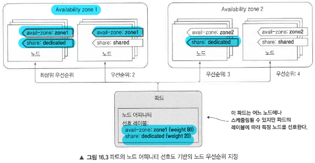
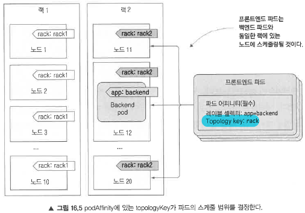

# 16. 고급 스케줄링
**16장에서 다루는 내용**
* 특정 노드에서 파드가 실행되지 않도록 노드 테인트와 파드 톨러레이션 사용
* 노드 셀렉터의 대안으로 노드 어피니티 규칙 정의
* 파드 어피니티를 사용해 파드를 함께 배치
* 파드 안티-어피니티를 사용해 파드를 서로 떨어뜨려 놓기

## 16.1 테인트와툴러레이션을 사용해 특정 노드에서 파드 실행 제한
* 노드 테인트(taint)와 테인트에 대한 파드 툴러레이션(toleration)은 어떤 파드가 특정 노드를 사용할 수 있는지를 제한할 수 있는 기능
* 노드의 테인트가 허용된(tolerate) 경우에만 파드가 노드에 스케줄링 될수 있음을 뜻함.
* 테인트는 기존의 파드를 수정하지 않고, 노드에 테인트를 추가하여 파드가 특정 노드에 베포되지 않도록 함.

### 16.1.1 테인트와 툴러레이션 소개
* 테인트에는 키, 값, 효과가 있고 <key>=<value>:<effect> 형태로 표시
* 마스터 노드의 테인트는 node-role.kubernetes.io/master:NoSchedule을 갖는다. (value:null은 표시되지 않음)
이 테인트는 파드가 이 테인트를 허용하지 않는 한 마스터 노드에 스케줄링되지 못하게 막는다.

```bash
$ kubectl describe po kube-proxy-80wqm -n kube-system
...
Tolerations: node-role.kubernetes.io/master=:NoSchedule    # kube-proxy가 마스터 노드에 스케줄링 되도록 허용
node.alpha.kubernetes.io/notReady=:Exists:NoExecute
node.alpha.kubernetes.io/unreachable=:Exists:NoExecute
...
```

#### 테인트 효과 이해
* NoSchedule : 파드가 테인트를 허용하지 않는경우 스케줄링되지않는다.
* PreferNoSchedule : 스케줄링을 하지않지만, 다른곳에 스케줄링 할곳이 없으면 스케줄링된다.
* NoExecute : 노드에서 이미 실행중인 파드에도 영향을준다. 해당 테인트를 추가하면 이미 실행중이지만 NoExecute를 허용하지 않은 파드는 노드에서 제거된다.

### 16.1.2 노드에 사용자 정의 테인트 추가하기
##### 노드에 테인트  추가
```yaml
# 프로덕션 노드에서 프로덕션이 아닌 파드가 실행되지 않도록함
kubectl taint node node1.k8s node-type=production:NoSchedule 
```

### 16.1.3 파드에 톨러레이션 추가
```yaml
apiVersion: extensions/v1beta1
kind: Deployment
metadata:
  name: prod
spec:
  replicas: 5
  template:
    metadata:
      labels:
        app: prod
    spec:
      containers:
      - args:
        - sleep
        - "99999"
        image: busybox
        name: main
      tolerations:               # 프로덕션 노드에 파드가 스케줄링 될수 있도록 톨러레이션 추가
      - key: node-type
        operator: Equal
        value: production
        effect: NoSchedule
```

### 16.1.4 테인트와 톨러레이션의 활용 방안
* 노드는 하나 이상의 테인트를 가질 수 있고, 파드는 하나 이상의 톨러레이션을 가질 수 있다.
* 스케줄링을 방지하고(NoSchedule 효과), 선호하지 않는 노드를 정의하고(PreferNoSchedule 효과), 노드에서 기존 파드를 제거하는(NoExecute) 데에도 사용할 수 있다.
* 톨러레이션을 사용해 쿠버네티스가 다른 노드로 파드를 다시 스케줄링하기 전에 대기해야 하는 시간을 지정할 수도 있다.

```yaml
tolerations:
- effect: NoExecute
  key: node.alpha.kubernetes.io/notReady     # 노드가 준비되지 않은 상태에서 파드는 스케쥴링되지 전에 300초동안 기다린다.
  operator: Exists
  tolerationSeconds: 300
- effect: NoExecute
  key: node.alpha.kubernetes.io/unreachable  # 도달할 수 없는 노드에도 동일하게 적용된다.
  operator: Exists
  tolerationSeconds: 300
```

### 16.2.1 하드 노드 어피니티 규칙 지정
노드 셀렉터를 이용하는 방식과 노드 어피티니를 이용하는 방식의 차이는 노드 어피니티를 이용하는 방식이 훨씬 복잡하지만 표현력이 풍부하여 노드 셀렉터로 할 수 없는 것들을 할 수 있다.

```yaml
# 노드 셀렉터를 이용한 방식
apiVersion: v1
kind: Pod
metadata:
  name: kubia-gpu
spec:
  nodeSelector:
    gpu: "true"      # gpu=true라는 레이블이 있는 노드에서만 스케쥴링
  containers:
  - image: luksa/kubia
    name: kubia

# 노드 어피니티 규칙을 이용한 방식
apiVersion: v1
kind: Pod
metadata:
  name: kubia-gpu
spec:
  affinity:
    nodeAffinity:
      requiredDuringSchedulingIgnoredDuringExecution:  # 이 필드 아래에 정의된 규칙은 파드가 노드로 스케줄링 하려는 레이블을 지정함
        nodeSelectorTerms:
        - matchExpressions:
          - key: gpu
            operator: In
            values:
            - "true"
  containers:
  - image: luksa/kubia
    name: kubia
```
  
#### 긴 nodeAffinity 속성 이름에 관하여
* requiredDuringScheduling... : 이 필드 아래에 정의도니 규칙은 파드가 노드로 스케줄링하려는 레이블 지정정
* ... IgnoredDuringExecution : 노드에서 이미 실행중인 파드에는 영향을 미치지 않는다는 의미


### 16.2.2 파드의 스케줄링 시점에 노드 우선순위 지정
preferredDuringSchedulingIgnoredDuringExecution 필드를 통해 스케줄러가 선호할 노드를 지정

```yaml
# 선호하는 노드 어피니티 규칙 지정
apiVersion: extensions/v1beta1
kind: Deployment
metadata:
  name: pref
spec:
  replicas: 5
  template:
    metadata:
      labels:
        app: pref
    spec:
      affinity:
        nodeAffinity:        
          preferredDuringSchedulingIgnoredDuringExecution:    # 필수가 아닌 선호 어피니티 속성 지정
          - weight: 80            # 가중치 80의 availability-zone 선호도 지정
            preference:
              matchExpressions:
              - key: availability-zone
                operator: In
                values:
                - zone1
          - weight: 20          # 가중치 20의 share-type 선호도 지정
            preference:
              matchExpressions:
              - key: share-type
                operator: In
                values:
                - dedicated
      containers:
      - args:
        - sleep
        - "99999"
        image: busybox
        name: main
```
Availability-zone과 share-type 레이블이 파드의 노드 어피니티와 일치하는 노드에 가장 높은 순위가 매겨짐.
1. zone1의 dedocated 노드가 최상위 순위
2. zone1의 shared노드가 우선순위
3. 다른 영역의 dedicated 노드
4. 그 외의 모든 노드




## 16.3 파드 어피니티와 안티-어피니티를 이용해 파드 함께 배치하기
* 쿠버네티스에서는 파드-노드간이 아닌 파드-파드간은 파드 어피니티(pod affinity)를 사용해서 2개의 파드를 서로 가깝게 유지하면서 적절한 곳에 배포가능

### 16.3.1 파드 간 어피니티를 사용해 같은 노드에 파드 배포하기

```yaml
apiVersion: extensions/v1beta1
kind: Deployment
metadata:
  name: frontend
spec:
  replicas: 5
  template:
    metadata:
      labels:
        app: frontend
    spec:
      affinity:
        podAffinity:
          requiredDuringSchedulingIgnoredDuringExecution:   # 선호도가 아닌 필수 요구사항을 정의
          - topologyKey: kubernetes.io/hostname
            labelSelector:
              matchLabels:
                app: backend       # 이 디플로이먼트의 파드는 셀렉터와 일치하는 노드에 배포되야함.
      containers:
      - name: main
        image: busybox
        args:
        - sleep
        - "99999"
```

### 16.3.2 동일한 랙, 가용 영역 또는 리전에 파드 배포

* 동일한 가용 영역에 파드 함께 배포하기
  topologyKey 속성 : failure-domain.beta.kubernetes.io/zone으로 변경하여 처리
* 동일한 리전에 파드 함께 배포하기
  topologyKey 속성 : failure-domain.beta.kubernetes.io/region으로 변경하여 처리

#### topologyKey 작동 방식
topologyKey 작동 방식은 단순히 레이블을 기준으로 동작하고 특별하지 않다.
만약 서버 랙을 기준으로 처리하고 싶다면, 자체적으로 서버랙 label을 정의하고, 이를 topologyKey에 사용해서 쉽게 스케줄링할 수 있다.


