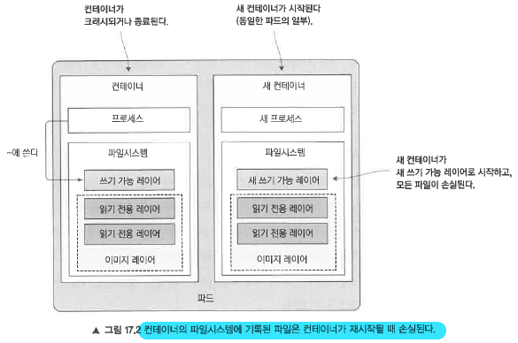
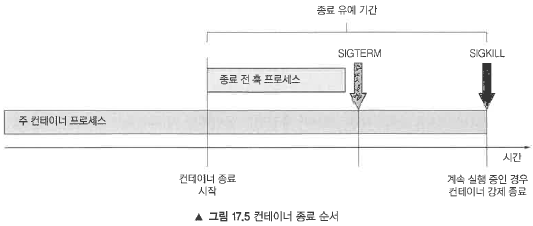

# 17. 쿠버네티스 애플리케이션 개발을 위한 모범사례
**17장에서 다루는 내용**
* 일반적인 애플리케이션에서 사용하는 쿠버네티스 리소스
* 파드 시작 후, 중지 전 라이프사이클 훅 추가
* 클라이언트 요청을 중단하지 않고 애플리케이션 종료
* 쿠버네티스에서 쉽게 관리하는 애플리케이션 만들기
* 파드에서 초기화 컨테이너 사용
* Minikube로 로컬 환경에서 개발

## 17.2 파드 라이프사이클 이해
파드에서 실행 중인 애플리케이션은 언제든지 종료될 수 있기 때문에 이를 고려해야함.

### 17.2.1 애플리케이션을 종료하고 파드 재배치 예상하기
#### 로컬 IP와 호스트 이름 변경 예상하기

* 파드가 종료되고 다른곳에서 실행되면 새로운 IP 주소와 새로운 이름, 호스트 이름을 갖게되므로 애플리케이션 개발 시 클러스터된 애플리케이션의 구성원을 IP 주소 기반으로 하면 안되며 호스트 이름을 기반으로 할 때에는 항상 스테이트풀셋을 사용해야함 (스테이트풀셋인 경우 호스트 이름이 변하지는 않지만 파드의 IP는 변경됨)

* 퍼시트턴트 스토리지를 마운트하지 않으면 앱이 새 파드로 시작된 후에 해당 데이터를 사용하지 못할 수 있음 
* 컨테이너가 다시 시작되면 완전히 새로운 쓰기 가능한 레이어로 시작되기 때문에 이전 파일들은 모두 손실된다.



**컨테이너를 재시작할 때 파일을 보존하려고 볼륨을 사용하는 것은 좋은 생각이지만 항상 그렇진 않다**
* 데이터가 손상돼 새로 생성된 프로세스가 다시 크래시되면 연속 크래시루프가 발생함.
(파드에 CrashLoopBackOff 상태가 표시됨)

* 레플리카셋 컨트롤러는 파드의 죽은 상태가 됐는지는 상관하지 않음.
* 파드 수가 의도하는 레플리카수와 일치하느냐만 관심이 있음.

```bash
$ kubectl get po
NAME READY STATUS RESTARTS AGE
crashing-pods-f1tcd 0/1 CrashLoopBackOff 5 6m   # 파드 상태는 컨테이너가 계속 크래시되기 때문에 kubelet이 재시작을 지연한다고 표시함.
crashing-pods-k7l6k 0/1 CrashLoopBackOff 5 6m
crashing-pods-z7l3v 0/1 CrashLoopBackOff 5 6m

$ kubectl describe rs crashing-pods
Name: crashing-pods
Replicas: 3 current / 3 desired      # 의도하는 레플리카 수와 일치하므로 컨트롤러가 아무런 조치도 취하지 않음.
Pods Status: 3 Running / 0 Waiting / 0 Succeeded / 0 Failed # 레플리카 3개가 실행중

$ kubectl describe po crashing-pods-f1tcd
Name: crashing-pods-f1tcd
Namespace: default
Node: minikube/192.168.99.102
Start Time: Thu, 02 Mar 2017 14:02:23 +0100
Labels: app=crashing-pods
Status: Running
```


### 17.2.3 원한 순서로 파드 시작하기
#### 파드 시작 방법
* 쿠버네티스에서는 파드의 실행 순서를 지시할 방법은 제공하지 않으나 초기화 컨테이너(init-container) 기능을 이용한다면 특정 파드들의 구동순서를 보장시킬 수 있다.
* 초기화 컨테이너(init-container)
주 파드의 볼륨에 데이터를 쓴 다음 주 컨테이너에 마운트 하는 것을 의미
즉, 초기화 컨테이너를 사용해 특정 사전 조건이 충족될때까지 파드의 주 컨테이너 시작을 지연시킬 수 있음.

```yaml
# 파드의 초기화 컨테이너 추가
apiVersion: v1
kind: Pod
metadata:
  name: fortune-client
spec:
  initContainers:      # 일반 컨테이너가 아닌 초기화 컨테이너를 정의
  - name: init
    image: busybox
    command:
    - sh
    - -c
    # 초기화 컨테이너는 fortune 서비스가 가동될 때까지 루프를 실행함.
```
* 이 파드를 배포하면 초기화 컨테이너만 시작함 (status열은 하나의 초기화 컨테이너 중 0개가 완료됐음을 의미)
```bash
$ kubectl get po
NAME            READY   STATUS      RESTARTS    AGE
fortune-client  0/1     Init:0/1    0           1m
```

* kubectl logs 명령어로 확인하면 fortune 서비스와 fortune 서버 파드를 배포할때까지 주 컨테이너가 실행되지 않음.
```bash
$ kubectl logs fortune-client -c init
Waiting for fortune service to come up...
```

### 17.2.4 라이프사이클 훅
* 파드는 시작 후 훅(post-start hook), 종료 전 훅(pre-stop hook) 이 2가지를 정의하여 컨테이너가 시작될 때와 중지되기 전에 실행할 수 있음.
  * 컨테이너 내부에서 명령 실행
  * URL로 HTTP GET 요청 수행

#### 컨테이너의 시작 후 라이프사이클 훅 사용
* 주 프로세스가 시작된 직후에 실행되며 애플리케이션이 시작될 떄 추가 작업을 수행하는 데 사용
* 훅은 주 프로세스와 병렬로 비동기적으로 수행되어 주 프로세스가 아직 구동전이더라도 라이프사이클 훅이 바로 동작할 수 있음.
* 훅이 실행되는 동안 컨테이너는 ContainerCreating인 채로 Waiting 상태를 유지하므로 파드는 Running중이 아니라 Pending 상태가 됨
* 훅이 실행되지 않거나 0이 아닌 종료 코드를 반환하면(오류로 인한 종료)라면 주 컨테이너가 종료됨.
  
```yaml
apiVersion: v1
kind: Pod
metadata:
  name: pod-with-poststart-hook
spec:
  containers:
  - image: luksa/kubia
    name: kubia
    lifecycle:
      postStart:          # 컨테이너가 시작될 떄 훅이 실행된다.
        exec:
          command:
          - sh
          - -c
          - "echo 'hook will fail with exit code 15'; sleep 5 ; exit 15"
```

* 라이프사이클 훅은 표준 출력에 로그가 남지 않아서 디버깅이 어려움 (훅이 실패하면 파드의 이벤트 중 FailedPostStartHook 경고만 표시)

#### 컨테이너의 종료 전 라이프사이클 훅 사용
* 컨테이너가 종료되기 직전에 종료 전 훅이 실행됨

```yaml
lifecycle:
  preStop:            # 종료 전 훅 정의
    httpGet:          # 종료전훅에서 http get 요청을 수행한다.
      port: 8080
      path: shutdown
```


### 17.2.5 파드 셧다운 이해하기

#### 컨테이너 종료 순서
1. 종료 전 훅(구성된 경우)을 실행하고 완료될 때까지 기다린다.
2. SIGTERM 신호를 컨테이너의 주 프로세스로 보낸다.
3. 컨테이너가 완전히 종료될 때까지 또는 종료 유예 기간이 끝날 때까지 기다린다.
4. 아직 정상적으로 종료되지 않은 경우 SIGKILL로 프로세스를 강제 종료한다.



* 종료 유예 기간은 파드 스펙의 terminateGracePeriodSeconds 필드로 설정
* 기본값은 30이고, 강제 종료되기 전에 정상 종료할 수 있도록 30초가 주어진다는 의미이고, 30초 이후에는 컨테이너 주 프로세스를 강제 종료시킴
* 이 값을 설정할 경우 프로세스가 시간 내에 정상 종료될 수 있도록 유예 기간을 충분히 길게 설정하는 것이 좋다.

#### 파드 삭제 시 발생하는 이벤트의 순서 이해


* 컨테이너 중지와 iptables에서 파드 삭제 이벤트는 동시에 발생하고, 파드에서 애플리케이션의 프로세스를 종료하는데 걸리는 시간은 iptables 규칙을 업데이트 하는 시간보다 약간 짧음
  -> 그래서 iptables 규칙이 모든 노드에서 업데이트 되기 전에 SIGTERM 신호가 전송될 가능성이 높음.


#### 문제 해결
* 위에서 설명한 것처럼 일련의 과정이 비동기적으로 일어나기 때문에 모든 kube-proxy가 iptables 규칙을 업데이트하기전까지는 종료 신호를 수신하더라도 파드가 연결을 계속 수락해야 하는 상황이 생기므로 어떤 클라이언트도 연결이 끊어지지 않도록 하려면 더 이상 파드에 대한 연결을 전달하지 않겠다고 알릴 때까지 기다려야 함
* 하지만 모든 구성요소가 여러 컴퓨터에 분산되어 있기 때문에 이는 불가능하므로 가장 좋은 해결방법은 모든 프록시가 자신의 작업을 완료할 수 있도록 충분한 시간을 기다리는 것 뿐이다.
* 완벽히 모든 클라이언트 연결을 끊어지지 않도록 할 수는 없겠지만 이 지연시간을 5~10초 정도 추가한다면 사용자 경험이 상당히 향상될 수 있다.
  
#### 애플리케이션을 적절히 종료하는 과정
* 몇 초를 기다린 후, 새 연결을 받는 것을 제한한다.
* 요청 중이 아닌 모든 ㅇ녀결 유지 연결(keep-alive connections)을 닫는다.
* 모든 활성 요청(active request)이 완료될 때까지 기다린다.
* 그런 다음 완전히 셧다운 한다.


#### 최소한 몇초 동안 대기하는 종료 전 훅을 추가하는 것도 가장 좋은 방법중 하나임
```yaml
lifecycle:
  preStop:
    exec:
      command:
      - sh
      - -c
      - "sleep 5"
```

### 17.4.1 관리 가능한 컨테이너 이미지 만들기
* 이미지를 만들때 OS 배포판의 모든 파일을 다 넣을 필요는 없지만 최소한의 이미지로는 디버깅이 어렵기 때문에 컨테이너 내에 ping,dig, curl 또는 이와 유사한 도구 등은 이미지에 포함시켜주는 것이 좋다.

### 17.4.2 이미지에 적절한 태그를 지정하고 imagePullPolicy를 현명하게 사용하자
* 파드 매니페스트에서 latest 태그를 참조하면 개별 파드 레플리카가 실행중인 이미지 버전을 알 수 없기 떄문에 이를 사용해서는 안된다.
* 개발을 제외하고는 latest 버전 대신 적절한 버전 지정자를 포함하는 태그를 사용해야 한다. 변경 가능한 버전이라면 파드 스펙의 imagePullPolicy 필드를 always로 설정하면 된다.
* imagePullPolicy가 always일때 주의사항
  * 새 파드가 배포될 떄마다 커네이너 런타임이 이미지 레지스트리에 접속해서 이미지를 가져와야 해서 파드 시작 속도가 약간 느려질 수 있다.
  * 그리고 혹시 레지스트리에 연결할 수 없는 상황에서는 파드를 시작할 수 없게 된다.


### 17.4.5 포르세스가 종료된 원인에 대한 정보 제공
* 컨테이너가 왜 종료되었는지를 추적하는 일은 무언가 해놓지 않았다면 굉장히 추적이 어렵기 때문에 로그 파일에 필요한 모든 디버그 정보를 포함시켜두는 것이 좋다.
* 프로세스가 컨테이너의 파일시스템에 있는 특정 파일에 종료 메시지를 작성하도록 하여 컨테이너가 종료될 때 이 파일의 내용을 kubelet에서 읽어서 kubectl describe pod에 표시되도록 할 수 있음

```yaml
apiVersion: v1
kind: Pod
metadata:
  name: pod-with-termination-message
spec:
  containers:
  - image: busybox
    name: main
    terminationMessagePath: /var/termination-reason     # 종료 메시지 파일의 기본 경로를 지정
    command:
    - sh
    - -c
    - 'echo "I''ve had enough" > /var/termination-reason ; exit 1'   # 컨테이너는 종료 직전 파일에 메시지를 쓴다.
    
```

```bash
$ kubectl describe po
Name: pod-with-termination-message
...
Containers:
...
    State: Waiting
      Reason: CrashLoopBackOff
    Last State: Terminated
      Reason: Error
      Message: I've had enough   # 로그를 확인할 필요 없이 컨테이너가 왜 종료됐는지 확인
      Exit Code: 1
      Started: Tue, 21 Feb 2017 21:38:31 +0100
      Finished: Tue, 21 Feb 2017 21:38:31 +0100
      Ready: False
      Restart Count: 6
```
